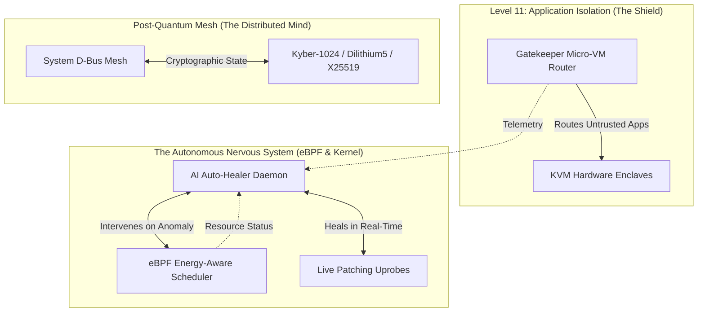

# 🧠 Ermete OS: The Singularity Architecture
## 🌌 The Nerves, The Brain, The Future of Computing

Ermete OS is not just an operating system. It is a **living, self-healing, agentic super-organism**. Built on a foundation of Zero-Trust, eBPF telemetry, hardware-isolated Micro-VMs, and Post-Quantum Cryptography, it represents the absolute apex of secure, dynamic computing.

This document serves as the **Architectural Map**—the Nerves and the Brain—exposing the intelligence that governs Ermete OS.

---

## 🧬 1. The Autonomous Brain (Neural Outputs)
Every design choice, audit, and evolutionary step of Ermete OS is driven by a decentralized AI orchestrator. The **Brain** is fully transparent. Explore the raw intelligence:

### 🔮 The Singularity Manifesto
- 📜 [**Agentic Arsenal Evolution**](docs/brain/agentic_arsenal_evolution.md): The proposal for Level 5 Singularity (Quantum Swarm Orchestration & Genetic Self-Mutation).
- 📜 [**The Map of Singularity**](docs/brain/la_mappa_della_singolarita.md): The overarching philosophical and technical roadmap.
- 📜 [**Ermete OS V2 Supremacy**](docs/brain/ermete_os_v2_supremacy.md): Why Ermete OS computationally obliterates the competition.

### 🛡️ Critical Forensic Audits
- 🔒 [**Ermete Forensic Audit Total**](docs/brain/ermete_forensic_audit_total.md): The uncompromising 360-degree security and structural audit.
- 🔒 [**Final Architectural Audit**](docs/brain/final_architectural_audit.md): The definitive gatekeeping review.
- 🔒 [**UI/UX Critical Audit**](docs/brain/ui_ux_critical_audit.md): Breaking down the user experience paradigms.

### ⚙️ Subsystem Documentation
- 🧠 [**Architectural God Nodes Report**](docs/brain/architectural_god_nodes_report.md)
- 🖥️ [**Kernel Layer**](docs/brain/doc_kernel_layer.md) | [**Core Daemons**](docs/brain/doc_core_daemons.md) | [**Build System**](docs/brain/doc_build_system.md)
- ☁️ [**Cloud Mesh**](docs/brain/doc_cloud_mesh.md) | 🎨 [**Shell UI**](docs/brain/doc_shell_ui.md)

---

## ⚡ 2. The Nerves (Core Architecture)

Ermete OS operates through a highly sophisticated network of "nerves"—interconnected subsystems that guarantee millisecond-level responsiveness, invulnerability, and distributed consensus.

### 🌟 Key Differentiators
1. **eBPF-Driven Energy Scheduler**: AI-inferred process classification directly injected into the Linux kernel scheduler (`sched_ext`), bypassing user-space latency.
2. **Post-Quantum Mesh (PQC)**: Dynamic, hardware-accelerated key rotation (Kyber-1024, Dilithium5, X25519) for invulnerable node-to-node and IPC communication.
3. **Zero-Trust MicroVM Compartmentalization**: Untrusted binaries never touch the host rootfs. They are transparently sandboxed inside hardware-accelerated KVM enclaves (`crosvm`).
4. **Agentic Self-Healing**: The OS doesn't just log errors; an embedded AI swarm detects anomalies, writes eBPF patches, and hot-swaps binaries in real-time with zero downtime.

---

> *"We don't write scripts. We breed enclaves, neural networks, and ASTs."* 
> — **Ermete OS Architectural Mandate**

Explore the source. Witness the future.
