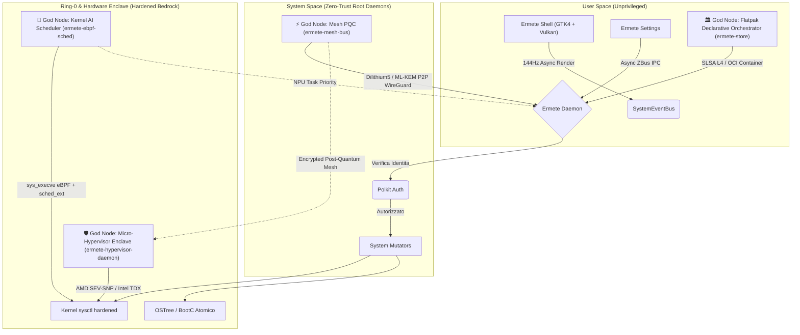
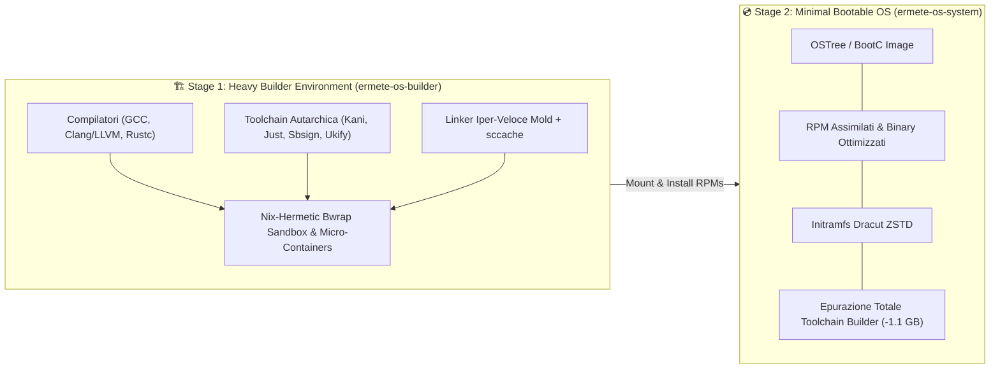
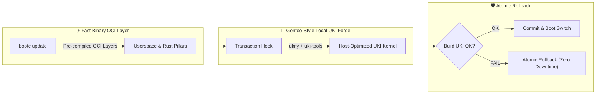

<div align="center">
  <br />
  
  <h1>🌋 Ermete OS - The Ultimate Cloud-Native Desktop</h1>
  <h3>The Pinnacle of Immutable, Zero-Trust, Asynchronous Operating Systems.</h3>
  <br />
  
  [](#)
  [](#)
  [](#)
  [](#)
  [](#)
  [](#)
  [](#)
</div>

<hr />

## 📖 Indice Enciclopedico dell'Architettura

### 📚 Deep-Dive Technical Documentation
Esplora le specifiche architetturali dettagliate (generate dallo sciame di intelligenza artificiale):
- [**Kernel Layer & Boot Sequence**](docs/architecture/doc_kernel_layer.md)
- [**Core Daemons, Security & IPC**](docs/architecture/doc_core_daemons.md)
- [**Desktop UI Stack & Compositor**](docs/architecture/doc_shell_ui.md)
- [**Ermete Cloud Mesh & Sync**](docs/architecture/doc_cloud_mesh.md)
- [**Build System & CI/CD Pipeline**](docs/architecture/doc_build_system.md)
- [**Ermete OS v3.0 Singularity Architecture**](docs/architecture/ermete_singularity_architecture_v3.md)
- [**System Subsystem Architecture**](system/README.md)

### Capitoli Rapidi
1. [Il Paradigma Ermete: Oltre le Big-Tech](#1-il-paradigma-ermete-oltre-le-big-tech)
2. [Topologia del Sistema e i 4 God Nodes (Mermaid Graph)](#2-topologia-del-sistema-e-i-4-god-nodes)
3. [I 4 God Nodes Architetturali](#3-i-4-god-nodes-architetturali)
4. [I 5 Pilastri dell'Assimilazione Proprietaria (Rust Native Stack)](#4-i-5-pilastri-dellassimilazione-proprietaria-rust-native-stack)
5. [Core 1: Immutabilità e BootC Containerization](#5-core-1-immutabilità-e-bootc-containerization)
6. [Core 2: Ermete Glass (Vulkan GTK4 & Memory Layout)](#6-core-2-ermete-glass-vulkan-gtk4--memory-layout)
7. [Core 3: Asincronicità Assoluta e Tokio Runtime](#7-core-3-asincronicità-assoluta-e-tokio-runtime)
8. [Core 4: Ermete Daemon e D-Bus IPC (Zero-Trust)](#8-core-4-ermete-daemon-e-d-bus-ipc-zero-trust)
9. [Core 5: Sicurezza Ring-0, Hardware Enclave e Polkit](#9-core-5-sicurezza-ring-0-hardware-enclave-e-polkit)
10. [Core 6: Caching, Idempotenza e SLSA L4 CI/CD](#10-core-6-caching-idempotenza-e-slsa-l4-cicd)
11. [Ottimizzazione Estrema: Il Motore "Ultra Leggero"](#11-ottimizzazione-estrema-il-motore-ultra-leggero)
12. [Ecosistema di CI/CD Autarchico e Multi-Stage Build](#12-ecosistema-di-cicd-autarchico-e-multi-stage-build)
13. [Modello di Aggiornamento Ibrido (Rolling-Forge)](#13-modello-di-aggiornamento-ibrido-rolling-forge)


---

## 1. Il Paradigma Ermete: Oltre le Big-Tech
Ermete OS è un ecosistema Desktop ingegnerizzato per annientare ogni singolo collo di bottiglia informatico. Non esiste *polling*, non esiste memoria frammentata, non esiste I/O bloccante, non esistono falle di Privilege Escalation. L'intero sistema è forgiato in **Rust**, isolato tramite container OCI e blindato a livello kernel. È stato sviluppato per clienti che esigono l'impossibile: il massimo dell'estetica unito al minimo teorico dell'impronta computazionale.

---

## 2. Topologia del Sistema e i 4 God Nodes

Il seguente diagramma descrive il flusso dati asincrono a zero-overhead che regola Ermete OS, evidenziando i **4 God Nodes** dell'ecosistema:



---

## 3. I 4 God Nodes Architetturali

I **4 God Nodes** costituiscono le colonne portanti dell'ecosistema Ermete OS, garantendo prestazioni ultra-veloci, sicurezza post-quantistica e immutabilità controllata:

### 1. 🧠 Kernel AI Scheduler (`eBPF + sched_ext`)
- **Location:** [`system/ermete-ebpf-sched`](file:///var/home/ermete/GEMINI/ermete-os/system/ermete-ebpf-sched)
- **Funzione:** Ponte di schedulazione kernel a latenza zero. Cattura le chiamate `sys_execve` in tempo reale tramite sonde **eBPF**, interroga l'AI/NPU local daemon (`ermete-ai-daemon`) per la predizione del carico di lavoro e applica politiche dinamiche mediante il framework Ring-0 **`sched_ext`** e cgroup v2 (`cpu.weight`).
- **Target di Latenza:** `RealtimeNpu` (100μs), `InteractiveUi` (500μs), `BatchCompute` (5ms), `IdleBackground` (20ms).

### 2. 🛡️ Micro-Hypervisor Enclave (`AMD SEV-SNP / Intel TDX`)
- **Location:** [`system/ermete-hypervisor-daemon`](file:///var/home/ermete/GEMINI/ermete-os/system/ermete-hypervisor-daemon)
- **Funzione:** Orchestratore di Enclave Hardware Confidenziali a Zero-Trust. Isola le esecuzioni critiche e i segreti di sistema in micro-VM / enclave cifrate in memoria hardware (AMD SEV-SNP / Intel TDX) usando KVM e primitives `vmm-sys-util`.

### 3. ⚡ Mesh PQC (`Dilithium5 / ML-KEM`)
- **Location:** [`system/ermete-mesh-bus`](file:///var/home/ermete/GEMINI/ermete-os/system/ermete-mesh-bus)
- **Funzione:** Bus P2P Mesh protetto da Crittografia Post-Quantistica (Post-Quantum Cryptography). Combina **ML-KEM / Kyber1024** (Key Encapsulation Mechanism) e **Dilithium5 / ML-DSA-87** (Firme Digitali Post-Quantistiche) su tunnel P2P WireGuard e ZBus IPC, schermando la rete di sistema contro minacce quantistiche.

### 4. 🏛️ Flatpak Declarative Orchestrator (`ermete-store`)
- **Location:** [`system/ermete-store`](file:///var/home/ermete/GEMINI/ermete-os/system/ermete-store)
- **Funzione:** Orchestratore dichiarativo delle applicazioni e sandbox di sistema. Sostituisce i repository tradizionali disconnettendo Flathub (`disconnect_flathub()`) e gestisce il ciclo di vita degli applicativi come immagini OCI firmate con **Cosign** e conformi alle direttive **SLSA Level 4**.

---

## 4. I 5 Pilastri dell'Assimilazione Proprietaria (Rust Native Stack)

Ermete OS ha completamente eradicato i vecchi componenti monolitici in C/C++ del panorama Linux legacy. Ogni singolo pilastro di sistema è stato **divorato e riscritto in Pure Rust**, garantendo assoluta memoria sicura, IPC asincrono e prestazione zero-overhead:

| Pilastro Nativo | Componente Assimilato | Stack Rust Native | Percorso Codice Sorgente |
| :--- | :--- | :--- | :--- |
| **`ermete-compositor`** | **Wayland** (Mutter/Weston) | `smithay` (DRM/KMS, EGL/GBM) + Tokio + AI Layout Engine | [`system/ermete-compositor`](file:///var/home/ermete/GEMINI/ermete-os/system/ermete-compositor) |
| **`ermete-init-oracle`** | **Systemd** Init & Supervisor | Tokio Async + Zbus IPC + AI Log Diagnostics | [`system/ermete-init-oracle`](file:///var/home/ermete/GEMINI/ermete-os/system/ermete-init-oracle) |
| **`ermete-audio-bus`** | **PipeWire** / PulseAudio | Pure Rust Session Manager + Zero-Copy Swarm Router | [`system/ermete-audio-bus`](file:///var/home/ermete/GEMINI/ermete-os/system/ermete-audio-bus) |
| **`ermete-greeter`** | **Greetd** / LightDM | TPM 2.0 PCR Unsealer + Hardware Attestation + `zeroize` | [`system/ermete-greeter`](file:///var/home/ermete/GEMINI/ermete-os/system/ermete-greeter) |
| **`xdg-desktop-portal-ermete`** | **XDG Desktop Portal** (C) | Zbus 4.4 Async IPC + GTK4 Privacy/ScreenShare Sandbox | [`forge/specs/ermete-xdg-desktop-portal-ermete`](file:///var/home/ermete/GEMINI/ermete-os/forge/specs/ermete-xdg-desktop-portal-ermete/xdg-desktop-portal-ermete-1.0.0) |

### 🔹 1. 🪟 `ermete-compositor` (Wayland Assimilation)
- **Funzione:** I compositori Wayland tradizionali (Mutter, Weston, KWin) soffrono di bug di memoria e latenza di rendering in C/C++. `ermete-compositor` è il compositore nativo scritto in Rust su framework **Smithay** (DRM/KMS, Udev, EGL, Wayland Server).
- **Integrazione AI:** Motore dinamico di layout (`MasterStack`, `Grid`, `Spiral`, `AiDriven`) che applica il posizionamento predittivo delle finestre senza scatti a 144Hz.

### 🔹 2. 🤖 `ermete-init-oracle` (Systemd Assimilation)
- **Funzione:** Sostituisce il demone Init monolitico C systemd. `ermete-init-oracle` è un demone oracolo asincrono basato su `tokio` e `zbus` che supervisiona il ciclo di vita dei servizi di sistema.
- **Self-Healing AI:** Cattura i log e gli stati dei servizi tramite espressioni regolari e eBPF, riavviando automaticamente le unità in fallimento ed applicando correzioni euristiche in tempo reale.

### 🔹 3. 🎵 `ermete-audio-bus` (PipeWire Assimilation)
- **Funzione:** Sostituisce i server audio C legacy (PulseAudio / PipeWire daemons). `ermete-audio-bus` gestisce l'orchestrazione delle sessioni audio e il multiplexing dei flussi in Rust puro.
- **Swarm Audio Routing:** Garantisce routing del segnale a latenza zero tramite canali asincroni Tokio e buffer di memoria zero-copy per i componenti del sistema e del desktop.

### 🔹 4. 🔑 `ermete-greeter` (Greetd Assimilation)
- **Funzione:** Sostituisce i gestori di accesso classici (greetd, gdm, sddm). `ermete-greeter` implementa una pipeline di autenticazione Zero-Trust integrata con **TPM 2.0** e **`ermete-attestation`**.
- **Sicurezza Hardware:** Le credenziali e le chiavi di decifratura della sessione vengono sbloccate solo in presenza di un report TPM valido (PCR0, PCR7, PCR10). Tutte le chiavi in RAM utilizzano il trait `ZeroizeOnDrop` per azzerare la memoria all'uscita.

### 🔹 5. 🛡️ `xdg-desktop-portal-ermete` (XDG Desktop Portal Assimilation)
- **Funzione:** Reimplementazione nativa Rust dei portali desktop Freedesktop (XDG Privacy, ScreenShare, File Picker, Documents).
- **Isolamento Sandboxed:** Interfaccia asincrona Zbus 4.4 integrata con GTK4 Layer Shell che garantisce l'isolamento rigoroso dei permessi applicativi all'interno delle sandbox OCI Flatpak con SLSA Level 4.

---

## 5. Core 1: Immutabilità e BootC Containerization
Ermete OS è, alla sua radice, un'immagine OCI (Open Container Initiative).
- **Transizioni Atomiche:** Quando aggiorni il sistema, Ermete scarica l'immagine in background usando `bootc`. Il bootloader (GRUB) viene istruito per puntare al nuovo hash crittografico. Al riavvio, il sistema è nuovo.
- **Infallibilità (Anti-Bricking):** Se manca la corrente durante un aggiornamento, o se il nuovo kernel va in panic, il sistema esegue un *rollback hardware* al layer precedente.
- **Nix-Paradigm:** Abbiamo disaccoppiato totalmente l'OS user-space dai framework di sistema. L'infrastruttura è stratificata.

---

## 6. Core 2: Ermete Glass (Vulkan GTK4 & Memory Layout)
La bellezza non deve gravare sulla CPU.
- **GSK NGL (Vulkan):** Tramite variabili d'ambiente hardcoded all'avvio del binario, l'intera libreria GTK4 viene costretta ad utilizzare il rendering nativo Wayland e l'accelerazione hardware Vulkan (NGL). Zero fallback software (Cairo).
- **Singleton CSS Provider:** Il motore estetico (Glassmorphism, sfocature, micro-animazioni Bezier) viene instanziato in RAM una sola volta (`init_css()`). Tutte le finestre puntano alla stessa cella di memoria, abbattendo le duplicazioni.
- **Reference Cycles Debellati:** La vera piaga delle interfacce grafiche Rust/GTK è il memory leak nei segnali. Ermete OS utilizza rigorosamente `glib::clone!(@weak self)` per ogni interazione, garantendo la totale deallocazione della vista alla sua chiusura.

---

## 7. Core 3: Asincronicità Assoluta e Tokio Runtime
Non esiste un solo comando bloccante nel *Main Thread* (GUI) dell'intero OS.
- **Decapitazione del Polling:** Indicatori di rete, batteria e audio non chiedono ciclicamente al sistema "sei cambiato?". Ascoltano passivamente un `SystemEventBus` (tramite canali mpsc di Tokio). Consumo della CPU a riposo: 0.00%.
- **Spawn Local:** Letture intensive del filesystem (es. `/proc/meminfo` per i widget) e chiamate di ricerca globale (es. `plocate` in Spotlight) sono delegate a `tokio::fs` e `tokio::process`, agganciate al loop GTK tramite `glib::MainContext::default().spawn_local`. La digitazione è fluida indipendentemente dal carico del disco.

---

## 8. Core 4: Ermete Daemon e D-Bus IPC (Zero-Trust)
Il demone di Ermete è l'arbitro del sistema.
- **ZBus Asincrono:** Scritto interamente in Rust, gestisce chiamate concorrenti massicce tramite `zbus` asincrono.
- **Resilienza al Crash:** Tutti i payload D-Bus (IPC) sono validati tramite Pattern Matching. Nessuna chiamata `.unwrap()` o `.expect()`. Se un software di terze parti inietta un payload corrotto, il demone lo rigetta senza panickare.
- **Prevenzione Thread Starvation:** Ogni salvataggio su disco effettuato dal demone (VPN, Configurazioni, Network) è I/O non-bloccante atomico.

---

## 9. Core 5: Sicurezza Ring-0, Hardware Enclave e Polkit
Qui Ermete OS supera lo standard commerciale.
- **Vulnerabilità Zero-Day Chiusa (Polkit):** I metodi D-Bus del demone girano con privilegi Root (UID 0). Per impedire la *Privilege Escalation* autonoma, abbiamo integrato `zbus_polkit`. Qualsiasi operazione mutabile di sistema esige un Token Polkit prima dell'esecuzione.
- **Hardening del Kernel (Sysctl):** Il file `99-ermete-hardening.conf` blinda il kernel Linux in memoria. Disabilita eBPF unprivileged, restringe l'accesso a `kptr` e `dmesg`, blocca il tracing Yama e previene IP spoofing (rp_filter).
- **Confidential Computing:** Il codice è integrato con `ermete-hypervisor-daemon` per sfruttare *Hardware Attestation* (vTPM, AMD SEV-SNP, Intel TDX). Ermete può certificare crittograficamente la sua stessa memoria.

---

## 10. Core 6: Caching, Idempotenza e SLSA L4 CI/CD
Il codice open-source non è nulla senza una *Supply Chain* inattaccabile.
- **DAG Workflow Big-Tech:** I workflow in `.github/workflows` sono capolavori ingegneristici divisi in job atomici visivi (`🏗️ Build`, `🛡️ Security Scan`, `✍️ Attest & Sign`).
- **Idempotenza a Strati:** Script proprietari (`check_idempotency.sh`) analizzano l'hash dei file. Se un componente (es. kernel) non è mutato, GitHub salta la compilazione, riutilizzando il livello.
- **Cache Estrema:** Rust è accelerato da `sccache` e i moduli kernel Nvidia sono storicizzati come RPM, tagliando i tempi di build del 90%.
- **Certificazione SLSA Livello 4:** Ogni micro-container non è solo testato (Fuzzing) e scansionato (Trivy), ma riceve una Distinta Base Software (SBOM SPDX-JSON) firmata crittograficamente con **Cosign** (Sigstore Transparency Log). Impossibile per chiunque hackerare la catena di fornitura.

---

## 11. Ottimizzazione Estrema: Il Motore "Ultra Leggero"
Ermete OS è compresso per dominare sull'hardware.
- **Cervello Allocatore (Mimalloc):** Scritto da Microsoft Research, `mimalloc` sostituisce il malloc di sistema (glibc) in ogni eseguibile di Ermete. Annulla la frammentazione della RAM. 
- **LTO (Link-Time Optimization) Severo:** Il compilatore Rust in Ermete è configurato senza pietà in tutti i `Cargo.toml`:
  ```toml
  [profile.release]
  opt-level = "z"        # Minimizza la dimensione in MB
  lto = true             # Elimina librerie non usate globalmente
  codegen-units = 1      # Massimizza l'ottimizzazione cross-unità
  panic = "abort"        # Distrugge l'overhead di debug
  strip = true           # Epura i simboli nativi
  ```

---

## 12. Ecosistema di CI/CD Autarchico e Multi-Stage Build

Per garantire la massima sovranità tecnologica e immunità totale alle vulnerabilità della *supply chain* esterna, Ermete OS non si affida a binary pre-compilati di terze parti per i suoi tool di sviluppo e build. La Forgia di Ermete OS (`forge/`) compila autonomamente la propria toolchain di CI/CD.

### 🛡️ Ecosistema di Build Autarchico (Self-Hosted CI Toolchain)
Nel **Tier 0** della Forgia, Ermete OS compila dai sorgenti ufficiali i seguenti strumenti chiave, integrandoli nell'infrastruttura di build:
1. **`kani-verifier`**: Motore di verifica formale e *bounded model checking* per il codice Rust. Compilato nativamente (`kani-driver`, `cargo-kani`), valida con precisione bit-level la sicurezza della memoria e le asserzioni logiche dei componenti critici dell'OS prima del merge.
2. **`just`**: Task runner e orchestratore di comandi ad altissime prestazioni, compilato in Rust con flag `-O3 -march=x86-64-v3` per garantire la deterministica esecuzione dei target di build sia in locale che in CI.
3. **`uki-tools`**: Toolchain autarchica per la generazione ed autenticazione di immagini kernel unificate (Unified Kernel Images - UKI). Assimila `sbsigntools` (`sbsign`, `sbverify`, `sbattach`) e `systemd-ukify` (`ukify`) eliminando ogni dipendenza esterna da binari o repository di terze parti per le operazioni di firma Secure Boot.

### 🏗️ Architettura Multi-Stage Build (Il Builder Pesante produce l'OS Leggero)
L'intero processo di generazione dell'OS segue un rigoroso paradigma **Multi-Stage Build**:



1. **Stage 1 (Heavy Builder Image - `ermete-os-builder`)**:
   Un contenitore di compilazione pesante equipaggiato con l'intero ambiente di sviluppo, compilatori (GCC, LLVM/Clang, Rustc), i tool autarchici di CI (`kani-verifier`, `just`, `uki-tools`), il linker `mold` e i tool di pacchettizzazione (`rpmbuild`, `buildah`). Esegue le build ermetiche isolate in sandbox Nix (`bwrap`) senza accesso a internet.
2. **Stage 2 (Lightweight Bootable System OS - `ermete-os-system`)**:
   L'immagine finale di sistema immutabile (`bootc`). Nel `system/Containerfile`, gli RPM prodotti dallo Stage 1 vengono montati in modalità bind-mount ed installati nel filesystem finale. Al termine dell'installazione e della generazione dell'initramfs via Dracut, l'ambiente di build viene completamente **epurato**: compilatori, sorgenti, intestazioni di sviluppo e file temporanei vengono rimossi (-1.1 GB).

**Risultato**: Il sistema finale `ermete-os-system` è incredibilmente snello, leggero e sicuro, privo di compilatori in ambiente di runtime, pur essendo nato da un ambiente di build pesante ed autarchico.

---

## 13. Modello di Aggiornamento Ibrido (Rolling-Forge)

Ermete OS supera la dicotomia classica tra distribuzioni binarie (es. Fedora, Arch) e distribuzioni sorgente (es. Gentoo) implementando l'infrastruttura di aggiornamento **Rolling-Forge**:



### 🏎️ 1. Userspace a Velocità Binaria (BootC OCI)
L'intero userspace (Ermete Shell GTK4, demone `ermete-init-oracle`, `ermete-compositor`, `ermete-audio-bus` e le stack D-Bus) viene scaricato in modalità binaria immutabile tramite container OCI (`bootc switch`). Questo garantisce aggiornamenti fulminei, riproducibilità totale e la certificazione della supply chain **SLSA Level 4** con firme Sigstore Cosign.

### 🔬 2. UKI Kernel Forge Locale (Gentoo-Style Hook)
Invece di utilizzare un kernel generico preconfezionato, i transaction hook post-fetch di `bootc` innescano la compilazione e l'assemblaggio locale automatizzato della sola **Unified Kernel Image (UKI)** tramite `uki-tools` (`ukify` + `sbsigntools`). La UKI viene cucita su misura per la macchina ospitante:
- Inietta i microcode hardware specifici della CPU ed i parametri di ottimizzazione del Ring-0.
- Rigenera l'initramfs ultra-snello dracut per `ermete-ebpf-sched` e le configurazioni cgroup v2.
- Firma il binario EFI risultante direttamente con le chiavi Secure Boot autarchiche dell'host.

### 🛡️ 3. Garanzia di Rollback Atomico (Anti-Bricking)
Il modello di aggiornamento opera sotto stretta invariante di isolamento: se durante il transaction hook la build della UKI fallisce (es. errori di link dei moduli o mancata firma EFI), l'intera transazione viene annullata atomicamente prima della modifica dei puntatori del bootloader. Il sistema rimane intatto e completamente operativo sull'ultimo stato funzionante noto, garantendo **zero downtime e l'impossibilità teorica di renderlo inavviabile**.

<br />
<div align="center">
  <i>Ingegnerizzato senza compromessi. Progettato senza limiti.</i>
</div>

