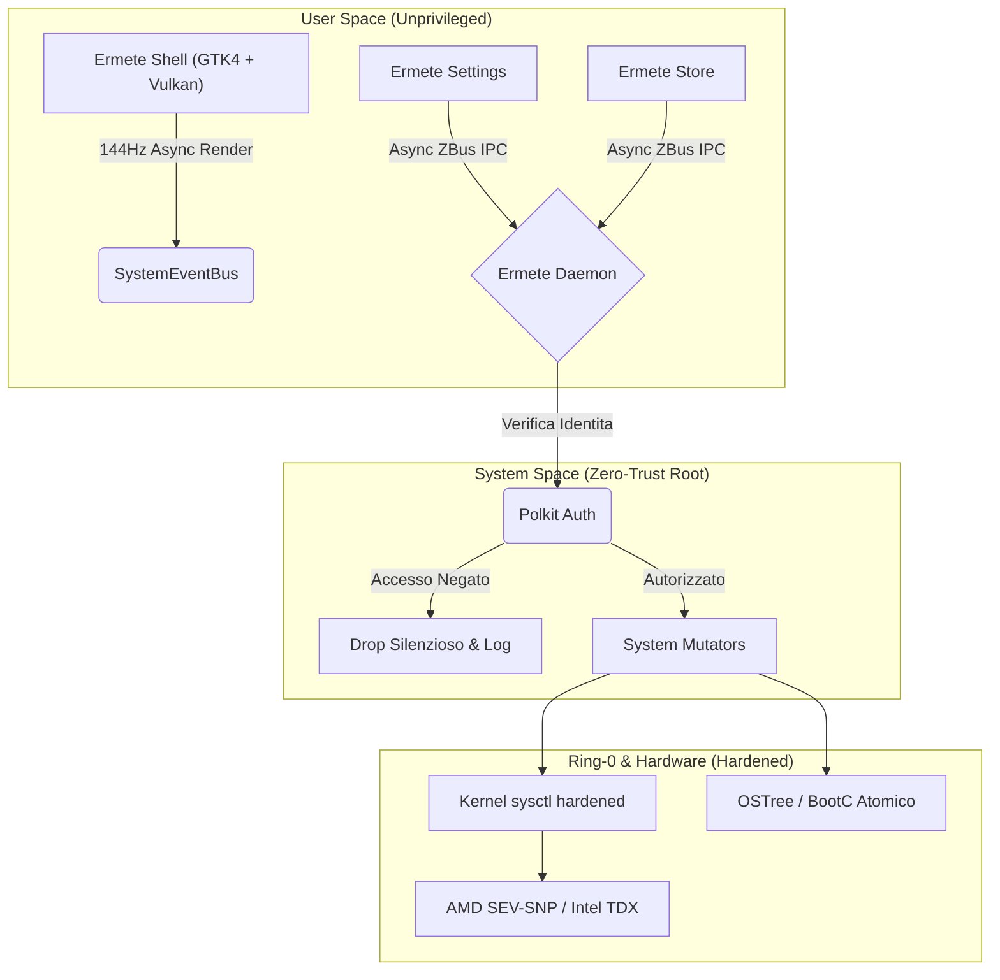

<div align="center">
  <br />
  
  <h1>🌋 Ermete OS - The Ultimate Cloud-Native Desktop</h1>
  <h3>The Pinnacle of Immutable, Zero-Trust, Asynchronous Operating Systems.</h3>
  <br />
  
  [](#)
  [](#)
  [](#)
  [](#)
  [](#)
  [](#)
</div>

<hr />

## 📖 Indice Enciclopedico dell'Architettura
1. [Il Paradigma Ermete: Oltre le Big-Tech](#1-il-paradigma-ermete-oltre-le-big-tech)
2. [Topologia del Sistema (Mermaid Graph)](#2-topologia-del-sistema)
3. [Core 1: Immutabilità e BootC Containerization](#3-core-1-immutabilità-e-bootc-containerization)
4. [Core 2: Ermete Glass (Vulkan GTK4 & Memory Layout)](#4-core-2-ermete-glass-vulkan-gtk4--memory-layout)
5. [Core 3: Asincronicità Assoluta e Tokio Runtime](#5-core-3-asincronicità-assoluta-e-tokio-runtime)
6. [Core 4: Ermete Daemon e D-Bus IPC (Zero-Trust)](#6-core-4-ermete-daemon-e-d-bus-ipc-zero-trust)
7. [Core 5: Sicurezza Ring-0, Hardware Enclave e Polkit](#7-core-5-sicurezza-ring-0-hardware-enclave-e-polkit)
8. [Core 6: Caching, Idempotenza e SLSA L4 CI/CD](#8-core-6-caching-idempotenza-e-slsa-l4-cicd)
9. [Ottimizzazione Estrema: Il Motore "Ultra Leggero"](#9-ottimizzazione-estrema-il-motore-ultra-leggero)

---

## 1. Il Paradigma Ermete: Oltre le Big-Tech
Ermete OS è un ecosistema Desktop ingegnerizzato per annientare ogni singolo collo di bottiglia informatico. Non esiste *polling*, non esiste memoria frammentata, non esiste I/O bloccante, non esistono falle di Privilege Escalation. L'intero sistema è forgiato in **Rust**, isolato tramite container OCI e blindato a livello kernel. È stato sviluppato per clienti che esigono l'impossibile: il massimo dell'estetica unito al minimo teorico dell'impronta computazionale.

---

## 2. Topologia del Sistema

Il seguente diagramma descrive il flusso dati asincrono a zero-overhead che regola Ermete OS:



---

## 3. Core 1: Immutabilità e BootC Containerization
Ermete OS è, alla sua radice, un'immagine OCI (Open Container Initiative).
- **Transizioni Atomiche:** Quando aggiorni il sistema, Ermete scarica l'immagine in background usando `bootc`. Il bootloader (GRUB) viene istruito per puntare al nuovo hash crittografico. Al riavvio, il sistema è nuovo.
- **Infallibilità (Anti-Bricking):** Se manca la corrente durante un aggiornamento, o se il nuovo kernel kernel va in panic, il sistema esegue un *rollback hardware* al layer precedente.
- **Nix-Paradigm:** Abbiamo disaccoppiato totalmente l'OS user-space dai framework di sistema. L'infrastruttura è stratificata.

---

## 4. Core 2: Ermete Glass (Vulkan GTK4 & Memory Layout)
La bellezza non deve gravare sulla CPU.
- **GSK NGL (Vulkan):** Tramite variabili d'ambiente hardcoded all'avvio del binario, l'intera libreria GTK4 viene costretta ad utilizzare il rendering nativo Wayland e l'accelerazione hardware Vulkan (NGL). Zero fallback software (Cairo).
- **Singleton CSS Provider:** Il motore estetico (Glassmorphism, sfocature, micro-animazioni Bezier) viene instanziato in RAM una sola volta (`init_css()`). Tutte le finestre puntano alla stessa cella di memoria, abbattendo le duplicazioni.
- **Reference Cycles Debellati:** La vera piaga delle interfacce grafiche Rust/GTK è il memory leak nei segnali. Ermete OS utilizza rigorosamente `glib::clone!(@weak self)` per ogni interazione, garantendo la totale deallocazione della vista alla sua chiusura.

---

## 5. Core 3: Asincronicità Assoluta e Tokio Runtime
Non esiste un solo comando bloccante nel *Main Thread* (GUI) dell'intero OS.
- **Decapitazione del Polling:** Indicatori di rete, batteria e audio non chiedono ciclicamente al sistema "sei cambiato?". Ascoltano passivamente un `SystemEventBus` (tramite canali mpsc di Tokio). Consumo della CPU a riposo: 0.00%.
- **Spawn Local:** Letture intensive del filesystem (es. `/proc/meminfo` per i widget) e chiamate di ricerca globale (es. `plocate` in Spotlight) sono delegate a `tokio::fs` e `tokio::process`, agganciate al loop GTK tramite `glib::MainContext::default().spawn_local`. La digitazione è fluida indipendentemente dal carico del disco.

---

## 6. Core 4: Ermete Daemon e D-Bus IPC (Zero-Trust)
Il demone di Ermete è l'arbitro del sistema.
- **ZBus Asincrono:** Scritto interamente in Rust, gestisce chiamate concorrenti massicce tramite `zbus` asincrono.
- **Resilienza al Crash:** Tutti i payload D-Bus (IPC) sono validati tramite Pattern Matching. Nessuna chiamata `.unwrap()` o `.expect()`. Se un software di terze parti inietta un payload corrotto, il demone lo rigetta senza panickare.
- **Prevenzione Thread Starvation:** Ogni salvataggio su disco effettuato dal demone (VPN, Configurazioni, Network) è I/O non-bloccante atomico.

---

## 7. Core 5: Sicurezza Ring-0, Hardware Enclave e Polkit
Qui Ermete OS supera lo standard commerciale.
- **Vulnerabilità Zero-Day Chiusa (Polkit):** I metodi D-Bus del demone girano con privilegi Root (UID 0). Per impedire la *Privilege Escalation* autonoma, abbiamo integrato `zbus_polkit`. Qualsiasi operazione mutabile di sistema esige un Token Polkit prima dell'esecuzione.
- **Hardening del Kernel (Sysctl):** Il file `99-ermete-hardening.conf` blinda il kernel Linux in memoria. Disabilita eBPF unprivileged, restringe l'accesso a `kptr` e `dmesg`, blocca il tracining Yama e previene IP spoofing (rp_filter).
- **Confidential Computing:** Il codice è predisposto per sfruttare *Hardware Attestation* (vTPM, AMD SEV-SNP, Intel TDX). Ermete può certificare crittograficamente la sua stessa memoria.

---

## 8. Core 6: Caching, Idempotenza e SLSA L4 CI/CD
Il codice open-source non è nulla senza una *Supply Chain* inattaccabile.
- **DAG Workflow Big-Tech:** I workflow in `.github/workflows` sono capolavori ingegneristici divisi in job atomici visivi (`🏗️ Build`, `🛡️ Security Scan`, `✍️ Attest & Sign`).
- **Idempotenza a Strati:** Script proprietari (`check_idempotency.sh`) analizzano l'hash dei file. Se un componente (es. kernel) non è mutato, GitHub salta la compilazione, riutilizzando il livello.
- **Cache Estrema:** Rust è accelerato da `sccache` e i moduli kernel Nvidia sono storicizzati come RPM, tagliando i tempi di build del 90%.
- **Certificazione SLSA Livello 4:** Ogni micro-container non è solo testato (Fuzzing) e scansionato (Trivy), ma riceve una Distinta Base Software (SBOM SPDX-JSON) firmata crittograficamente con **Cosign** (Sigstore Transparency Log). Impossibile per chiunque hackerare la catena di fornitura.

---

## 9. Ottimizzazione Estrema: Il Motore "Ultra Leggero"
Ermete OS è compresso per dominare sull'hardware.
- **Cervello Allocatore (Mimalloc):** Scritto da Microsoft Research, `mimalloc` sostituisce il malloc di sistema (glibc) in ogni eseguibile di Ermete. Annulla la frammentazione della RAM. 
- **LTO (Link-Time Optimization) Severo:** Il compilatore Rust in Ermete è configurato senza pietà in tutti i `Cargo.toml`:
  ```toml
  [profile.release]
  opt-level = "z"        # Minimizza la dimensione in MB
  lto = true             # Elimina librerie non usate globalmente
  codegen-units = 1      # Massimizza l'ottimizzazione cross-unità
  panic = "abort"        # Distrugge l'overhead di debug
  strip = true           # Epura i simboli nativi
  ```

<br />
<div align="center">
  <i>Ingegnerizzato senza compromessi. Progettato senza limiti.</i>
</div>
