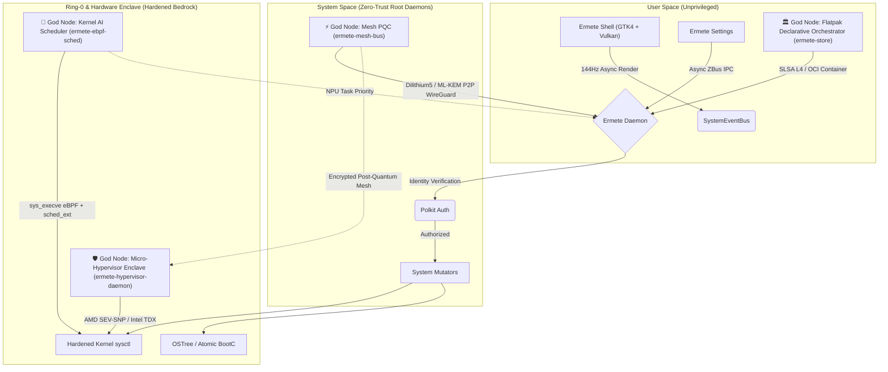
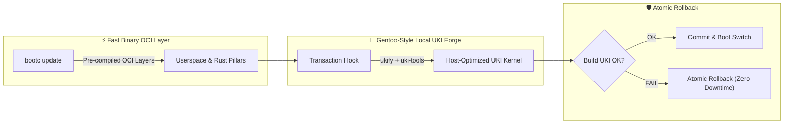

<div align="center">
  <br />
  
  <h1>🌋 Ermete OS - The Ultimate Cloud-Native Desktop</h1>
  <h3>The Pinnacle of Immutable, Zero-Trust, Asynchronous Operating Systems.</h3>
  <br />
  
  [](#)
  [](#)
  [](#)
  [](#)
  [](#)
  [](#)
  [](#)
</div>

<hr />

## 📖 Encyclopedic Architectural Index

### 📚 Deep-Dive Technical Documentation
Explore the detailed architectural specifications (generated and maintained by our AI swarm):
- [**Kernel Layer & Boot Sequence**](docs/architecture/doc_kernel_layer.md)
- [**Core Daemons, Security & IPC**](docs/architecture/doc_core_daemons.md)
- [**Desktop UI Stack & Compositor**](docs/architecture/doc_shell_ui.md)
- [**Ermete Cloud Mesh & Sync**](docs/architecture/doc_cloud_mesh.md)
- [**Build System & CI/CD Pipeline**](docs/architecture/doc_build_system.md)
- [**Ermete OS v3.0 Singularity Architecture**](docs/architecture/ermete_singularity_architecture_v3.md)
- [**System Subsystem Architecture**](system/README.md)

### Quick Chapters
1. [The Ermete Paradigm: Beyond Big-Tech](#1-the-ermete-paradigm-beyond-big-tech)
2. [System Topology and the 4 God Nodes (Mermaid Graph)](#2-system-topology-and-the-4-god-nodes)
3. [The 4 Architectural God Nodes](#3-the-4-architectural-god-nodes)
4. [The 5 Pillars of Proprietary Assimilation (Rust Native Stack)](#4-the-5-pillars-of-proprietary-assimilation-rust-native-stack)
5. [Core 1: Immutability and BootC Containerization](#5-core-1-immutability-and-bootc-containerization)
6. [Core 2: Ermete Glass (Vulkan GTK4 & Memory Layout)](#6-core-2-ermete-glass-vulkan-gtk4--memory-layout)
7. [Core 3: Absolute Asynchronicity and Tokio Runtime](#7-core-3-absolute-asynchronicity-and-tokio-runtime)
8. [Core 4: Ermete Daemon and D-Bus IPC (Zero-Trust)](#8-core-4-ermete-daemon-and-d-bus-ipc-zero-trust)
9. [Core 5: Ring-0 Security, Hardware Enclave, and Polkit](#9-core-5-ring-0-security-hardware-enclave-and-polkit)
10. [Core 6: Caching, Idempotence, and SLSA L4 CI/CD](#10-core-6-caching-idempotence-and-slsa-l4-cicd)
11. [Extreme Optimization: The "Ultra-Light" Engine](#11-extreme-optimization-the-ultra-light-engine)
12. [Autarkic CI/CD Ecosystem and Multi-Stage Build](#12-autarkic-cicd-ecosystem-and-multi-stage-build)
13. [Hybrid Update Model (Rolling-Forge)](#13-hybrid-update-model-rolling-forge)


---

## 1. The Ermete Paradigm: Beyond Big-Tech
Ermete OS is an enterprise-grade Desktop ecosystem engineered to annihilate every single computing bottleneck. There is no polling, no memory fragmentation, no blocking I/O, and no privilege escalation vulnerabilities. The entire system is forged in **Rust**, isolated via OCI containers, and hardened at the kernel level. It is designed for enterprise users and professionals who demand the impossible: breathtaking UI/UX aesthetics combined with the theoretical minimum computational footprint. Cohesive, synergistic, and relentlessly efficient.

---

## 2. System Topology and the 4 God Nodes

The following diagram describes the zero-overhead asynchronous data flow that governs Ermete OS, highlighting the **4 God Nodes** of the ecosystem:



---

## 3. The 4 Architectural God Nodes

The **4 God Nodes** form the load-bearing pillars of the Ermete OS ecosystem, ensuring ultra-fast performance, post-quantum security, and controlled immutability:

### 1. 🧠 Kernel AI Scheduler (`eBPF + sched_ext`)
- **Location:** [`system/ermete-ebpf-sched`](file:///var/home/ermete/GEMINI/ermete-os/system/ermete-ebpf-sched)
- **Function:** Zero-latency kernel scheduling bridge. It captures `sys_execve` calls in real time via **eBPF** probes, queries the local AI/NPU daemon (`ermete-ai-daemon`) for workload prediction, and applies dynamic policies using the Ring-0 **`sched_ext`** framework and cgroup v2 (`cpu.weight`).
- **Latency Targets:** `RealtimeNpu` (100μs), `InteractiveUi` (500μs), `BatchCompute` (5ms), `IdleBackground` (20ms).

### 2. 🛡️ Micro-Hypervisor Enclave (`AMD SEV-SNP / Intel TDX`)
- **Location:** [`system/ermete-hypervisor-daemon`](file:///var/home/ermete/GEMINI/ermete-os/system/ermete-hypervisor-daemon)
- **Function:** Zero-Trust Confidential Hardware Enclave Orchestrator. It isolates critical executions and system secrets in encrypted micro-VMs residing in hardware memory (AMD SEV-SNP / Intel TDX) using KVM and `vmm-sys-util` primitives.

### 3. ⚡ Mesh PQC (`Dilithium5 / ML-KEM`)
- **Location:** [`system/ermete-mesh-bus`](file:///var/home/ermete/GEMINI/ermete-os/system/ermete-mesh-bus)
- **Function:** Post-Quantum Cryptography (PQC) protected P2P Mesh Bus. It combines **ML-KEM / Kyber1024** (Key Encapsulation Mechanism) and **Dilithium5 / ML-DSA-87** (Post-Quantum Digital Signatures) over P2P WireGuard tunnels and ZBus IPC, shielding the system network against quantum computing threats.

### 4. 🏛️ Flatpak Declarative Orchestrator (`ermete-store`)
- **Location:** [`system/ermete-store`](file:///var/home/ermete/GEMINI/ermete-os/system/ermete-store)
- **Function:** Declarative orchestrator for applications and system sandboxes. It replaces traditional repositories by disconnecting Flathub (`disconnect_flathub()`) and manages the application lifecycle as OCI images signed with **Cosign** and compliant with **SLSA Level 4** directives.

---

## 4. The 5 Pillars of Proprietary Assimilation (Rust Native Stack)

Ermete OS has completely eradicated legacy monolithic C/C++ components from the Linux landscape. Every single system pillar has been **devoured and rewritten in Pure Rust**, ensuring absolute memory safety, asynchronous IPC, and zero-overhead performance:

| Native Pillar | Assimilated Component | Rust Native Stack | Source Code Path |
| :--- | :--- | :--- | :--- |
| **`ermete-compositor`** | **Wayland** (Mutter/Weston) | `smithay` (DRM/KMS, EGL/GBM) + Tokio + AI Layout Engine | [`system/ermete-compositor`](file:///var/home/ermete/GEMINI/ermete-os/system/ermete-compositor) |
| **`ermete-init-oracle`** | **Systemd** Init & Supervisor | Tokio Async + Zbus IPC + AI Log Diagnostics | [`system/ermete-init-oracle`](file:///var/home/ermete/GEMINI/ermete-os/system/ermete-init-oracle) |
| **`ermete-audio-bus`** | **PipeWire** / PulseAudio | Pure Rust Session Manager + Zero-Copy Swarm Router | [`system/ermete-audio-bus`](file:///var/home/ermete/GEMINI/ermete-os/system/ermete-audio-bus) |
| **`ermete-greeter`** | **Greetd** / LightDM | TPM 2.0 PCR Unsealer + Hardware Attestation + `zeroize` | [`system/ermete-greeter`](file:///var/home/ermete/GEMINI/ermete-os/system/ermete-greeter) |
| **`xdg-desktop-portal-ermete`** | **XDG Desktop Portal** (C) | Zbus 4.4 Async IPC + GTK4 Privacy/ScreenShare Sandbox | [`forge/specs/ermete-xdg-desktop-portal-ermete`](file:///var/home/ermete/GEMINI/ermete-os/forge/specs/ermete-xdg-desktop-portal-ermete/xdg-desktop-portal-ermete-1.0.0) |

### 🔹 1. 🪟 `ermete-compositor` (Wayland Assimilation)
- **Function:** Traditional Wayland compositors (Mutter, Weston, KWin) suffer from memory bugs and rendering latency in C/C++. `ermete-compositor` is the native compositor written in Rust on the **Smithay** framework (DRM/KMS, Udev, EGL, Wayland Server).
- **AI Integration:** Dynamic layout engine (`MasterStack`, `Grid`, `Spiral`, `AiDriven`) that applies predictive window positioning fluidly at 144Hz.

### 🔹 2. 🤖 `ermete-init-oracle` (Systemd Assimilation)
- **Function:** Replaces the monolithic C systemd Init daemon. `ermete-init-oracle` is an asynchronous oracle daemon based on `tokio` and `zbus` that supervises the lifecycle of system services.
- **Self-Healing AI:** Captures logs and service states via regex and eBPF, automatically restarting failing units and applying heuristic corrections in real time.

### 🔹 3. 🎵 `ermete-audio-bus` (PipeWire Assimilation)
- **Function:** Replaces legacy C audio servers (PulseAudio / PipeWire daemons). `ermete-audio-bus` manages audio session orchestration and stream multiplexing in pure Rust.
- **Swarm Audio Routing:** Guarantees zero-latency signal routing via asynchronous Tokio channels and zero-copy memory buffers for system and desktop components.

### 🔹 4. 🔑 `ermete-greeter` (Greetd Assimilation)
- **Function:** Replaces classic login managers (greetd, gdm, sddm). `ermete-greeter` implements a Zero-Trust authentication pipeline integrated with **TPM 2.0** and **`ermete-attestation`**.
- **Hardware Security:** Credentials and session decryption keys are unlocked only in the presence of a valid TPM report (PCR0, PCR7, PCR10). All in-RAM keys use the `ZeroizeOnDrop` trait to wipe memory upon exit.

### 🔹 5. 🛡️ `xdg-desktop-portal-ermete` (XDG Desktop Portal Assimilation)
- **Function:** Native Rust reimplementation of Freedesktop portals (XDG Privacy, ScreenShare, File Picker, Documents).
- **Sandboxed Isolation:** Asynchronous Zbus 4.4 interface integrated with GTK4 Layer Shell ensuring strict application permission isolation inside OCI Flatpak sandboxes with SLSA Level 4 compliance.

---

## 5. Core 1: Immutability and BootC Containerization
At its root, Ermete OS is an OCI (Open Container Initiative) image.
- **Atomic Transitions:** When updating the system, Ermete downloads the image in the background using `bootc`. The bootloader (GRUB) is instructed to point to the new cryptographic hash. Upon reboot, the system is brand new.
- **Infallibility (Anti-Bricking):** If power is lost during an update, or if the new kernel panics, the system performs a *hardware rollback* to the previous layer.
- **Nix-Paradigm:** We have totally decoupled the user-space OS from system frameworks. The infrastructure is deeply layered.

---

## 6. Core 2: Ermete Glass (Vulkan GTK4 & Memory Layout)
Beauty must not burden the CPU. The user experience is seamlessly liquid at 144Hz.
- **GSK NGL (Vulkan):** Via hardcoded environment variables at binary startup, the entire GTK4 library is forced to use native Wayland rendering and Vulkan (NGL) hardware acceleration. Zero software fallbacks (Cairo).
- **Singleton CSS Provider:** The aesthetic engine (Glassmorphism, blurs, Bezier micro-animations) is instantiated in RAM only once (`init_css()`). All windows point to the exact same memory cell, obliterating duplications.
- **Reference Cycles Vanquished:** The true plague of Rust/GTK GUIs is memory leaks in signals. Ermete OS strictly uses `glib::clone!(@weak self)` for every interaction, guaranteeing total view deallocation upon closure.

---

## 7. Core 3: Absolute Asynchronicity and Tokio Runtime
There is not a single blocking command in the *Main Thread* (GUI) of the entire OS.
- **Decapitation of Polling:** Network, battery, and audio indicators do not cyclically ask the system "have you changed?". They passively listen to a `SystemEventBus` (via Tokio mpsc channels). Idle CPU consumption: 0.00%.
- **Spawn Local:** Intensive filesystem reads (e.g., `/proc/meminfo` for widgets) and global search calls (e.g., `plocate` in Spotlight) are delegated to `tokio::fs` and `tokio::process`, hooked to the GTK loop via `glib::MainContext::default().spawn_local`. Typing remains perfectly fluid regardless of disk load.

---

## 8. Core 4: Ermete Daemon and D-Bus IPC (Zero-Trust)
The Ermete daemon is the ultimate system arbiter.
- **Asynchronous ZBus:** Written entirely in Rust, it handles massive concurrent calls via async `zbus`.
- **Crash Resilience (Panic-Free):** All D-Bus (IPC) payloads are validated via Pattern Matching. No `.unwrap()` or `.expect()` calls are present in production logic. If third-party software injects a corrupted payload, the daemon rejects it without panicking.
- **Thread Starvation Prevention:** Every disk save performed by the daemon (VPN, Configurations, Network) is an atomic non-blocking I/O operation.

---

## 9. Core 5: Ring-0 Security, Hardware Enclave, and Polkit
This is where Ermete OS transcends commercial standards.
- **Zero-Day Vulnerability Closed (Polkit):** The daemon's D-Bus methods run with Root privileges (UID 0). To prevent autonomous *Privilege Escalation*, we integrated `zbus_polkit`. Any mutable system operation demands a Polkit Token prior to execution.
- **Kernel Hardening (Sysctl):** The `99-ermete-hardening.conf` file locks down the Linux kernel in memory. It disables unprivileged eBPF, restricts access to `kptr` and `dmesg`, blocks Yama tracing, and prevents IP spoofing (rp_filter).
- **Confidential Computing:** The code integrates with `ermete-hypervisor-daemon` to leverage *Hardware Attestation* (vTPM, AMD SEV-SNP, Intel TDX). Ermete cryptographically certifies its own memory.

---

## 10. Core 6: Caching, Idempotence, and SLSA L4 CI/CD
Open-source code is nothing without an unassailable *Supply Chain*.
- **Big-Tech DAG Workflows:** The `.github/workflows` are engineering masterpieces divided into atomic visual jobs (`🏗️ Build`, `🛡️ Security Scan`, `✍️ Attest & Sign`).
- **Layered Idempotence:** Proprietary scripts (`check_idempotency.sh`) analyze file hashes. If a component (e.g., kernel) has not mutated, GitHub skips compilation, reusing the layer.
- **Extreme Caching:** Rust is accelerated by `sccache` and Nvidia kernel modules are historicized as RPMs, slashing build times by 90%.
- **SLSA Level 4 Certification:** Every micro-container is not only tested (Fuzzing) and scanned (Trivy), but receives a Software Bill of Materials (SBOM SPDX-JSON) cryptographically signed with **Cosign** (Sigstore Transparency Log). It is mathematically impossible for anyone to hack the supply chain.

---

## 11. Extreme Optimization: The "Ultra-Light" Engine
Ermete OS is compressed to dominate on the hardware.
- **Allocator Brain (Mimalloc):** Written by Microsoft Research, `mimalloc` replaces the system malloc (glibc) in every Ermete executable. It nullifies RAM fragmentation. 
- **Severe LTO (Link-Time Optimization):** The Rust compiler in Ermete is ruthlessly configured across all `Cargo.toml` files:
  ```toml
  [profile.release]
  opt-level = "z"        # Minimizes footprint in MB
  lto = true             # Eliminates globally unused libraries
  codegen-units = 1      # Maximizes cross-unit optimization
  panic = "abort"        # Destroys debugging overhead
  strip = true           # Purges native symbols
  ```

---

## 12. Autarkic CI/CD Ecosystem and Multi-Stage Build

To guarantee maximum technological sovereignty and total immunity to external *supply chain* vulnerabilities, Ermete OS does not rely on third-party pre-compiled binaries for its development and build tools. The Ermete Forge (`forge/`) autonomously compiles its own CI/CD toolchain.

### 🛡️ Autarkic Build Ecosystem (Self-Hosted CI Toolchain)
In **Tier 0** of the Forge, Ermete OS compiles the following key tools from official sources, integrating them into the build infrastructure:
1. **`kani-verifier`**: Formal verification engine and *bounded model checking* for Rust code. Compiled natively (`kani-driver`, `cargo-kani`), it validates bit-level memory safety and logical assertions of critical OS components before merging.
2. **`just`**: High-performance task runner and command orchestrator, compiled in Rust with `-O3 -march=x86-64-v3` flags to guarantee deterministic execution of build targets locally and in CI.
3. **`uki-tools`**: Autarkic toolchain for generating and authenticating Unified Kernel Images (UKI). It assimilates `sbsigntools` (`sbsign`, `sbverify`, `sbattach`) and `systemd-ukify` (`ukify`), eliminating dependencies on third-party binaries or repositories for Secure Boot signing operations.

### 🏗️ Multi-Stage Build Architecture (The Heavy Builder produces the Light OS)
The entire OS generation process follows a rigorous **Multi-Stage Build** paradigm:


1. **Stage 1 (Heavy Builder Image - `ermete-os-builder`)**:
   A heavy build container equipped with the entire development environment, compilers (GCC, LLVM/Clang, Rustc), autarkic CI tools (`kani-verifier`, `just`, `uki-tools`), the `mold` linker, and packaging tools (`rpmbuild`, `buildah`). It executes hermetic builds isolated in Nix sandboxes (`bwrap`) without internet access.
2. **Stage 2 (Lightweight Bootable System OS - `ermete-os-system`)**:
   The final immutable system image (`bootc`). In the `system/Containerfile`, the RPMs produced by Stage 1 are bind-mounted and installed into the final filesystem. After installation and initramfs generation via Dracut, the build environment is completely **purged**: compilers, sources, development headers, and temporary files are obliterated (-1.1 GB).

**Result**: The final `ermete-os-system` is incredibly lean, lightweight, and secure. It lacks compilers in its runtime environment, despite being born from a heavy, autarkic build setup.

---

## 13. Hybrid Update Model (Rolling-Forge)

Ermete OS supersedes the classic dichotomy between binary distributions (e.g., Fedora, Arch) and source distributions (e.g., Gentoo) by implementing the **Rolling-Forge** update infrastructure:



### 🏎️ 1. Binary Speed Userspace (BootC OCI)
The entire userspace (Ermete Shell GTK4, `ermete-init-oracle` daemon, `ermete-compositor`, `ermete-audio-bus`, and D-Bus stacks) is downloaded in immutable binary mode via OCI containers (`bootc switch`). This guarantees lightning-fast updates, absolute reproducibility, and **SLSA Level 4** supply chain certification with Sigstore Cosign signatures.

### 🔬 2. Local UKI Kernel Forge (Gentoo-Style Hook)
Instead of using a generic prepackaged kernel, `bootc` post-fetch transaction hooks trigger the automated local compilation and assembly of the **Unified Kernel Image (UKI)** via `uki-tools` (`ukify` + `sbsigntools`). The UKI is tailor-made for the host machine:
- Injects CPU-specific hardware microcode and Ring-0 optimization parameters.
- Regenerates the ultra-lean dracut initramfs for `ermete-ebpf-sched` and cgroup v2 configurations.
- Signs the resulting EFI binary directly with the host's autarkic Secure Boot keys.

### 🛡️ 3. Atomic Rollback Guarantee (Anti-Bricking)
The update model operates under a strict isolation invariant: if the UKI build fails during the transaction hook (e.g., module link errors or EFI signing failure), the entire transaction is atomically rolled back before any bootloader pointers are modified. The system remains pristine and fully operational on the last known good state, guaranteeing **zero downtime and the theoretical impossibility of bricking**.

<br />
<div align="center">
  <i>Engineered without compromise. Designed without limits.</i>
</div>
