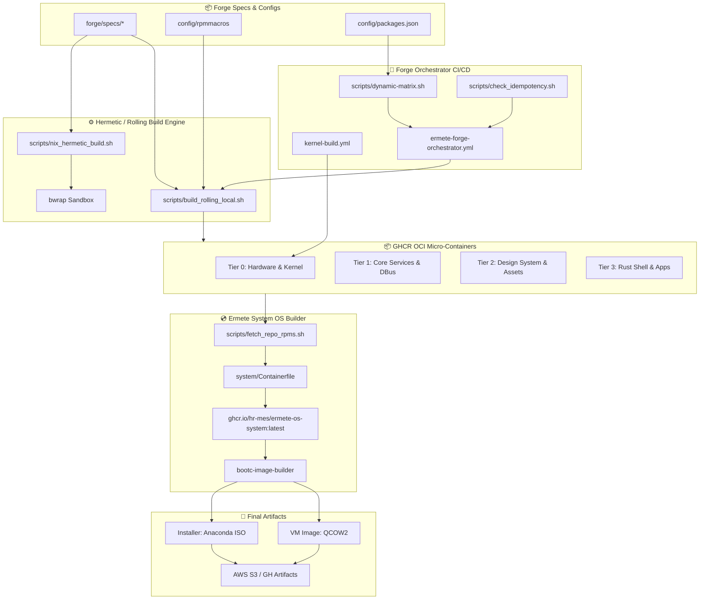
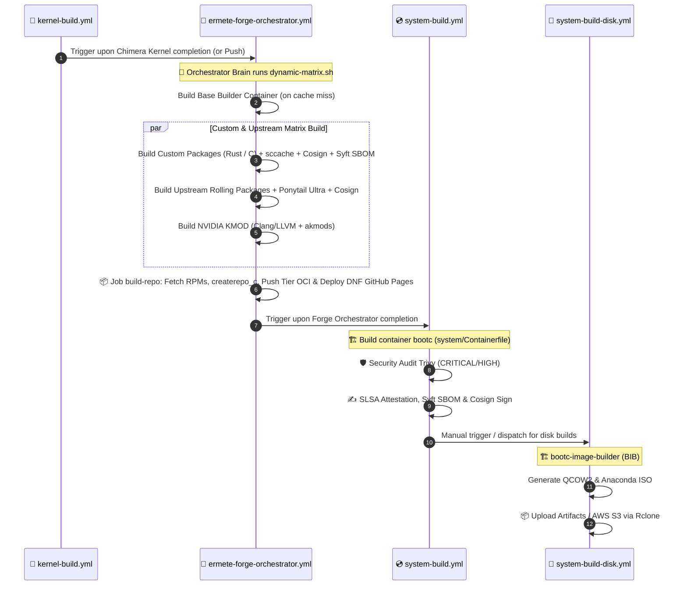

# 🌋 Ermete OS Build Infrastructure Specification

## 1. General Build System Architecture

Ermete OS is an **immutable, cloud-native, and eBPF-hardened** operating system built upon the **Fedora Bootc (OCI Image-Based OS)** paradigm. The build infrastructure is divided into two interconnected macro-components:

1. **Ermete Forge (`forge/`)**: The compilation engine for RPM packages, the Chimera Kernel, and NVIDIA kernel driver modules. Forge employs an **OCI micro-container per package** strategy, structured in a 4-Tier hierarchy and exported both to container registries (GHCR) and as aggregated DNF repositories deployed via GitHub Pages.
2. **Ermete System (`system/`)**: The builder for the immutable system OS image (`ermete-os-system`). It ingests RPM packages from Forge Tier repositories via multi-stage container bind-mounts, installs system services, regenerates the initramfs via Dracut, and outputs bootc OCI images, QCOW2 virtual machine images, and installable Anaconda ISOs.

The entire build target tree is declaratively managed through a unified runner powered by **Justfile** (root `Justfile`, `forge/Justfile`, and `system/Justfile`).

### 1.1 Autarkic CI/CD Ecosystem & Multi-Stage Build Strategy

Ermete OS relies on zero third-party pre-compiled binaries for its assembly line. In **Tier 0** of the Forge, the system self-compiles its own CI/CD toolchain:
- **`kani-verifier`**: Bounded model checking engine for Rust compiled natively (`kani-driver`, `cargo-kani`), enabling formal mathematical verification of security invariants.
- **`just`**: Task runner and build orchestrator compiled with CachyOS optimizations (`-O3 -march=x86-64-v3`, `mold`).
- **`uki-tools`**: Autarkic Secure Boot toolchain combining `sbsigntools` (`sbsign`, `sbverify`, `sbattach`) and `systemd-ukify` (`ukify`).

#### Multi-Stage Architecture (Heavy Builder Produces Lean OS)
- **Stage 1 (`ermete-os-builder`)**: Heavyweight builder container equipped with GCC, LLVM, Rustc, Mold, and the autarkic toolchain (`kani-verifier`, `just`, `uki-tools`). Compiles RPMs in isolated OCI micro-containers.
- **Stage 2 (`ermete-os-system`)**: Final immutable BootC runtime container. Installs compiled RPMs via bind-mounts, generates the initramfs with Dracut, and completely purges the builder toolchain (-1.1 GB disk footprint reduction).



---

## 2. In-Depth Analysis of Bash Scripts in `forge/scripts/`

The `forge/scripts/` directory houses the core automation logic for build execution, idempotency calculations, dependency retrieval, and sandbox isolation.

### 2.1 `build_rolling_local.sh`
* **Purpose**: Local guided compilation of single RPM packages within a rolling environment based on DNF and Bedrock macros.
* **Operational Flow**:
  1. Accepts target package name as parameter (e.g., `just forge/build-rolling niri`).
  2. Verifies and installs host prerequisite tools (`rpm-build`, `dnf-plugins-core`, `rpmdevtools`).
  3. Initializes a temporary `rpmbuild` tree and injects global `forge/config/rpmmacros` into the user's `~/.rpmmacros`.
  4. Enables **RPMFusion Free & NonFree** repositories for Fedora 43.
  5. Downloads source package (`dnf download --source <package>`).
  6. Computes and installs build dependencies automatically via `sudo dnf builddep -y *.src.rpm`.
  7. Injects `%global debug_package %{nil}` into the extracted spec to strip debug sub-packages and optimize final payload size.
  8. Launches extreme compilation via `rpmbuild -bb --nocheck`. If `/work` is mounted, copies generated RPMs to `/work/output/<package>/`.

### 2.2 `check_idempotency.sh`
* **Purpose**: Deterministic calculation of **Cache Hit / Cache Miss** to prevent redundant re-compilations on GHCR.
* **Operational Flow**:
  1. Accepts arguments `--package`, `--registry`, `--owner`, `--image-name`, `--base-digest`.
  2. **For Custom Packages (`specs/ermete-<package>`) or `builder`**:
     - Computes SHA-256 hash combining all files in the spec folder (sorted by relative path and content), `config/rpmmacros`, `builder/Containerfile`, `builder/rpmfusion-custom.repo`, `config/packages.json`, and version seed `CACHE_EPOCH=v7`.
  3. **For Upstream Packages**:
     - Queries DNF (`repoquery`) for exact version and release available in official repositories.
     - Inspects base image digest (`ermete-base-nvidia:latest`) via `skopeo`.
     - Generates `CONTENT_HASH` fusing package name, upstream version, and base image digest.
  4. Inspects GHCR registry via `skopeo inspect --no-tags docker://ghcr.io/<owner>/<image_name>:<CONTENT_HASH>`.
  5. Outputs variables `CACHE_HIT=true|false` and `CONTENT_HASH`.

### 2.3 `dynamic-matrix.sh`
* **Purpose**: Dynamic JSON build matrix generation for GitHub Actions parallel matrix jobs.
* **Operational Flow**:
  1. Parses package arrays from `config/packages.json` (`custom_packages`, `upstream_core`, `upstream_desktop`, `upstream_media`, `upstream_cli`).
  2. Pre-fetches `BASE_DIGEST` for NVIDIA base image via `skopeo` (saving dozens of individual network calls).
  3. Spawns worker container (`ermete-os-builder`) via `podman` and runs `check_idempotency.sh` in parallel across all package definitions using `xargs -n 2 -P 5`.
  4. Filters packages registering `CACHE_HIT=false` (MISS) and constructs JSON vectors for target groups (`custom_packages`, `upstream_packages`, etc.).
  5. Emits results into `$GITHUB_OUTPUT` to feed GitHub Actions matrices.

### 2.4 `fetch_repo_rpms.sh`
* **Purpose**: Incremental caching, OCI container extraction, deduplication, and multi-tier RPM aggregation.
* **Operational Flow**:
  1. Loads Tier definitions from `config/packages.json`:
     - **Tier 0**: Chimera Kernel, NVIDIA drivers, base hardware, base-config, tetragon, core upstream.
     - **Tier 1**: Core User Services, Keylime, Scudo, DBus, desktop upstream.
     - **Tier 2**: Design system, Matugen, Bibata, graphical assets.
     - **Tier 3**: Rust Shell (Niri, Starship, Bat) and user applications.
  2. Pulls aggregated repos from previous runs (`ermete-os-forge-tierX-repo:latest`) and extracts `manifest.json` files containing known hashes.
  3. Downloads and extracts in parallel (via `buildah from` and `buildah mount`) all single-package micro-containers from GHCR into `repo-cache/repo-tierX/`.
  4. **Smart Deduplication**:
     - Deletes outdated RPM versions sharing identical prefixes, preserving only the latest release.
     - Strips standard/legacy kernels when `ermete-kernel` is present.
  5. Synchronizes deduplicated RPMs into aggregated directory `repo-cache/repo/` and generates new JSON manifests for each Tier.

### 2.5 `nix_hermetic_build.sh`
* **Purpose**: Deterministic, hermetic build execution without network access (Nix Paradigm).
* **Operational Flow**:
  1. Accepts lockfile argument (default: `ermete-build.lock`).
  2. Validates cryptographic integrity of downloaded dependencies with `sha256sum --check "$LOCKFILE"`.
  3. Launches **Bubblewrap (`bwrap`)** sandbox with `--unshare-all` flag, revoking all network interfaces and user namespaces.
  4. Mounts host base filesystem as Read-Only (`/usr`, `/tmp`, `/var`, `/proc`, `/dev`) and workspace directory as Read-Write (`/workspace`).
  5. Executes local build script inside total hermetic environment.

---

## 3. Spec File Structure (`forge/specs/`) and Compilation Macros

### 3.1 Spec Organization
The `forge/specs/` directory hosts over 40 custom and adapted RPM package definitions. Each sub-directory `specs/ermete-<package>/` contains:
* **`.spec` file**: Standard RPM definition with `%prep`, `%build`, `%install`, and `%files` directives.
* **`SOURCES/` directory**: Local patches, systemd unit files, SELinux policy modules, and specific assets.
* **`sources.hash` file**: SHA-256 checksums of external tarballs used for pre-build verification.
* **Dedicated Build Scripts** (where required):
  - `specs/ermete-kernel/prepare-chimera.sh`: Downloads official Fedora SRPM, applies **CachyOS BORE (Burst-Oriented Response Enhancer)** scheduler patches, extracts custom Kconfig, and validates NVIDIA module ABI compatibility.
  - `specs/ermete-kernel/build-local.sh`: Local containerized Chimera Kernel builder.

### 3.2 Bedrock Compilation Macros (`forge/config/rpmmacros`)
Compilation flags merge strategies from **Clear Linux, CachyOS, and Gentoo LTO**:

| Parameter / Macro | Configuration / Flags | Purpose & Impact |
| :--- | :--- | :--- |
| **Payload Compression** | `%_binary_payload w19T0.zstdio` | Level 19 multi-threaded ZSTD payload compression for RPM packages. |
| **Diet Audit** | `%_excludedocs 1` | Total stripping of man pages, info pages, and documentation files. |
| **C/C++ Flags** | `-O3 -march=x86-64-v3 -pipe -fno-semantic-interposition -falign-functions=32 -mprefer-vector-width=256` | Maximum AVX2/BMI vectorization, zero I/O latency, and accelerated dynamic symbol lookup. |
| **Linker** | `-fuse-ld=mold -Wl,-O2 -Wl,--as-needed -Wl,--icf=all` | Adoption of hyper-parallel **MOLD** linker with ICF (Identical Code Folding) and dead code elimination. |
| **Rust / Cargo** | `%rustflags -C target-cpu=x86-64-v3 -C opt-level=3 -C codegen-units=16 -C strip=symbols` | Extreme Rust binary optimization with ThinLTO (`CARGO_PROFILE_RELEASE_LTO="thin"`) and `sccache` compiler caching wrapper. |

---

## 4. Bootc Operating System Assembly (`system/`)

### 4.1 `system/Containerfile`
The immutable OS image is compiled through a multi-stage Containerfile:
1. **Base**: Inherits from `ghcr.io/hr-mes/ermete-base-nvidia:latest`.
2. **Kernel Purge**: Strips standard Fedora kernel packages to prevent ABI conflicts.
3. **Multi-Tier Installation (`RUN --mount=type=bind`)**:
   - **Tier 0**: Injects base config and installs **Chimera Kernel** and **NVIDIA** drivers from bind-mounted Tier 0 repos. Enforces kernel lock via DNF.
   - **Tier 1**: Installs **Scudo Hardened Allocator (compiler-rt)**, **Keylime Agent/Tenant**, and Tier 1 system packages.
   - **Tier 2**: Installs design system and graphical assets.
   - **Tier 3**: Installs Rust desktop environment (Niri, Starship, etc.).
4. **Systemd Configuration & Presets**: Enables system-wide services (`tetragon.service`, `systemd-homed.service`, `keylime_agent.service`, `ermete-tpm-rollback-check.service`).
5. **Initramfs Generation (Dracut)**:
   - Identifies exact release version of installed Chimera Kernel.
   - Regenerates reproducible initramfs compressed with `zstd -T0 -15`.
   - Injects essential early modules: `ostree`, `fido2`, `tpm2-tss`, `systemd-pcrphase`.
6. **Hardening & Linting**: Purges build tools (`gcc`, `make`, `llvm-static`), resets `/etc/machine-id`, and runs formal validation via `bootc container lint`.

### 4.2 Disk Configurations (`system/disk_config/`)
* **`disk.toml`**: Consumed by `bootc-image-builder` for VM disk (QCOW2) creation. Sets Bcachefs rootfs minimum size to 20 GiB with default user `hermes`.
* **`iso.toml`**: Consumed for Anaconda installable ISO creation. Injects Kickstart `%post` script executing `bootc switch --mutate-in-place --transport registry ghcr.io/hr-mes/ermete-os:latest` post-installation.

---

## 5. CI/CD Automation (GitHub Actions Pipeline)

The CI/CD pipeline is orchestrated across 4 main GitHub Actions workflows:



### 5.1 Workflow Breakdown
1. **`kernel-build.yml`**:
   - Executes preparation and compilation of Chimera Kernel using LLVM/Clang and ThinLTO.
   - Packages generated RPMs into OCI image `ghcr.io/hr-mes/ermete-os-kernel:latest`.
   - Generates SPDX SBOM with Syft and signs container image with Cosign.
2. **`ermete-forge-orchestrator.yml`**:
   - **`orchestrator-brain` Job**: Calculates build matrix via `dynamic-matrix.sh`.
   - **`custom-packages` & `upstream-packages` Jobs**: Run parallel builds inside `ermete-os-builder` containers, publishing each package as an OCI micro-container `ermete-os-forge-<pkg>`.
   - **`build-nvidia` Job**: Compiles `kmod-nvidia` kernel modules using Clang/LLVM aligned with Chimera Kernel ABI.
   - **`build-repo` Job**: Aggregates all RPMs using `fetch_repo_rpms.sh`, runs `createrepo_c`, signs with GPG key, updates Tier micro-containers, and deploys official DNF repos to `gh-pages` branch.
3. **`system-build.yml`**:
   - Compiles containerized OS image `ermete-os-system` via `system/Containerfile`.
   - Runs vulnerability scanning via **Trivy** (`CRITICAL,HIGH`).
   - Generates SLSA Level 4 provenance attestations, SPDX SBOM via **Syft**, and signs OCI image with **Cosign**.
4. **`system-build-disk.yml`**:
   - Invokes `bootc-image-builder` (BIB) to transform container OCI image into:
     * **QCOW2** (converted to VHDX if needed).
     * **Anaconda ISO** for bare-metal deployments.
   - Uploads generated artifacts to GitHub Actions or **AWS S3** buckets via `rclone`.

---

## 6. Step-by-Step Operations Guide: Packaging & Testing

### Step 1: Add or Modify an RPM Package
1. Define spec in `forge/specs/ermete-<name>/ermete-<name>.spec`.
2. Place local patches or configuration files in `SOURCES/` directory.
3. Register package in target Tier within `forge/config/packages.json` (e.g., `custom_packages` and `custom_tier3`).

### Step 2: Test & Local Build
* **Local Rolling Build**:
  ```bash
  just forge/build-rolling <package-name>
  ```
* **Idempotency Check**:
  ```bash
  just forge/check-idempotency <package-name>
  ```
* **Hermetic Sandbox Build (Nix Paradigm)**:
  ```bash
  just forge/hermetic-build
  ```

### Step 3: Local Chimera Kernel Compilation
```bash
just forge/kernel-prepare full
just forge/kernel-build-local
```

### Step 4: System Operating System Container Build
```bash
just system-build
```
*Creates local container image `localhost/ermete-os-system:latest`.*

### Step 5: Generate Disk & ISO Images
* **Virtual Machine Image (QCOW2)**:
  ```bash
  just disk-qcow2
  ```
* **Anaconda Installable ISO**:
  ```bash
  just disk-iso
  ```

### Step 6: Audit, Lint & Security Validation
```bash
# Run Bash and Justfile linters
just lint

# Rust code security audit
just audit

# Fuzzing suite across Rust components
just fuzz component=all time=60

# NVIDIA driver module validation
just test-nvidia

# Container OS image vulnerability scan
just system/security-scan
```

### Step 7: VM Execution & Mutate-in-Place Testing (`bootc switch`)
1. Boot VM using QEMU/KVM with generated QCOW2 disk:
   ```bash
   qemu-system-x86_64 -enable-kvm -m 4096 -smp 4 -drive file=system/output/qcow2/disk.qcow2,format=qcow2
   ```
2. Update an existing running Ermete OS node to the newly built system image:
   ```bash
   sudo bootc switch ghcr.io/hr-mes/ermete-os-system:latest
   sudo reboot
   ```
