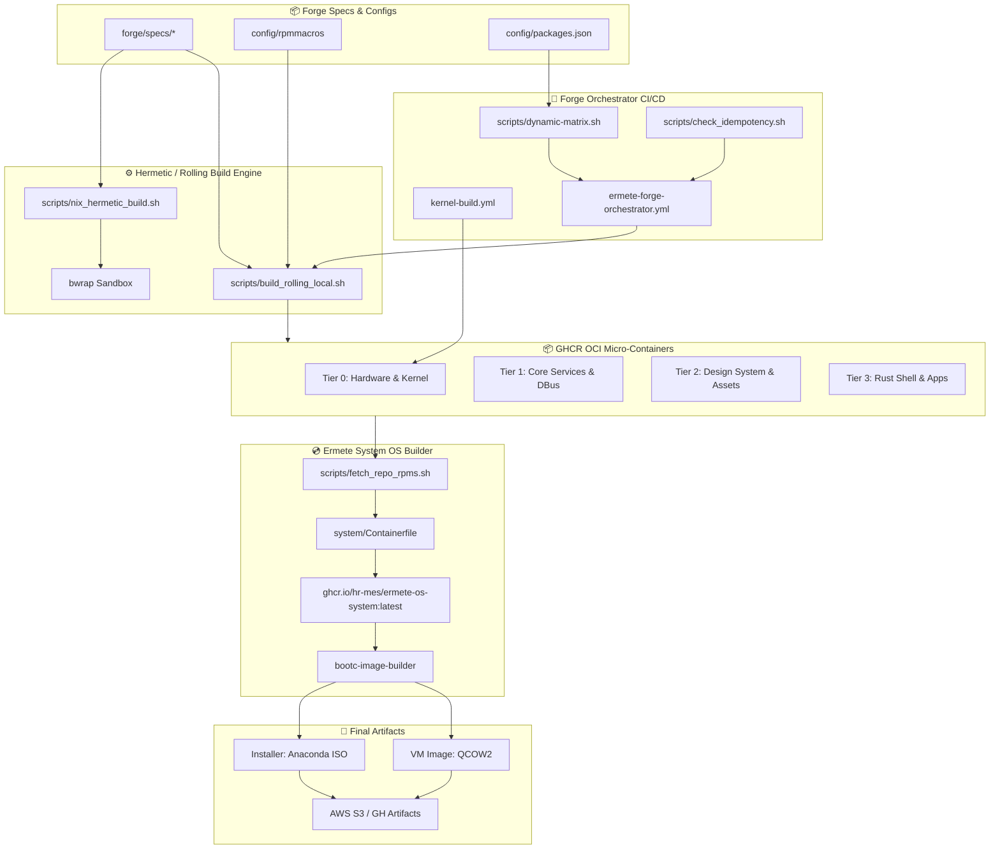
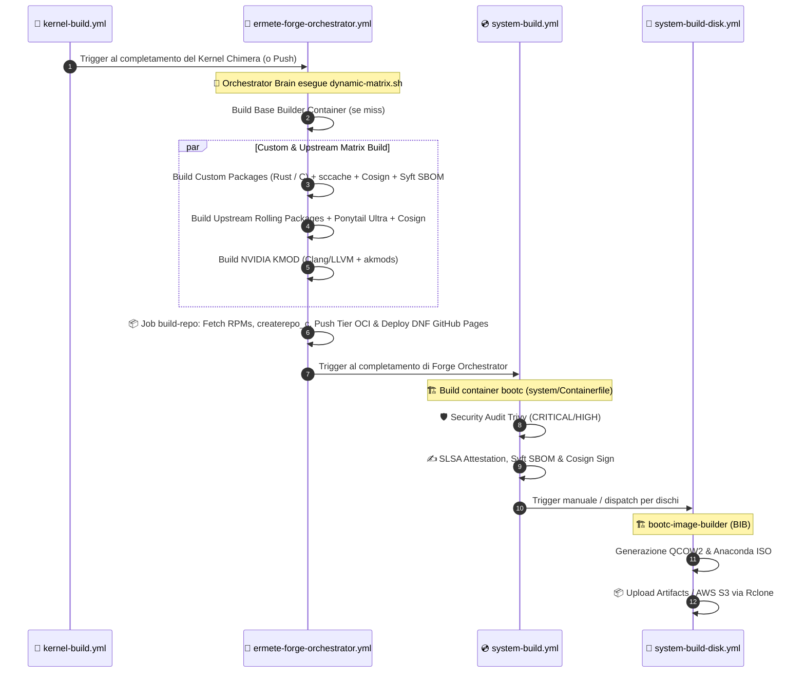

# 🌋 Documentazione dell'Infrastruttura di Build di Ermete OS

## 1. Architettura Generale del Sistema di Build

Ermete OS è un sistema operativo **immutabile, cloud-native ed eBPF-hardened** basato sull'architettura **Fedora Bootc (OCI Image-Based OS)**. L'infrastruttura di build è suddivisa in due macro-componenti interconnessi:

1. **Ermete Forge (`forge/`)**: Il motore di compilazione pacchetti RPM, del Kernel Chimera e dei moduli driver NVIDIA. Forge adotta una strategia di **micro-container OCI per pacchetto**, organizzati in una gerarchia a 4 Tier ed esportati sia verso container registry (GHCR) sia come repository DNF aggregati pubblicati via GitHub Pages.
2. **Ermete System (`system/`)**: Il costruttore dell'immagine di sistema immutabile (`ermete-os-system`). Riceve i pacchetti RPM dai repository Tier di Forge tramite *multi-stage container mounts*, installa e configura i servizi di sistema, rigenera l'initramfs via Dracut ed emette immagini OCI bootc, file QCOW2 per virtualizzazione e immagini ISO installabili via Anaconda.

L'intero albero dei target di build è gestito in maniera dichiarativa tramite un runner unificato basato su **Justfile** (`Justfile` radice, `forge/Justfile` e `system/Justfile`).

### 1.1 Ecosistema di CI/CD Autarchico & Multi-Stage Build Strategy

Ermete OS non dipende da alcun binario pre-compilato di terze parti per la sua catena di montaggio. Nel **Tier 0** della Forgia, il sistema compila la propria toolchain di CI/CD:
- **`kani-verifier`**: Motore di *bounded model checking* per Rust compilato nativamente (`kani-driver`, `cargo-kani`), per la verifica formale formale delle invarianti di sicurezza.
- **`just`**: Task runner e orchestratore di build compilato con ottimizzazioni CachyOS (`-O3 -march=x86-64-v3`, `mold`).
- **`uki-tools`**: Toolchain autarchica Secure Boot che assimila `sbsigntools` (`sbsign`, `sbverify`, `sbattach`) e `systemd-ukify` (`ukify`).

#### Architettura Multi-Stage (Il Builder Pesante produce l'OS Leggero)
- **Stage 1 (`ermete-os-builder`)**: Contenitore pesante dotato di GCC, LLVM, Rustc, Mold e toolchain autarchica (`kani-verifier`, `just`, `uki-tools`). Compila gli RPM in micro-container OCI isolati.
- **Stage 2 (`ermete-os-system`)**: Contenitore finale immutabile BootC. Installa gli RPM compilati via bind-mount, genera l'initramfs con Dracut ed epura completamente la toolchain del builder (-1.1 GB su disco).



---

## 2. Analisi Minuziosa dei Bash Script in `forge/scripts/`

La directory `forge/scripts/` racchiude la logica fondamentale di automazione, calcolo dell'idempotenza, recupero delle dipendenze e isolamento sandbox.

### 2.1 `build_rolling_local.sh`
* **Scopo**: Compilazione locale guidata di pacchetti RPM singoli in un ambiente rolling basato su DNF e macro Bedrock.
* **Flusso Operativo**:
  1. Richiede come parametro il nome del pacchetto (es. `just forge/build-rolling niri`).
  2. Verifica ed installa i tool prerequisiti dell'host (`rpm-build`, `dnf-plugins-core`, `rpmdevtools`).
  3. Inizializza un albero `rpmbuild` temporaneo ed inietta le macro globali `forge/config/rpmmacros` nel file `~/.rpmmacros` dell'utente.
  4. Abilita i repository **RPMFusion Free & NonFree** per Fedora 43.
  5. Scarica il pacchetto sorgente (`dnf download --source <package>`).
  6. Esegue il calcolo e l'installazione automatica delle dipendenze di build via `sudo dnf builddep -y *.src.rpm`.
  7. Inietta la macro `%global debug_package %{nil}` nello spec estratto per disabilitare i sub-pacchetti di debug e ottimizzare la dimensione finale.
  8. Avvia la compilazione estrema con `rpmbuild -bb --nocheck`. Se la directory `/work` è montata nell'ambiente, copia gli RPM generati in `/work/output/<package>/`.

### 2.2 `check_idempotency.sh`
* **Scopo**: Determinazione deterministica del **Cache Hit / Cache Miss** per evitare ricompilazioni ridondanti su GHCR.
* **Flusso Operativo**:
  1. Riceve gli argomenti `--package`, `--registry`, `--owner`, `--image-name`, `--base-digest`.
  2. **Per pacchetti Custom (`specs/ermete-<package>`) o per il `builder`**:
     - Calcola un hash SHA-256 combinando tutti i file presenti nella cartella dello spec (ordinati per percorso relativo e contenuto), il file `config/rpmmacros`, `builder/Containerfile`, `builder/rpmfusion-custom.repo`, `config/packages.json` e il seed di versione `CACHE_EPOCH=v7`.
  3. **Per pacchetti Upstream**:
     - Interroga DNF (`repoquery`) per rilevare la versione e release esatta disponibile nei repo ufficiali.
     - Ispeziona il digest dell'immagine base (`ermete-base-nvidia:latest`) tramite `skopeo`.
     - Genera il `CONTENT_HASH` fondendo nome pacchetto, versione upstream e digest dell'immagine base.
  4. Ispeziona il registry GHCR via `skopeo inspect --no-tags docker://ghcr.io/<owner>/<image_name>:<CONTENT_HASH>`.
  5. Emette le variabili `CACHE_HIT=true|false` e `CONTENT_HASH` in output.

### 2.3 `dynamic-matrix.sh`
* **Scopo**: Generazione dinamica della matrice di build in formato JSON per i job paralleli di GitHub Actions.
* **Flusso Operativo**:
  1. Legge le liste dei pacchetti da `config/packages.json` (`custom_packages`, `upstream_core`, `upstream_desktop`, `upstream_media`, `upstream_cli`).
  2. Recupera in anticipo il `BASE_DIGEST` dell'immagine base NVIDIA via `skopeo` (risparmiando decine di chiamate di rete singole).
  3. Istanzia un contenitore worker (`ermete-os-builder`) via `podman` ed esegue in parallelo su tutte le definizioni di pacchetto gli script `check_idempotency.sh` usando `xargs -n 2 -P 5`.
  4. Filtra i pacchetti che registrano `CACHE_HIT=false` (MISS) e costruisce i vettori JSON per i vari gruppi (`custom_packages`, `upstream_packages`, ecc.).
  5. Scrive i risultati in `$GITHUB_OUTPUT` per alimentare la matrice delle GitHub Actions.

### 2.4 `fetch_repo_rpms.sh`
* **Scopo**: Caching incrementale, estrazione da container OCI, deduplicazione e aggregazione multi-tier dei pacchetti RPM.
* **Flusso Operativo**:
  1. Carica le definizioni dei Tier da `config/packages.json`:
     - **Tier 0**: Kernel Chimera, driver NVIDIA, hardware base, base-config, tetragon, core upstream.
     - **Tier 1**: Core User Services, Keylime, Scudo, DBus, desktop upstream.
     - **Tier 2**: Design system, Matugen, Bibata, asset grafici.
     - **Tier 3**: Rust Shell (Niri, Starship, Bat) e applicazioni utente.
  2. Recupera i repository aggregati della precedente run (`ermete-os-forge-tierX-repo:latest`) ed estrae i file `manifest.json` contenenti gli hash noti.
  3. Scarica ed estrae in parallelo (tramite `buildah from` e `buildah mount`) tutti i micro-container dei singoli pacchetti memorizzati su GHCR nelle relative directory `repo-cache/repo-tierX/`.
  4. **Deduplicazione Intelligente**:
     - Elimina versioni obsolete di pacchetti RPM con lo stesso prefisso, preservando sempre la versione più recente.
     - Rimuove eventuali kernel standard/precedenti se è presente il pacchetto `ermete-kernel`.
  5. Sincronizza tutti gli RPM deduplicati nella directory aggregate `repo-cache/repo/` e genera i nuovi manifest JSON per ogni Tier.

### 2.5 `nix_hermetic_build.sh`
* **Scopo**: Esecuzione di build deterministiche ed ermetiche prive di accesso di rete (Nix-Paradigm).
* **Flusso Operativo**:
  1. Accetta un file di lockfile (default: `ermete-build.lock`).
  2. Valida l'integrità crittografica di tutte le dipendenze scaricate confrontando i checksum con `sha256sum --check "$LOCKFILE"`.
  3. Avvia la sandbox di isolamento **Bubblewrap (`bwrap`)** con flag `--unshare-all` che sradica ogni interfaccia di rete e namespace utente.
  4. Monta in modalità Read-Only il sistema di base host (`/usr`, `/tmp`, `/var`, `/proc`, `/dev`) e in Read-Write solo la directory del workspace in `/workspace`.
  5. Esegue lo script di build locale dentro l'ambiente totalmente hermetico.

---

## 3. Struttura delle Spec (`forge/specs/`) e Macro di Compilazione

### 3.1 Organizzazione delle Spec
La directory `forge/specs/` ospita oltre 40 definizioni di pacchetti RPM custom ed adattati. Ogni sottodirectory `specs/ermete-<package>/` contiene:
* **File `.spec`**: Definizione RPM standard con direttive `%prep`, `%build`, `%install`, `%files`.
* **Directory `SOURCES/`**: Patch locali, file di configurazione systemd, policy SELinux e asset specifici.
* **File `sources.hash`**: Checksum SHA-256 dei tarball o file sorgente esterni usati per la verifica pre-build.
* **Script di Build Dedicati** (ove richiesto):
  - `specs/ermete-kernel/prepare-chimera.sh`: Download dell'SRPM Fedora ufficiale, applicazione delle patch **CachyOS BORE (Burst-Oriented Response Enhancer)**, estrazione configurazione Kconfig custom e validazione compatibilità moduli NVIDIA.
  - `specs/ermete-kernel/build-local.sh`: Script per la compilazione containerizzata locale del kernel Chimera.

### 3.2 Macro di Compilazione Bedrock (`forge/config/rpmmacros`)
Le ottimizzazioni di compilazione uniscono le strategie di **Clear Linux, CachyOS e Gentoo LTO**:

| Parametro / Macro | Configurazione / Flag | Scopo & Impatto |
| :--- | :--- | :--- |
| **Payload Compression** | `%_binary_payload w19T0.zstdio` | Compressione ZSTD livello 19 multi-thread per i pacchetti RPM. |
| **Diet Audit** | `%_excludedocs 1` | Disabilitazione totale di man pages, info pages e documentazione. |
| **C/C++ Flags** | `-O3 -march=x86-64-v3 -pipe -fno-semantic-interposition -falign-functions=32 -mprefer-vector-width=256` | Massima ottimizzazione vettoriale AVX2/BMI, azzeramento latenza I/O e velocizzazione chiamate dinamiche. |
| **Linker** | `-fuse-ld=mold -Wl,-O2 -Wl,--as-needed -Wl,--icf=all` | Adozione del linker iper-parallelo **MOLD** con ICF (Identical Code Folding) e rimozione codice inutilizzato. |
| **Rust / Cargo** | `%rustflags -C target-cpu=x86-64-v3 -C opt-level=3 -C codegen-units=16 -C strip=symbols` | Ottimizzazione estrema binaries Rust con ThinLTO (`CARGO_PROFILE_RELEASE_LTO="thin"`) e wrapper `sccache`. |

---

## 4. Assemblaggio del Sistema Operativo Bootc (`system/`)

### 4.1 `system/Containerfile`
L'immagine immutabile dell'OS viene compilata tramite un Containerfile multi-stage estremamente strutturato:
1. **Base**: Parte da `ghcr.io/hr-mes/ermete-base-nvidia:latest`.
2. **Purge Kernel**: Rimuove i pacchetti kernel standard di Fedora per evitare conflitti.
3. **Installazione Multi-Tier (`RUN --mount=type=bind`)**:
   - **Tier 0**: Inietta la base config ed installa il **Kernel Chimera** e i driver **NVIDIA** dai repo bind-mounted di Tier 0. Blocco permanente degli aggiornamenti kernel via DNF.
   - **Tier 1**: Installa lo **Scudo Hardened Allocator (compiler-rt)**, **Keylime Agent/Tenant** e i pacchetti di sistema Tier 1.
   - **Tier 2**: Installa il design system e gli asset grafici.
   - **Tier 3**: Installa l'ambiente desktop Rust (Niri, Starship, ecc.).
4. **Configurazione Systemd & Presets**: Abilita i servizi trasversali (`tetragon.service`, `systemd-homed.service`, `keylime_agent.service`, `ermete-tpm-rollback-check.service`).
5. **Initramfs Generation (Dracut)**:
   - Identifica la versione esatta del Kernel Chimera installato.
   - Rigenera l'initramfs riproducibile compresso in `zstd -T0 -15`.
   - Inietta i moduli essenziali: `ostree`, `fido2`, `tpm2-tss`, `systemd-pcrphase`.
6. **Hardening & Linting**: Rimuove i tool di build residui (`gcc`, `make`, `llvm-static`), resetta `/etc/machine-id` ed esegue la validazione formale via `bootc container lint`.

### 4.2 Configurazione Dischi (`system/disk_config/`)
* **`disk.toml`**: Utilizzato da `bootc-image-builder` per la generazione di dischi VM (QCOW2). Imposta rootfs Bcachefs con dimensione minima 20 GiB e utente predefinito `hermes`.
* **`iso.toml`**: Utilizzato per la generazione dell'ISO Anaconda installabile. Inietta lo script Kickstart `%post` per eseguire `bootc switch --mutate-in-place --transport registry ghcr.io/hr-mes/ermete-os:latest` al termine dell'installazione.

---

## 5. Automazione CI/CD (GitHub Actions Workflow Pipeline)

Il processo di CI/CD è orchestrato tramite 4 workflow GitHub Actions principali:



### 5.1 Dettaglio Workflows
1. **`kernel-build.yml`**:
   - Esegue la preparazione e compilazione del Kernel Chimera con LLVM/Clang e ThinLTO.
   - Confeziona gli RPM generati nell'immagine OCI `ghcr.io/hr-mes/ermete-os-kernel:latest`.
   - Genera SBOM SPDX con Syft e firma il container con Cosign.
2. **`ermete-forge-orchestrator.yml`**:
   - **Job `orchestrator-brain`**: Calcola i vettori di build con `dynamic-matrix.sh`.
   - **Job `custom-packages` & `upstream-packages`**: Eseguono build in parallelo dentro contenitori `ermete-os-builder`, pubblicando ciascun pacchetto come micro-container OCI `ermete-os-forge-<pkg>`.
   - **Job `build-nvidia`**: Compila i moduli kernel `kmod-nvidia` utilizzando Clang/LLVM in sintonia con il kernel Chimera.
   - **Job `build-repo`**: Raccoglie tutti gli RPM con `fetch_repo_rpms.sh`, esegue `createrepo_c`, firma con chiave GPG, aggiorna i micro-container dei Tier e pubblica i repository DNF ufficiali sul ramo `gh-pages` (GitHub Pages).
3. **`system-build.yml`**:
   - Compila l'immagine container OS `ermete-os-system` tramite `system/Containerfile`.
   - Effettua la scansione delle vulnerabilità con **Trivy** (`CRITICAL,HIGH`).
   - Genera l'attestazione SLSA Level 4, lo SBOM SPDX via **Syft** e firma l'immagine OCI con **Cosign**.
4. **`system-build-disk.yml`**:
   - Invoca `bootc-image-builder` (BIB) per trasformare l'immagine container OCI in:
     * **QCOW2** (convertito in VHDK se necessario).
     * **Anaconda ISO** per installazione bare-metal.
   - Pubblica le immagini generate negli artifact di GitHub Actions o su bucket **AWS S3** tramite `rclone`.

---

## 6. Guida Operativa Step-by-Step: Pacchettizzazione e Testing dell'OS

### Passo 1: Aggiunta o Modifica di un Pacchetto RPM
1. Definire la spec in `forge/specs/ermete-<nome>/ermete-<nome>.spec`.
2. Aggiungere eventuali patch o sorgenti locali nella cartella `SOURCES/`.
3. Registrare il pacchetto nel Tier appropriato all'interno di `forge/config/packages.json` (es. in `custom_packages` e `custom_tier3`).

### Passo 2: Test e Build Locale del Pacchetto
* **Compilazione Rolling Locale**:
  ```bash
  just forge/build-rolling <nome-pacchetto>
  ```
* **Test di Idempotenza**:
  ```bash
  just forge/check-idempotency <nome-pacchetto>
  ```
* **Compilazione Hermetica Sandbox (Paradigma Nix)**:
  ```bash
  just forge/hermetic-build
  ```

### Passo 3: Compilazione Locale del Kernel Chimera
```bash
just forge/kernel-prepare full
just forge/kernel-build-local
```

### Passo 4: Build dell'Immagine Container del Sistema Operativo
```bash
just system-build
```
*Questo comando crea l'immagine container locale `localhost/ermete-os-system:latest`.*

### Passo 5: Generazione delle Immagini Disco e ISO
* **Immagine per Macchina Virtuale QCOW2**:
  ```bash
  just disk-qcow2
  ```
* **ISO Installabile Anaconda**:
  ```bash
  just disk-iso
  ```

### Passo 6: Audit, Linter e Test di Sicurezza
```bash
# Esecuzione linter Bash e Justfile
just lint

# Audit di sicurezza codice Rust
just audit

# Fuzzing suite sui componenti Rust
just fuzz component=all time=60

# Validazione moduli driver NVIDIA
just test-nvidia

# Scansione vulnerabilità immagine OS container
just system/security-scan
```

### Passo 7: Esecuzione VM e Test del Mutate-in-Place (`bootc switch`)
1. Avviare la VM con QEMU/KVM usando la QCOW2 generata:
   ```bash
   qemu-system-x86_64 -enable-kvm -m 4096 -smp 4 -drive file=system/output/qcow2/disk.qcow2,format=qcow2
   ```
2. Per aggiornare un sistema Ermete OS esistente alla nuova build:
   ```bash
   sudo bootc switch ghcr.io/hr-mes/ermete-os-system:latest
   sudo reboot
   ```
```
