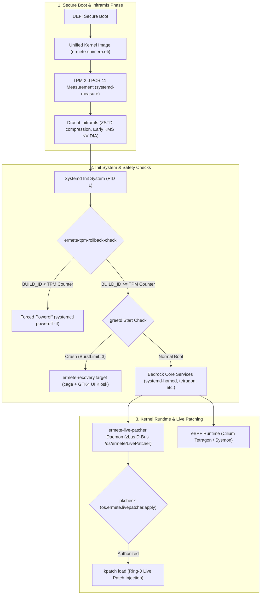
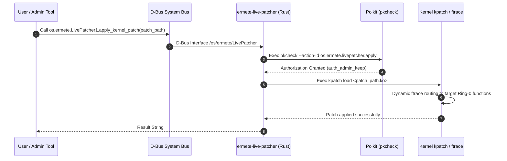

# Kernel Layer Architecture & Bedrock Foundation Specification

> [!IMPORTANT]
> The lowest layer of Ermete OS (Tier 0 / Bedrock Foundation) unifies an immutable OCI/bootc (OSTree Container) philosophy, a custom-built kernel (**Ermete Chimera Kernel**), zero-downtime Ring-0 hot-patching via D-Bus/Polkit, cryptographic boot measurement via TPM 2.0, and hardware anti-downgrade counter protection.

---

## 1. Kernel Layer & Boot Sequence Topology Map

The diagram below details the end-to-end execution flow from UEFI/UKI initialization to live patching and eBPF runtime loading.



---

## 2. Chimera Kernel Engine: Architecture, Toolchain & Kconfig

The Ermete OS kernel is compiled through a dynamic pipeline managed by `forge/specs/ermete-kernel/prepare-chimera.sh` and `ermete-kernel.spec`.

### 2.1 Toolchain & LLVM Standards
- **Upstream Base**: Fedora Kernel Linux 6.14.x.
- **NVIDIA Shield (Dynamic Ceiling)**: Automated calculation of maximum kernel release supported by installed NVIDIA drivers (`akmod-nvidia`), preventing ABI/KMOD incompatibilities.
- **Toolchain**: Native LLVM/Clang 18+ (`LLVM=1 LLVM_IAS=1`, `%toolchain clang`, `%_ld ld.lld`).
- **LTO Optimization & Profiling**:
  - ThinLTO enabled (`CONFIG_LTO_CLANG_THIN=y`).
  - Aggressive performance tuning (`CONFIG_CC_OPTIMIZE_FOR_PERFORMANCE_O3=y`, `-O3 -march=x86-64-v3`).
  - AutoFDO (Sample PGO) driven by ChromeOS Kernel AFDO profiles (`-fprofile-sample-use`).

### 2.2 Patches & Scheduler
- **CachyOS BORE Scheduler**: Burst-Oriented Response Enhancer (`CONFIG_SCHED_BORE=y`) minimizing latency for interactive UI workloads.
- **Networking**: BBRv3 TCP Congestion Control (`CONFIG_DEFAULT_BBR=y`, `CONFIG_TCP_CONG_BBR=y`).
- **Memory Management**: Multi-Gen LRU (`CONFIG_LRU_GEN=y`, `CONFIG_LRU_GEN_ENABLED=y`), ZSTD Memory Compression (`CONFIG_ZRAM_DEF_COMP_ZSTD=y`, `CONFIG_ZSWAP_COMPRESSOR_DEFAULT_ZSTD=y`), and Ultra Kernel Samepage Merging (`CONFIG_UKSM=y`).
- **Wine/Proton Acceleration**: Native NTSYNC integration (`CONFIG_NTSYNC=y`).
- **Rust Kernel Integration**: Native Rust support (`CONFIG_RUST=y`).

### 2.3 Hardening KSPP (Kernel Self-Protection Project)
Strict zero-trust security configuration:
```ini
CONFIG_FORTIFY_SOURCE=y
CONFIG_RANDOMIZE_BASE=y            # KASLR
CONFIG_RANDOMIZE_MEMORY=y          # Memory KASLR
CONFIG_PAGE_TABLE_ISOLATION=y      # PTI (Meltdown protection)
CONFIG_BPF_UNPRIV_DEFAULT_OFF=y    # Disable unprivileged eBPF
CONFIG_SECURITY_DMESG_RESTRICT=y   # Restrict dmesg access
CONFIG_LEGACY_VSYSCALL_NONE=y     # Strip legacy vsyscall
CONFIG_LOCK_DOWN_KERNEL_FORCE_INTEGRITY=y # Integrity lockdown mode
CONFIG_CFI_CLANG=y                 # Control Flow Integrity
CONFIG_SHADOW_CALL_STACK=y         # Shadow Call Stack
```

### 2.4 Legacy Ablation
Aggressive removal of obsolete drivers to shrink attack surface and eliminate compilation overhead under ThinLTO:
- Removal of floppy, parport, legacy PATA, ISDN, `nouveau`.
- Stripping of non-essential datacenter NIC drivers (`MELLANOX`, `CHELSIO`, `QLOGIC`, `NETRONOME`, `CAVIUM`).

---

## 3. Kernel Live-Patcher Engine (`ermete-live-patcher` & `ermete-livepatch`)

Ermete OS implements zero-downtime Ring-0 hot-patching, eliminating reboots for critical security updates.



### 3.1 `ermete-live-patcher` (Rust D-Bus Daemon)
- **Source**: `forge/specs/ermete-live-patcher/ermete-live-patcher-1.0.0/src/main.rs`.
- **Technology**: Rust, `tokio`, `zbus`.
- **D-Bus Service**: Registered on System Bus under name `os.ermete.LivePatcher` at path `/os/ermete/LivePatcher`.
- **Polkit Access Control**: Verifies D-Bus caller authorization via Polkit action `os.ermete.livepatcher.apply`.
- **Execution**: Invokes `kpatch load <path.ko>` upon credential validation.

### 3.2 Polkit Policy Configuration
Provided in `os.ermete.livepatcher.policy`:
```xml
<action id="os.ermete.livepatcher.apply">
  <description>Apply Kernel Live Patch</description>
  <message>Authentication is required to apply kernel live patches.</message>
  <defaults>
    <allow_any>auth_admin</allow_any>
    <allow_inactive>auth_admin</allow_inactive>
    <allow_active>auth_admin_keep</allow_active>
  </defaults>
</action>
```

### 3.3 Boot Injection Manager (`ermete-livepatch`)
- **Source**: `forge/specs/ermete-livepatch/ermete-livepatch-injector.sh`.
- **Function**: Boot script scanning `/usr/lib/modules/livepatch/` and injecting `.ko` modules via `insmod`, enforcing immediate persistent patch application.

---

## 4. Disk Parameters, Kickstart & Filesystem Immutability

Partitioning layouts and bare-metal installation manifests are defined in `system/disk_config/` and `system/ermete-install.ks`.

### 4.1 TOML Partition Declarations (`system/disk_config/`)
- `disk.toml`: Root `/` mount point definition with 20 GiB minimum allocation and system user `hermes` (group `wheel`).
- `iso.toml`: Anaconda module parameters (Storage, Runtime, Network, Security, Services, Users, Timezone) and Kickstart `%post` directive for OCI binding:
  ```toml
  [customizations.installer.kickstart]
  contents = """
  %post
  bootc switch --mutate-in-place --transport registry ghcr.io/hr-mes/ermete-os:latest
  %end
  """
  ```

### 4.2 Bare-Metal Kickstart (`system/ermete-install.ks`)
- **Kernel Boot Parameters**:
  ```bash
  bootloader --append="quiet splash fastboot iommu=pt intel_iommu=on amd_iommu=on efi=disable_early_pci_dma zswap.enabled=1 zswap.compressor=zstd rootflags=noatime slab_nomerge pti=on randomize_kstack_offset=on vsyscall=none debugfs=off oops=panic module.sig_enforce=1 lockdown=integrity init_on_free=1"
  ```
- **OSTree Image Provisioning**:
  ```bash
  ostreecontainer --url=ghcr.io/hr-mes/ermete-os-system:latest --transport=registry
  ```
- **TPM 2.0 Monotonic Counter Initialization**:
  Initializes hardware TPM2 NV index counter `0x01800001`:
  ```bash
  tpm2_nvdefine 0x01800001 -C o -s 8 -a "ownerread|ownerwrite|authread|authwrite|nt=counter"
  tpm2_nvincrement 0x01800001 -C o
  ```
- **Encrypted User Home (`systemd-homed` with LUKS2 + TPM2 + FIDO2)**:
  ```bash
  homectl create hermes \
      --storage=luks \
      --fs-type=ext4 \
      --member-of=wheel \
      --tpm2-device=auto \
      --tpm2-pcrs=7+11 \
      --fido2-device=auto
  ```

---

## 5. Init System, Initramfs & Bootc Modules (Dracut & Systemd)

### 5.1 Dracut Slim Initramfs (`99-ermete-slim-boot.conf` & Containerfile)
Generates a reproducible, highly compressed ZSTD initramfs:
- **Compression**: `zstd -T0 -19 --long=27` (or `-15` inside Containerfile).
- **Module Omission**: Omits non-critical modules (`pcsc`, `floppy`, `nfs`, `cifs`, `iscsi`, `network`, `bluetooth`, `plymouth`, `nouveau`, `simpledrm`).
- **Critical Inclusions**: Includes `ostree`, `fido2`, `tpm2-tss`, `systemd-pcrphase`, and early NVIDIA KMS drivers (`nvidia`, `nvidia_modeset`, `nvidia_uvm`, `nvidia_drm`).

### 5.2 Bootc Declarative Kernel Arguments (`usr/lib/bootc/kargs.d/`)
Organizes kernel arguments into modular TOML files in `ermete-base-config`:
1. `01-nvidia.toml`: `nvidia-drm.modeset=1`, `nvidia-drm.fbdev=1`, `nvidia.NVreg_PreserveVideoMemoryAllocations=1`
2. `02-hardening.toml`: `slab_nomerge`, `pti=on`, `randomize_kstack_offset=on`, `vsyscall=none`, `debugfs=off`, `oops=panic`, `module.sig_enforce=1`, `lockdown=integrity`, `init_on_free=1`
3. `03-ima-evm.toml`: `ima_appraise=enforce`, `ima_policy=tcb`, `ima_policy=appraise_tcb`, `ima_hash=sha256`, `evm=enforce`, `evm_hash=sha256`
4. `04-confidential-compute.toml`: `mem_encrypt=on`, `kvm_amd.sev=1`, `kvm_intel.tdx=1`
5. `05-dma-protection.toml`: `intel_iommu=on`, `amd_iommu=on`, `efi=disable_early_pci_dma`
6. `06-mte-lam.toml`: `arm64.mte=on`, `lam=on`

### 5.3 Systemd Preset Optimization (`99-Ermete-Base.preset`)
To eliminate boot bottlenecks:
- **Disabled**: `NetworkManager-wait-online.service`, `systemd-networkd-wait-online.service`, `plymouth-quit-wait.service`, `systemd-udev-settle.service`, `systemd-remount-fs.service`.
- **Enabled**: `nvidia-powerd.service`, `nvidia-persistenced.service`, `systemd-homed.service`, `tetragon.service`, `keylime_agent.service`, `ermete-tpm-rollback-check.service`, `ermete-tpm-rollback-update.service`.

---

## 6. Measured Secure Boot, TPM Anti-Rollback & Recovery Kiosk

### 6.1 Unified Kernel Image (UKI) & Measured Boot (`ermete-secure-boot`)
`ermete-secure-boot` handles cryptographic signing and kernel measurement:
1. **UKI Assembly**: `systemd-ukify build` unifies `vmlinuz`, `initramfs.img`, `cmdline`, and `os-release` into EFI binary `/boot/efi/EFI/Linux/ermete-chimera.efi`.
2. **PCR 11 Prediction**: `systemd-measure sign` pre-calculates TPM PCR 11 register state, emitting `/etc/systemd/pcrlock.json`.
3. **UEFI Secure Boot Signing**: `sbsign` signs UKI payload with platform key (`ermete-secure-boot.key`).

### 6.2 Hardware TPM 2.0 Anti-Rollback Protection (`ermete-tpm-rollback-check`)
`/usr/libexec/ermete/ermete-tpm-rollback-check.sh` executes during `systemd-pcrphase-sysinit.service.d`:
- Reads TPM2 NV index counter `0x01800001` via `tpm2_nvread`.
- Compares `/etc/os-release` `BUILD_ID` against hardware counter.
- **Threat Mitigation**: If `BUILD_ID < TPM Counter` (downgrade / rollback attack), triggers forced shutdown:
  ```bash
  systemctl poweroff -ff
  ```
- Valid updates trigger `ermete-tpm-rollback-update.sh`, incrementing the hardware NV index via `tpm2_nvincrement`.

### 6.3 Pre-Boot GUI Recovery Kiosk (`ermete-recovery`)
If `greetd` fails boot execution 3 consecutive times (`StartLimitBurst=3`):
1. Systemd isolates system to `ermete-recovery.target`.
2. Launches `cage` Wayland compositor running GTK4 application `ermete-recovery-ui`.
3. Admin can execute a 1-click automated rollback to a known-good OSTree/bootc deployment.

### 6.4 Level 12 Unikernel Runtime Engine (`x86_64-unknown-hermit`)
The **Level 12 Unikernel Runtime Engine** enables compiling Rust microservices as bare-metal Ring-0 unikernels based on **RustyHermit** (`x86_64-unknown-hermit`):
1. **Zero POSIX Overhead**: Bypasses traditional POSIX userland and syscall stacks, running network daemons directly on hypervisor layer (`uhyve`).
2. **Hermetic Build Pipeline**: Invoked via `system/scripts/build_unikernel.sh` and targets `just unikernel` / `just system/build-unikernel` using `-Z build-std=std,panic_abort`.
3. **Immutability & Zero-Trust Isolation**: Sub-2MB footprint binaries suited for cloud microservices and zero-latency P2P mesh networking.

---

## 7. Kernel Layer Component Summary

| Component | Path / Spec | Stack | Architectural Role |
| :--- | :--- | :--- | :--- |
| **Ermete Chimera Kernel** | `forge/specs/ermete-kernel/` | C / Rust / Clang LLVM | Custom x86-64-v3 kernel, ThinLTO, AutoFDO, BORE scheduler, BBRv3, Zero-Trust hardening. |
| **`ermete-live-patcher`** | `forge/specs/ermete-live-patcher/` | Rust (`zbus`, `tokio`) | D-Bus and Polkit daemon for zero-downtime Ring-0 patch application via `kpatch`. |
| **`ermete-livepatch`** | `forge/specs/ermete-livepatch/` | Bash | Boot injection script for persistent `.ko` modules in `/usr/lib/modules/livepatch/`. |
| **Disk Config & KS** | `system/disk_config/`, `system/ermete-install.ks` | TOML / Kickstart | LUKS2+TPM2 partitioning, `systemd-homed`, `bootc switch` OCI immutability setup. |
| **Base Config & Kargs** | `forge/specs/ermete-base-config/` | TOML / Systemd Presets | Bootc kernel arguments (NVIDIA, IMA/EVM, Confidential Compute), Dracut Slim configuration. |
| **Secure Boot & TPM** | `forge/specs/ermete-secure-boot/` | Bash / TPM2 Tools / `ukify` | UKI generation, Secure Boot signing, PCR 11 measurement, TPM hardware counter anti-rollback. |
| **Recovery Kiosk** | `forge/specs/ermete-recovery/` | Rust (GTK4 + `cage`) | Pre-boot GUI emergency recovery environment with 1-click OSTree/bootc rollback. |
| **Unikernel Runtime Engine** | `system/unikernel/`, `system/scripts/build_unikernel.sh` | Rust (RustyHermit target) | Bare-metal Ring-0 zero-latencyunikernel runtime & compilation toolchain. |
