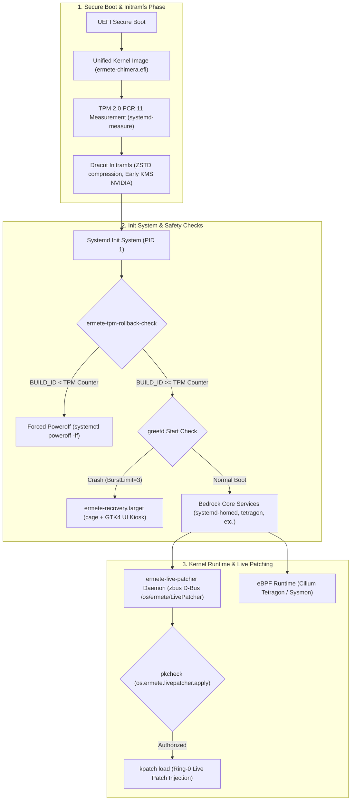
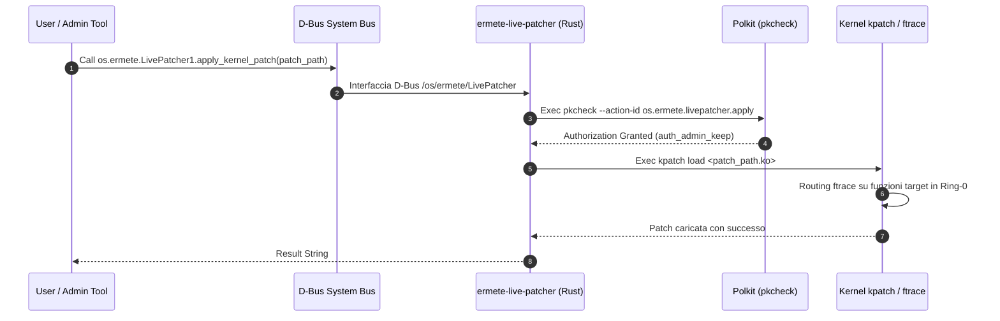

# Architettura dello Strato Kernel e Fondamenta di Ermete OS

> [!IMPORTANT]
> Lo strato più basso di Ermete OS (Tier 0 / Bedrock Foundation) combina una filosofia di immutabilità OCI/bootc (OSTree Container), un kernel fortemente personalizzato (**Ermete Chimera Kernel**), patching a caldo Ring-0 via D-Bus/Polkit, misurazione crittografica del boot tramite TPM 2.0 e protezione anti-downgrade hardware.

---

## 1. Mappa Architetturale dello Strato Kernel & Boot Sequence

Il diagramma sottostante illustra il flusso completo dal caricamento UEFI/UKI fino all'esecuzione dei daemon di live patching ed eBPF nel sistema operativo.



---

## 2. Chimera Kernel Engine: Architettura, Toolchain e Kconfig

Il kernel di Ermete OS viene compilato tramite una pipeline dinamica gestita dallo script `forge/specs/ermete-kernel/prepare-chimera.sh` e dal file spec `ermete-kernel.spec`.

### 2.1 Standard di Compilazione & Toolchain LLVM
- **Upstream Base**: Fedora Kernel Linux 6.14.x.
- **NVIDIA Shield (Dynamic Ceiling)**: Calcolo automatico della versione massima del kernel supportata dai driver NVIDIA installati (`akmod-nvidia`), evitando incompatibilità ABI/KMOD.
- **Toolchain**: LLVM/Clang 18+ nativo (`LLVM=1 LLVM_IAS=1`, `%toolchain clang`, `%_ld ld.lld`).
- **Ottimizzazione LTO & Profiling**:
  - ThinLTO abilitato (`CONFIG_LTO_CLANG_THIN=y`).
  - Ottimizzazione aggressive delle prestazioni (`CONFIG_CC_OPTIMIZE_FOR_PERFORMANCE_O3=y`, `-O3 -march=x86-64-v3`).
  - AutoFDO (Sample PGO) basato sui profili ChromeOS Kernel AFDO (`-fprofile-sample-use`).

### 2.2 Patches & Scheduler
- **CachyOS BORE Scheduler**: Burst-Oriented Response Enhancer (`CONFIG_SCHED_BORE=y`) per minimizzare la latenza nei carichi interattivi e UI.
- **Networking**: BBRv3 TCP Congestion Control (`CONFIG_DEFAULT_BBR=y`, `CONFIG_TCP_CONG_BBR=y`).
- **Memory Management**: Multi-Gen LRU (`CONFIG_LRU_GEN=y`, `CONFIG_LRU_GEN_ENABLED=y`), ZSTD Memory Compression (`CONFIG_ZRAM_DEF_COMP_ZSTD=y`, `CONFIG_ZSWAP_COMPRESSOR_DEFAULT_ZSTD=y`), e Ultra Kernel Samepage Merging (`CONFIG_UKSM=y`).
- **Wine/Proton Acceleration**: Integratione NTSYNC nativa (`CONFIG_NTSYNC=y`).
- **Rust in Kernel**: Abilitazione supporto Rust nativo nel kernel (`CONFIG_RUST=y`).

### 2.3 Hardening KSPP (Kernel Self-Protection Project)
Il kernel applica una politica Zero-Trust rigorosa:
```ini
CONFIG_FORTIFY_SOURCE=y
CONFIG_RANDOMIZE_BASE=y            # KASLR
CONFIG_RANDOMIZE_MEMORY=y          # Memory KASLR
CONFIG_PAGE_TABLE_ISOLATION=y      # PTI (Meltdown protection)
CONFIG_BPF_UNPRIV_DEFAULT_OFF=y    # Disabilita eBPF non privilegiato
CONFIG_SECURITY_DMESG_RESTRICT=y   # Blocca dmesg agli utenti standard
CONFIG_LEGACY_VSYSCALL_NONE=y     # Eliminazione vsyscall legacy
CONFIG_LOCK_DOWN_KERNEL_FORCE_INTEGRITY=y # Lockdown in modalità Integrity
CONFIG_CFI_CLANG=y                 # Control Flow Integrity
CONFIG_SHADOW_CALL_STACK=y         # Shadow Call Stack
```

### 2.4 Legacy Ablation
Rimozione drastica di driver e sottosistemi obsoleti per ridurre la superficie d'attacco ed eliminare l'overhead in compilazione ThinLTO:
- Disabilitazione floppy, parport, PATA legacy, ISDN, `nouveau`.
- Disabilitazione driver NIC Datacenter non necessari (`MELLANOX`, `CHELSIO`, `QLOGIC`, `NETRONOME`, `CAVIUM`).

---

## 3. Kernel Live-Patcher Engine (`ermete-live-patcher` & `ermete-livepatch`)

Ermete OS integra un'architettura di patching a caldo del kernel in Ring-0 a **zero downtime**, evitando reboot per patch di sicurezza critiche.



### 3.1 `ermete-live-patcher` (Daemon Rust D-Bus)
- **Codice**: `forge/specs/ermete-live-patcher/ermete-live-patcher-1.0.0/src/main.rs`.
- **Tecnologia**: Rust, `tokio`, `zbus`.
- **Servizio D-Bus**: Registrato sul System Bus sotto il name `os.ermete.LivePatcher` e l'oggetto `/os/ermete/LivePatcher`.
- **Controllo Accessi Polkit**: Verifica il chiamante D-Bus interrogando Polkit tramite l'azione `os.ermete.livepatcher.apply`.
- **Esecuzione**: Esegue `kpatch load <path.ko>` dopo l'approvazione delle credenziali.

### 3.2 Polkit Policy Configuration
Fornita in `os.ermete.livepatcher.policy`:
```xml
<action id="os.ermete.livepatcher.apply">
  <description>Apply Kernel Live Patch</description>
  <message>Authentication is required to apply kernel live patches.</message>
  <defaults>
    <allow_any>auth_admin</allow_any>
    <allow_inactive>auth_admin</allow_inactive>
    <allow_active>auth_admin_keep</allow_active>
  </defaults>
</action>
```

### 3.3 Boot Injection Manager (`ermete-livepatch`)
- **Codice**: `forge/specs/ermete-livepatch/ermete-livepatch-injector.sh`.
- **Funzione**: Script eseguito all'avvio che scansiona la directory `/usr/lib/modules/livepatch/` e inietta i moduli `.ko` preesistenti tramite `insmod`, garantendo l'applicazione immediata delle patch persistenti.

---

## 4. Configuration parameters, Kickstart & Immutabilità del File System

Il layout di partizionamento e l'infrastruttura di installazione bare-metal sono definiti in `system/disk_config/` e `system/ermete-install.ks`.

### 4.1 Dichiarazioni TOML di Partizionamento (`system/disk_config/`)
- `disk.toml`: Definizione del punto di montaggio radice `/` con dimensione minima di 20 GiB e creazione dell'utente di sistema `hermes` (gruppo `wheel`).
- `iso.toml`: Configurazione dei moduli Anaconda (Storage, Runtime, Network, Security, Services, Users, Timezone) e istruzione Kickstart `%post` per il binding immutabile OCI:
  ```toml
  [customizations.installer.kickstart]
  contents = """
  %post
  bootc switch --mutate-in-place --transport registry ghcr.io/hr-mes/ermete-os:latest
  %end
  """
  ```

### 4.2 Kickstart Bare-Metal (`system/ermete-install.ks`)
- **Parametri Kernel da Bootloader**:
  ```bash
  bootloader --append="quiet splash fastboot iommu=pt intel_iommu=on amd_iommu=on efi=disable_early_pci_dma zswap.enabled=1 zswap.compressor=zstd rootflags=noatime slab_nomerge pti=on randomize_kstack_offset=on vsyscall=none debugfs=off oops=panic module.sig_enforce=1 lockdown=integrity init_on_free=1"
  ```
- **Image Provisioning OSTree**:
  ```bash
  ostreecontainer --url=ghcr.io/hr-mes/ermete-os-system:latest --transport=registry
  ```
- **Inizializzazione Monotonic Counter TPM 2.0**:
  Dichiara e incrementa il contatore TPM2 hardware all'indice NV `0x01800001`:
  ```bash
  tpm2_nvdefine 0x01800001 -C o -s 8 -a "ownerread|ownerwrite|authread|authwrite|nt=counter"
  tpm2_nvincrement 0x01800001 -C o
  ```
- **User Home Cifrata `systemd-homed` (LUKS2 + TPM2 + FIDO2)**:
  ```bash
  homectl create hermes \
      --storage=luks \
      --fs-type=ext4 \
      --member-of=wheel \
      --tpm2-device=auto \
      --tpm2-pcrs=7+11 \
      --fido2-device=auto
  ```

---

## 5. Init System, Initramfs & Moduli Bootc (Dracut & Systemd)

### 5.1 Generazione Initramfs Dracut Slim (`99-ermete-slim-boot.conf` & Containerfile)
Il sistema genera l'initramfs in modalità riproducibile e ad altissima compressione ZSTD:
- **Compressione**: `zstd -T0 -19 --long=27` (o `-15` nel Containerfile).
- **Omissione Moduli Inutili**: `pcsc`, `floppy`, `nfs`, `cifs`, `iscsi`, `network`, `bluetooth`, `plymouth`, `nouveau`, `simpledrm`.
- **Inclusione Moduli Critici**: `ostree`, `fido2`, `tpm2-tss`, `systemd-pcrphase`, e driver NVIDIA KMS precoce (`nvidia`, `nvidia_modeset`, `nvidia_uvm`, `nvidia_drm`).

### 5.2 Parametri Kernel Dichiarativi Bootc (`usr/lib/bootc/kargs.d/`)
Ermete OS organizza i parametri del kernel in file TOML modulari inseriti nel pacchetto `ermete-base-config`:
1. `01-nvidia.toml`: `nvidia-drm.modeset=1`, `nvidia-drm.fbdev=1`, `nvidia.NVreg_PreserveVideoMemoryAllocations=1`
2. `02-hardening.toml`: `slab_nomerge`, `pti=on`, `randomize_kstack_offset=on`, `vsyscall=none`, `debugfs=off`, `oops=panic`, `module.sig_enforce=1`, `lockdown=integrity`, `init_on_free=1`
3. `03-ima-evm.toml`: `ima_appraise=enforce`, `ima_policy=tcb`, `ima_policy=appraise_tcb`, `ima_hash=sha256`, `evm=enforce`, `evm_hash=sha256`
4. `04-confidential-compute.toml`: `mem_encrypt=on`, `kvm_amd.sev=1`, `kvm_intel.tdx=1`
5. `05-dma-protection.toml`: `intel_iommu=on`, `amd_iommu=on`, `efi=disable_early_pci_dma`
6. `06-mte-lam.toml`: `arm64.mte=on`, `lam=on`

### 5.3 Ottimizzazione Systemd Presets (`99-Ermete-Base.preset`)
Per garantire tempi di avvio prossimi allo zero, vengono disabilitati i collo di bottiglia sincroni del boot:
- **Disabilitati**: `NetworkManager-wait-online.service`, `systemd-networkd-wait-online.service`, `plymouth-quit-wait.service`, `systemd-udev-settle.service`, `systemd-remount-fs.service`.
- **Abilitati**: `nvidia-powerd.service`, `nvidia-persistenced.service`, `systemd-homed.service`, `tetragon.service`, `keylime_agent.service`, `ermete-tpm-rollback-check.service`, `ermete-tpm-rollback-update.service`.

---

## 6. Measured Secure Boot, TPM Anti-Rollback & Recovery Kiosk

### 6.1 Unified Kernel Image (UKI) & Measured Boot (`ermete-secure-boot`)
Il pacchetto `ermete-secure-boot` fornisce l'automazione crittografica per la firma e misurazione del kernel:
1. **Generazione UKI**: `systemd-ukify build` unifica `vmlinuz`, `initramfs.img`, `cmdline` e `os-release` in un singolo binario EFI (`/boot/efi/EFI/Linux/ermete-chimera.efi`).
2. **Predizione PCR 11**: `systemd-measure sign` pre-calcola lo stato dei registri PCR 11 nel TPM e genera `/etc/systemd/pcrlock.json`.
3. **UEFI Secure Boot Signing**: `sbsign` firma il binario UKI con la chiave del sistema (`ermete-secure-boot.key`).

### 6.2 Protezione Hardware Anti-Rollback TPM 2.0 (`ermete-tpm-rollback-check`)
Lo script `/usr/libexec/ermete/ermete-tpm-rollback-check.sh` viene eseguito nella fase `systemd-pcrphase-sysinit.service.d`:
- Legge l'indice NV `0x01800001` dal TPM2 (`tpm2_nvread`).
- Confronta `BUILD_ID` di `/etc/os-release` con il contatore hardware.
- **Risposta Minaccia**: Se `BUILD_ID < TPM Counter` (downgrade d'immagine/attacco di rollback), il sistema esegue uno spegnimento immediato per evitare exploit:
  ```bash
  systemctl poweroff -ff
  ```
- Durante gli aggiornamenti validi, `ermete-tpm-rollback-update.sh` incrementa atomicamente il contatore hardware via `tpm2_nvincrement`.

### 6.3 Pre-Boot GUI Recovery Kiosk (`ermete-recovery`)
Se l'ambiente grafico principale (`greetd`) fallisce l'avvio per 3 volte consecutive (`StartLimitBurst=3`):
1. Systemd isola il sistema su `ermete-recovery.target`.
2. Viene avviato il compositor Wayland `cage` che esegue l'applicazione Rust GTK4 `ermete-recovery-ui`.
3. L'utente o l'amministratore può eseguire il rollback automatico ad una deployment OSTree/bootc stabile precedente con 1 solo click.

### 6.4 Level 12 Unikernel Runtime Engine (`x86_64-unknown-hermit`)
Il **Level 12 Unikernel Runtime Engine** consente di compilare i microservizi Rust di Ermete OS come Unikernel bare-metal Ring-0 basati sull'astrazione **RustyHermit** (`x86_64-unknown-hermit`):
1. **Zero POSIX Overhead**: Bypassa completamente lo stack di chiamate di sistema Linux e lo userland POSIX tradizionale, portando i demoni di rete a girare direttamente sul livello bare-metal / ipervisore (`uhyve`).
2. **Hermetic Build Pipeline**: Script di build dedicato (`system/scripts/build_unikernel.sh`) e target `just unikernel` / `just system/build-unikernel` che gestisce la toolchain `-Z build-std=std,panic_abort`.
3. **Immutabilità & Isolation Zero-Trust**: Binari Unikernel autonomi con footprint ultraridotto (< 2 MB) ideali per micro-servizi cloud, networking e p2p zero-latency.

---

## 7. Tabella Riassuntiva dei Componenti dello Strato Kernel

| Componente | Repository / Path Spec | Linguaggio / Tech | Ruolo Architetturale |
| :--- | :--- | :--- | :--- |
| **Ermete Chimera Kernel** | `forge/specs/ermete-kernel/` | C / Rust / Clang LLVM | Kernel personalizzato x86-64-v3, ThinLTO, AutoFDO, BORE scheduler, BBRv3, Zero-Trust hardening. |
| **`ermete-live-patcher`** | `forge/specs/ermete-live-patcher/` | Rust (`zbus`, `tokio`) | Daemon D-Bus e Polkit per l'applicazione a caldo di live patch Ring-0 tramite `kpatch`. |
| **`ermete-livepatch`** | `forge/specs/ermete-livepatch/` | Bash | Script di boot per l'iniezione automatica dei moduli livepatch preesistenti in `/usr/lib/modules/livepatch/`. |
| **Disk Config & KS** | `system/disk_config/`, `system/ermete-install.ks` | TOML / Kickstart | Setup partizionamento LUKS2+TPM2, `systemd-homed`, immutabilità OCI `bootc switch`. |
| **Base Config & Kargs** | `forge/specs/ermete-base-config/` | TOML / Systemd Presets | Argomenti Kernel Bootc (NVIDIA, IMA/EVM, Confidential Compute, Hardening), Dracut Slim conf. |
| **Secure Boot & TPM** | `forge/specs/ermete-secure-boot/` | Bash / TPM2 Tools / `ukify` | Generazione UKI, firma Secure Boot, misurazione PCR 11, check anti-rollback hardware via NV Counter. |
| **Recovery Kiosk** | `forge/specs/ermete-recovery/` | Rust (GTK4 + `cage`) | Ambiente GUI di ripristino ed emergenza con rollback 1-click per OSTree / bootc. |
| **Unikernel Runtime Engine** | `system/unikernel/`, `system/scripts/build_unikernel.sh` | Rust (RustyHermit target) | Runtime & build toolchain per la compilazione di demoni Ring-0 bare-metal Zero-Latency. |
