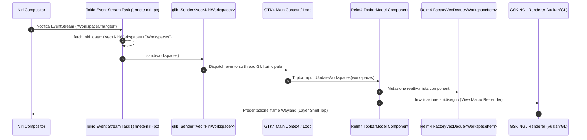

# Documentazione Tecnica Stack Desktop UI - Ermete OS (`doc_shell_ui.md`)

## 1. Panoramica dell'Architettura Desktop Stack

L'infrastruttura UI di **Ermete OS** è costruita su uno stack moderno in Rust che integra **GTK4 / Relm4**, **Wayland Layer Shell**, **Tokio Async I/O**, ed il compositor **Niri** (scrollable tiling compositor).

```mermaid
graph TD
    subgraph Compositor & System Layer
        Niri[Niri Compositor] <-->|Unix Socket / NIRI_SOCKET| IPC[ermete-niri-ipc]
        DBus[DBus System/Session Bus] <-->|zbus| Proxies[System Proxies / IPC]
    end

    subgraph Design System
        Style[ermete-style] -->|Glassmorphic CSS / Load Theme| Shell
        Style -->|Glassmorphic CSS / Load Theme| Dock
        Style -->|Glassmorphic CSS / Load Theme| Settings
        Style -->|Glassmorphic CSS / Load Theme| Store
    end

    subgraph Applications & Overlays (GTK4 / Relm4)
        Shell[ermete-shell-rs] <-->|glib::Sender / EventStream| IPC
        Shell <-->|zbus| DBus
        
        Dock[ermete-dock] <-->|LayerShell Overlay & Top| Niri
        Dock <-->|Watchers / IPC| IPC
        
        Settings[ermete-settings-rs] -->|Lazy Stack / Relm4| Shell
        Settings <-->|Config Mutation / IPC| IPC
        
        Store[ermete-store-rs] <-->|Tokio DBus Server| DBus
    end
```

### Parametri e Tecnologie di Esecuzione Runtime
- **Allocatore di Memoria:** `mimalloc` (`mimalloc::MiMalloc`), configurato a livello globale in tutti i binari (`#[global_allocator]`), elimina le pause di frammentazione ed ottimizza l'allocazione per l'interfaccia grafica a 120+ FPS.
- **Renderer Grafico GSK:** Forzato a `ngl` (New OpenGL / Vulkan) tramite `std::env::set_var("GSK_RENDERER", "ngl")`.
- **Backend GDK:** Backend puro Wayland (`std::env::set_var("GDK_BACKEND", "wayland")`).
- **Scaling:** Scaling frazionario X11 disabilitato (`GDK_SCALE=1`) per prevenire sfocature nel rendering dei font.
- **Isolamento e Sicurezza:** Applicazione di sandbox rigorose tramite **Landlock** all'avvio (`crate::sys::sandbox::apply_landlock_sandbox()`).

---

## 2. Analisi Dettagliata dei Componenti dello Stack UI

### 2.1 `ermete-shell-rs`
- **Ruolo:** Shell di sistema principale ed erogatore delle finestre modali/overlay (`os.ermete.Shell`).
- **Moduli UI inclusi:**
  - `topbar`: Barra superiore di stato e navigazione workspace.
  - `control_center`: Centro di controllo rapido (Wi-Fi, Bluetooth, Audio, Luminosità, Profili energetici).
  - `spotlight` & `launcher`: Ricerca globale in stile macOS Spotlight ed Application Launcher.
  - `notifications`: Daemon notifiche desktop reattivo.
  - `greeter` / `lockscreen`: Interfaccia di autenticazione e blocco schermo.
  - `osd`: On-Screen Display per volume e luminosità.
  - `powermenu`, `calendar`, `clipboard`, `desktop_widgets`, `store`, `privacy_prompt`, `gatekeeper_prompt`.

#### Architettura Relm4 & Actor Model nella Topbar
La Topbar adotta il pattern Actor Model fornito dal framework **Relm4**:
- **`TopbarModel`:** Implementa `SimpleComponent`. Gestisce lo stato globale della barra (orologio, livello batteria, icona rete, titolo finestra focalizzata).
- **`WorkspaceItem`:** Implementa `FactoryComponent` ed è gestito all'interno di una `FactoryVecDeque<WorkspaceItem>`. Ciascun workspace viene renderizzato come un widget pulsante reattivo (`WorkspaceMsg::Focus`).
- **Messaggi `TopbarInput`:**
  - `TickSecond`: Aggiornamento dell'orologio e dello stato UPower/NetworkManager.
  - `TickFast`: Aggiornamento continuo del titolo della finestra focalizzata.
  - `UpdateWorkspaces(Vec<NiriWorkspace>)`: Sincronizzazione dinamica della lista dei workspace inviata da Niri.
  - `ToggleControlCenter`, `ToggleSpotlight`, `ToggleCalendar`, etc.

#### Integrazione Wayland Layer Shell
Tutte le finestre modali ed i popup utilizzano `gtk4-layer-shell`:
- Ancoraggio (`set_anchor(Edge::Top, true)`), gestione del layer (`Layer::Top` / `Layer::Overlay`).
- **Autoclose Overlay Pattern (`setup_popup_autoclose` in `wayland/popup.rs`):** Viene creata una finestra trasparente a schermo intero (`bg-overlay-window`) su `Layer::Top` con gestore di click `GestureClick`. Qualsiasi click esterno chiude la finestra pop-up attiva senza bloccare l'interazione del compositor.

---

### 2.2 `ermete-dock`
- **Ruolo:** Dock di sistema multi-monitor intelligente e dinamica (`os.ermete.Dock`).
- **Costruzione GTK4 + Layer Shell:**
  - Per ciascun monitor presente nel sistema (`gdk::Display::monitors()`), viene creata un'istanza `DockMonitorInstance`.
  - **Finestra Dock Principale:** `ApplicationWindow` ancorata in basso (`Edge::Bottom`, `margin=12`) su `Layer::Top` con classe CSS `.dock-container`.
  - **Finestra Trigger Invisibile (`dock-trigger`):** Una seconda finestra d'altezza 6px ancorata su `Layer::Overlay` con la zona esclusiva disabilitata (`set_exclusive_zone(-1)`). Rileva il movimento del mouse verso il bordo inferiore dello schermo (`EventControllerMotion::connect_enter`) per rivelare la Dock quando è in stato auto-hide.

#### Dynamic Reconciliation Engine (`reconcile_dock_items`)
Sincronizza in tempo reale le icone della dock unendo due sorgenti dati:
1. **Applicazioni Fissate:** Caricate da `dock_config.rs` (file JSON `~/.config/ermete-dock/dock.json`).
2. **Finestre Niri Attive:** Recuperate da `niri_client::fetch_niri_data::<Vec<NiriWindowInfo>>("Windows", "Windows")`.

#### Algoritmo di Auto-Hide Multi-Monitor (`should_autohide_for_monitor`)
Calcola se la Dock deve nascondersi su uno specifico monitor:
- Trova il workspace attivo per il connettore del monitor (es. `DP-1`, `HDMI-A-1`).
- Analizza le coordinate `y` ed `h` (altezza) della geometria delle finestre aperte in quel workspace.
- Se la parte inferiore della finestra supera la soglia (`screen_height - 85.0`), attiva la classe CSS `.dock-hidden`.

#### Funzionalità di Interattività UI
- **Right-Click Context Menu:** Implementato tramite `gtk4::Popover` con azioni per fissare/rimuovere app, aprire nuove istanze o chiudere tutte le finestre.
- **Scroll Wheel Navigation:** `EventControllerScroll` sulle icone della dock per scorrere tra le finestre aperte dell'app focalizzando la finestra corrispondente su Niri.
- **Drag-and-Drop Feedback:** `DropControllerMotion` applica la classe CSS `.aura-active` durante il trascinamento di file o elementi sopra le icone.

---

### 2.3 `ermete-settings-rs`
- **Ruolo:** Applicazione centrale di configurazione di sistema (`os.ermete.Settings`).
- **Architettura Relm4:** Componente `AppModel` (`SimpleComponent`) gestito da `RelmApp`.

#### Architettura Lazy Loading delle Pagine
Per garantire un avvio istantaneo e ridurre l'uso della RAM, `ermete-settings-rs` impiega un caricamento differito delle pagine:
1. All'avvio vengono creati solo i contenitori vuoti `gtk4::Box` all'interno dello `Stack` centrale (`gtk4::Stack`).
2. Viene renderizzata immediatamente **solo** la pagina iniziale richiesta (default `"wifi"` o specificata via CLI `--page=...`).
3. Il segnale `connect_visible_child_name_notify` intercetta il cambio scheda nello stack: se il contenitore della pagina selezionata è vuoto (`container.first_child().is_none()`), viene eseguita la funzione di build specifica (`build_fn()`) caricando i widget GTK4 in modo pigro.

#### Omnibox AI Natural Language Routing
Un'interfaccia di ricerca naturale (`AppMsg::RouteAi`) analizza l'intento dell'utente tramite keyword matching e routing intelligente:
- Query come *"Il mio audio non va"* -> Selezione automatica scheda `"audio"`.
- Query come *"Voglio cambiare tema"* -> Selezione automatica scheda `"appearance"`.

#### Schede di Impostazione Disponibili (17 Pagine)
Wi-Fi, Bluetooth, Rete Cablata, Audio, Notifiche, Focus/Do-Not-Disturb, Generali, Aspetto/Temi, Desktop & Dock, Schermi (Niri output config), Ecosistema, Aggiornamenti, Batteria, Tastiera, Mouse & Trackpad, Account, Privacy & Sicurezza.

---

### 2.4 `ermete-store-rs`
- **Ruolo:** Store software ed hub di gestione pacchetti (`os.ermete.Store`).
- **Architettura Dual-Thread Tokio/Relm4:**
  - **Backend DBus Tokio (Background Thread):** Thread dedicato che esegue `backend::dbus::start_dbus_server()` su un runtime Tokio asincrono per gestire operazioni di sistema senza bloccare l'interfaccia.
  - **Frontend UI Relm4 (Main Thread):** Finestra principale (`AppModel`) basata su Relm4 GTK4 con layout sidebar stile Windows 11 / macOS (`store-sidebar`) e contenuto centrale a stack (`ShowcaseModel`).
- **Backend di Gestione Pacchetti Supported:**
  - **Flatpak:** Gestione installazione e aggiornamento da Flathub / remote configurati.
  - **OCI Containers:** Supporto per pacchetti applicativi containerizzati.
  - **EOPKG:** Gestione pacchetti di sistema nativi.

---

### 2.5 `ermete-style`
- **Ruolo:** Crate centralizzata contenente il **Design System** globale ed il tema CSS Glassmorphism per tutte le app del sistema operativo.
- **Inizializzazione Theme (`load_glass_theme()`):** Carica `style.css` (incluso a tempo di compilazione tramite `include_str!("style.css")`) ed aggiunge il provider a `gdk::Display::default()` con priorità `STYLE_PROVIDER_PRIORITY_APPLICATION`.

#### CSS Tokens e Proprietà Estetiche
```css
@define-color glass_bg rgba(30, 30, 32, 0.65);
@define-color glass_border rgba(255, 255, 255, 0.1);
@define-color accent_color #007aff;
@define-color hover_bg rgba(255, 255, 255, 0.15);

/* Core Glassmorphism Base */
window, popover {
    background-color: @glass_bg;
    backdrop-filter: blur(20px);
    border: 1px solid @glass_border;
    border-radius: 24px;
    padding: 16px;
    box-shadow: 0 8px 32px rgba(0, 0, 0, 0.3);
}

/* Pulsanti Tattili con Feedback Reattivo */
button {
    background-color: transparent;
    color: white;
    border: 1px solid @glass_border;
    border-radius: 16px;
    padding: 12px 24px;
    font-weight: bold;
    transition: all 0.3s cubic-bezier(0.25, 0.8, 0.25, 1);
}

button:hover {
    background-color: @hover_bg;
    transform: scale(1.02);
    box-shadow: 0 4px 15px rgba(0, 0, 0, 0.2);
}

button:active {
    transform: scale(0.98);
}
```

---

### 2.6 Compositor `niri` & Crate `ermete-niri-ipc`

#### Configurazione Compositor (`niri/config.kdl`)
- **Gestione Layout:** Scrollable tiling layout con preset di ampiezza colonne (33.3%, 50%, 66.6%, 100%).
- **Focus Ring & Shadow:** Anello di focus sfumato (`active-gradient from="#89b4fa" to="#cba6f7"`) e ombre morbide (`softness 32`, `color "#00000070"`).
- **Regole Layer Shell (`layer-rule`):** Applicazione automatica di bordi arrotondati (`geometry-corner-radius 10`) ed ombreggiature a tutti i componenti della shell (`bar`, `dock`, `control-center`, `launcher`, `spotlight`, `powermenu`, `clipboard`, `wifi`, `notifications`, `osd`).
- **Keybindings Matrix:** Mappatura completa per il lancio di `ermete-shell-rs` con vari flag CLI (`--dock`, `--launcher`, `--control-center`, `--media-player`, `--sys-monitor`, `--calendar`, `--powermenu`, `--clipboard`).

#### Crate `ermete-niri-ipc` (`async_client.rs`)
Fornisce un client asincrono Tokio non bloccante per comunicare via Unix Socket (`NIRI_SOCKET`):
- **Safety e Timeout:** Tutte le chiamate I/O di rete Unix Socket sono racchiuse in blocchi `tokio::time::timeout(Duration::from_millis(1000), ...)`, prevenendo qualsiasi blocco nel thread principale GTK4.
- **Funzioni IPC Principali:**
  - `get_outputs()`, `set_output_scale()`, `set_output_vrr()`, `set_output_hdr()`, `set_output_mode()`.
  - `focus_window()`, `close_window()`, `focus_workspace_down()`, `focus_workspace_up()`, `focus_workspace_by_id()`.
- **Mutazione Configurazione KDL (`update_niri_kdl_setting`):** Modifica in modo non bloccante via `tokio::fs` le chiavi all'interno di `~/.config/niri/config.kdl`.
- **Streaming Eventi Reattivi (`watch_niri_event_stream`):** Si connette al socket `"EventStream"` di Niri in un task Tokio in background. Ogni volta che si verifica un evento (es. cambio finestra o workspace), esegue la callback fornita notificando i canali `glib::Sender`.

---

## 3. Mappatura del Flusso Eventi (CodeGraph & Actor Model)

Il seguente schema illustra la propagazione reattiva di un evento generato dal compositor Niri fino al rendering finale su schermo:


