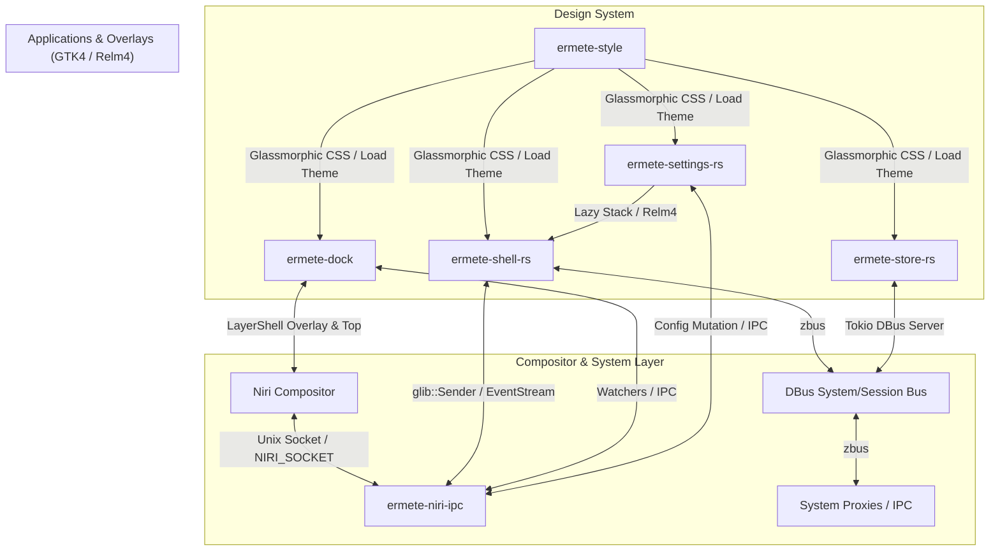
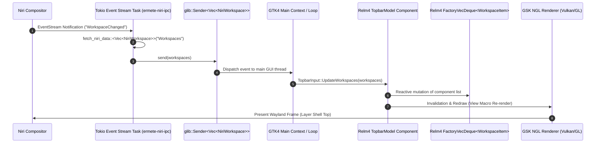

# Technical Specification: Desktop UI Stack — Ermete OS (`doc_shell_ui.md`)

## 1. Desktop Stack Architectural Overview

The UI infrastructure of **Ermete OS** is built upon a high-performance Rust stack integrating **GTK4 / Relm4**, **Wayland Layer Shell**, **Tokio Async I/O**, and the **Niri** scrollable tiling compositor.



### Execution Parameters & Runtime Technologies
- **Memory Allocator:** `mimalloc` (`mimalloc::MiMalloc`), configured globally across all binaries (`#[global_allocator]`), eliminating fragmentation pauses and guaranteeing fluid 144Hz+ rendering performance.
- **GSK Graphics Renderer:** Forced to `ngl` (New OpenGL / Vulkan) via `std::env::set_var("GSK_RENDERER", "ngl")`.
- **GDK Backend:** Pure Wayland backend (`std::env::set_var("GDK_BACKEND", "wayland")`).
- **Scaling:** Fractional scaling under X11 disabled (`GDK_SCALE=1`) to prevent font rasterization blur.
- **Sandboxing & Security:** Strict sandboxing via **Landlock** applied at startup (`crate::sys::sandbox::apply_landlock_sandbox()`).

---

## 2. In-Depth Component Breakdown of UI Stack

### 2.1 `ermete-shell-rs`
- **Role:** Core system shell and provider of modal overlays (`os.ermete.Shell`).
- **Included UI Modules:**
  - `topbar`: Upper status bar and workspace navigation.
  - `control_center`: Quick control center (Wi-Fi, Bluetooth, Audio, Brightness, Energy profiles).
  - `spotlight` & `launcher`: macOS Spotlight-style global search & Application Launcher.
  - `notifications`: Reactive desktop notification daemon.
  - `greeter` / `lockscreen`: Authentication interface and lockscreen.
  - `osd`: On-Screen Display overlay for volume and brightness feedback.
  - `powermenu`, `calendar`, `clipboard`, `desktop_widgets`, `store`, `privacy_prompt`, `gatekeeper_prompt`.

#### Relm4 Architecture & Actor Model in Topbar
The Topbar incorporates the Actor Model provided by **Relm4**:
- **`TopbarModel`:** Implements `SimpleComponent`. Manages global bar state (clock, battery level, network status, active window title).
- **`WorkspaceItem`:** Implements `FactoryComponent` contained within a `FactoryVecDeque<WorkspaceItem>`. Each workspace renders as a reactive button widget (`WorkspaceMsg::Focus`).
- **`TopbarInput` Messages:**
  - `TickSecond`: Clock updates and UPower/NetworkManager poll ticks.
  - `TickFast`: Continuous focused window title polling.
  - `UpdateWorkspaces(Vec<NiriWorkspace>)`: Dynamic workspace list sync emitted by Niri.
  - `ToggleControlCenter`, `ToggleSpotlight`, `ToggleCalendar`, etc.

#### Wayland Layer Shell Integration
All modal overlays and popups leverage `gtk4-layer-shell`:
- Anchoring (`set_anchor(Edge::Top, true)`), layer management (`Layer::Top` / `Layer::Overlay`).
- **Autoclose Overlay Pattern (`setup_popup_autoclose` in `wayland/popup.rs`):** Spawns a full-screen transparent window (`bg-overlay-window`) on `Layer::Top` listening for `GestureClick`. Any click outside the active modal automatically dismisses the popup without interrupting compositor events.

---

### 2.2 `ermete-dock`
- **Role:** Dynamic multi-monitor desktop dock (`os.ermete.Dock`).
- **GTK4 + Layer Shell Construction:**
  - For each active display output (`gdk::Display::monitors()`), a dedicated `DockMonitorInstance` is spawned.
  - **Main Dock Window:** `ApplicationWindow` anchored to bottom (`Edge::Bottom`, `margin=12`) on `Layer::Top` with CSS class `.dock-container`.
  - **Invisible Trigger Window (`dock-trigger`):** Secondary 6px window anchored on `Layer::Overlay` with exclusive zone disabled (`set_exclusive_zone(-1)`). Tracks cursor proximity (`EventControllerMotion::connect_enter`) to reveal the Dock when auto-hidden.

#### Dynamic Reconciliation Engine (`reconcile_dock_items`)
Reconciles dock icons in real time by merging two data streams:
1. **Pinned Applications:** Parsed from `dock_config.rs` (`~/.config/ermete-dock/dock.json`).
2. **Active Niri Windows:** Queried from `niri_client::fetch_niri_data::<Vec<NiriWindowInfo>>("Windows", "Windows")`.

#### Multi-Monitor Auto-Hide Algorithm (`should_autohide_for_monitor`)
Calculates whether the Dock should collapse on a given monitor connector:
- Identifies active workspace for target connector (`DP-1`, `HDMI-A-1`).
- Analyzes vertical bounding geometry (`y` coordinate and height `h`) of windows in that workspace.
- If window bottom edge crosses threshold (`screen_height - 85.0`), toggles CSS class `.dock-hidden`.

#### Interactive Features
- **Right-Click Context Menu:** Implemented via `gtk4::Popover` providing actions to pin/unpin apps, launch new instances, or close window instances.
- **Scroll Wheel Navigation:** `EventControllerScroll` over dock items cycles through open windows of an application by focusing target window IDs on Niri.
- **Drag-and-Drop Feedback:** `DropControllerMotion` applies CSS class `.aura-active` during drag hover events over dock icons.

---

### 2.3 `ermete-settings-rs`
- **Role:** System Control Center & Settings Application (`os.ermete.Settings`).
- **Relm4 Architecture:** Core `AppModel` (`SimpleComponent`) driven by `RelmApp`.

#### Lazy Page Loading Architecture
To ensure zero cold-start delay and minimize RAM consumption, `ermete-settings-rs` employs deferred container loading:
1. At startup, empty placeholder `gtk4::Box` containers are registered inside the main `gtk4::Stack`.
2. Only the initial target view (default `"wifi"` or specified via CLI `--page=...`) is immediately instantiated.
3. The `connect_visible_child_name_notify` signal intercepts tab switches: if the selected stack container is empty (`container.first_child().is_none()`), it invokes the page constructor (`build_fn()`), lazily populating GTK4 widgets.

#### Omnibox AI Natural Language Routing
A natural language search interface (`AppMsg::RouteAi`) analyzes user intent through keyword matching and intelligent routing:
- Query *"My audio is broken"* -> Auto-routes to tab `"audio"`.
- Query *"I want to change the wallpaper"* -> Auto-routes to tab `"appearance"`.

#### Available Configuration Pages (17 Pages)
Wi-Fi, Bluetooth, Wired Network, Audio, Notifications, Focus / Do-Not-Disturb, General, Appearance & Themes, Desktop & Dock, Displays (Niri output config), Ecosystem, Updates, Battery, Keyboard, Mouse & Trackpad, Accounts, Privacy & Security.

---

### 2.4 `ermete-store-rs`
- **Role:** Software Store & Package Manager Application (`os.ermete.Store`).
- **Dual-Thread Tokio/Relm4 Architecture:**
  - **Backend Tokio DBus Server (Background Thread):** Dedicated thread executing `backend::dbus::start_dbus_server()` on async Tokio runtime to execute system operations without blocking UI frame rendering.
  - **Frontend Relm4 UI (Main Thread):** Main window (`AppModel`) powered by Relm4 GTK4 featuring a sidebar layout (`store-sidebar`) and stack navigation (`ShowcaseModel`).
- **Supported Package Engine Backends:**
  - **Flatpak:** Installation and management from Flathub or private OCI endpoints.
  - **OCI Containers:** Containerized application bundle management.
  - **EOPKG:** Native system package operations.

---

### 2.5 `ermete-style`
- **Role:** Central crate supplying global **Design System** assets and Glassmorphic CSS themes across all OS applications.
- **Theme Initialization (`load_glass_theme()`):** Loads `style.css` (embedded at compile time via `include_str!("style.css")`) and registers provider to `gdk::Display::default()` with `STYLE_PROVIDER_PRIORITY_APPLICATION`.

#### CSS Tokens & Glassmorphism Properties
```css
@define-color glass_bg rgba(30, 30, 32, 0.65);
@define-color glass_border rgba(255, 255, 255, 0.1);
@define-color accent_color #007aff;
@define-color hover_bg rgba(255, 255, 255, 0.15);

/* Core Glassmorphism Base */
window, popover {
    background-color: @glass_bg;
    backdrop-filter: blur(20px);
    border: 1px solid @glass_border;
    border-radius: 24px;
    padding: 16px;
    box-shadow: 0 8px 32px rgba(0, 0, 0, 0.3);
}

/* Tactile Buttons with Reactive Motion Feedback */
button {
    background-color: transparent;
    color: white;
    border: 1px solid @glass_border;
    border-radius: 16px;
    padding: 12px 24px;
    font-weight: bold;
    transition: all 0.3s cubic-bezier(0.25, 0.8, 0.25, 1);
}

button:hover {
    background-color: @hover_bg;
    transform: scale(1.02);
    box-shadow: 0 4px 15px rgba(0, 0, 0, 0.2);
}

button:active {
    transform: scale(0.98);
}
```

---

### 2.6 Compositor `niri` & `ermete-niri-ipc` Crate

#### Compositor Configuration (`niri/config.kdl`)
- **Layout Engine:** Scrollable tiling layout with column width presets (33.3%, 50%, 66.6%, 100%).
- **Focus Ring & Shadow:** Soft gradient focus ring (`active-gradient from="#89b4fa" to="#cba6f7"`) and drop shadows (`softness 32`, `color "#00000070"`).
- **Layer Shell Rules (`layer-rule`):** Automatic corner rounding (`geometry-corner-radius 10`) and shadows applied across shell overlays (`bar`, `dock`, `control-center`, `launcher`, `spotlight`, `powermenu`, `clipboard`, `wifi`, `notifications`, `osd`).
- **Keybindings Matrix:** Full shortcut mapping for invoking `ermete-shell-rs` flags (`--dock`, `--launcher`, `--control-center`, `--media-player`, `--sys-monitor`, `--calendar`, `--powermenu`, `--clipboard`).

#### `ermete-niri-ipc` Crate (`async_client.rs`)
Non-blocking Tokio async client communicating over Unix Sockets (`NIRI_SOCKET`):
- **Safety & Timeouts:** Socket I/O calls are wrapped in `tokio::time::timeout(Duration::from_millis(1000), ...)`, preventing UI thread hangs.
- **Core IPC Methods:**
  - `get_outputs()`, `set_output_scale()`, `set_output_vrr()`, `set_output_hdr()`, `set_output_mode()`.
  - `focus_window()`, `close_window()`, `focus_workspace_down()`, `focus_workspace_up()`, `focus_workspace_by_id()`.
- **KDL Config Mutation (`update_niri_kdl_setting`):** Non-blocking modification of `~/.config/niri/config.kdl` key-value pairs via `tokio::fs`.
- **Reactive Event Streaming (`watch_niri_event_stream`):** Connects to Niri's `"EventStream"` socket in a background Tokio task. On compositor events (e.g. workspace change), emits signals to `glib::Sender` channels.

---

## 3. Event Flow Topology (CodeGraph & Actor Model)

The diagram below details the reactive propagation of compositor events from Niri through to GTK4 display rendering:


