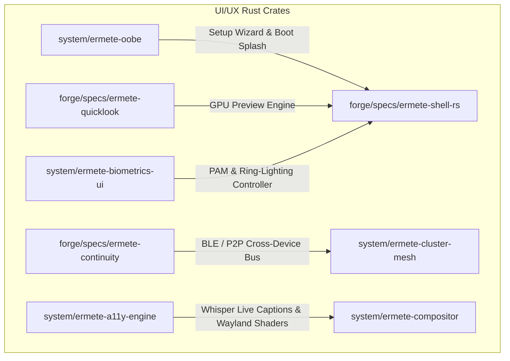

# 🔬 ERMETE OS: DEFINITIVE UI/UX GAP ANALYSIS & DEEP-AUDIT REPORT
> **Lead Deep-Audit UI/UX Auditor**  
> *Systematic Benchmarking vs. macOS Sequoia, Windows 11 (24H2), ChromeOS, Zorin OS 17, and Deepin V23*

---

## 📋 1. INTRODUCTION & AUDIT METHODOLOGY

The desktop architecture of **Ermete OS** establishes a solid technical foundation powered by **GTK4/Relm4**, **Niri (Scrollable Tiling Compositor)**, **Wayland Layer Shell**, **eBPF-driven telemetry**, and a **Post-Quantum Cryptography Mesh**.

However, benchmarking against competitive desktop operating systems (**macOS Sequoia**, **Windows 11 24H2**, **ChromeOS**, **Zorin OS 17**, **Deepin V23**) identifies critical functional and experiential UX gaps.

The 5 core pillars (`ermete-shell-rs`, `ermete-settings-rs`, `ermete-store-rs`, `ermete-dock`, and `ermete-gatekeeper-rs`) leave unaddressed user interaction macro-areas that dictate enterprise operating system refinement.

This report compiles the **DEFINITIVE SYSTEM GAP LIST**, categorized across 9 Macro-Areas and mapped into target system architecture.

---

## 🎯 2. MACRO-AREA 1: OOBE (OUT-OF-BOX EXPERIENCE) & GREETER FRAMEWORK

`system/ermete-greeter` currently executes PAM authentication paired with TPM 2.0 attestation verification, lacking first-boot setup wizards.

| Missing Capability | Current State | Competitive Benchmark | Target Implementation Specification for Ermete OS |
| :--- | :--- | :--- | :--- |
| **First-Boot OOBE Setup Wizard** | ❌ Absent | macOS Setup Assistant / Windows 11 OOBE | Full-screen GTK4 setup wizard (`ermete-oobe`) managing initial configuration: locale selection, Wi-Fi onboarding, keyboard mapping, interactive timezone selection, user creation / SSH key provisioning, telemetry opt-in, and auto-display scaling detection. |
| **Welcome Animations & Sound Branding** | ❌ Absent | macOS "Hello" Canvas / ChromeOS Boot Splash | High-framerate (120+ FPS) vector branding animation (Lottie / GSK Vulkan renderer) playing upon OOBE completion or initial login, paired with spatial audio soundscapes via PipeWire. |
| **Lockscreen Dynamic Widgets & Glanceable Info** | ❌ Absent | iOS 17 / Windows 11 Lockscreen Widgets | At-a-glance info grid integrated into greeter/lockscreen: local weather forecasts, calendar events, paired Bluetooth device battery levels, media controls, and system telemetry metrics. |
| **Multi-User Fast Switching & Guest Enclave** | ❌ Partial | macOS Fast User Switching / ChromeOS Guest Mode | Greeter interface widget enabling instant user switching without halting background tasks, and a "Guest Enclave" button spawning ephemeral micro-VM sessions with RAM-backed rootfs destroyed upon logout. |
| **Boot-Time Accessibility Toggle (Voice & Visual)** | ❌ Absent | macOS VoiceOver OOBE / Win11 Narrator Shortcut | Universal accessibility menu accessible via `Super+Alt+S` shortcut during OOBE/Greeter, triggering guided speech synthesis, high-contrast modes, and screen magnification prior to login. |

---

## 🔍 3. MACRO-AREA 2: GLOBAL SEARCH (SPOTLIGHT / RAYCAST / POWERTOYS RUN)

`spotlight.rs` in `ermete-shell-rs` is currently limited to basic string matching for applications and generic text queries forwarded to the AI daemon.

| Missing Capability | Current State | Competitive Benchmark | Target Implementation Specification for Ermete OS |
| :--- | :--- | :--- | :--- |
| **Inline Math Engine, Unit & Currency Converter** | ❌ Absent | Raycast / Spotlight / PowerToys Run | Real-time mathematical expression evaluation (`evalexpr`), physical unit conversions, and live currency rates via D-Bus with 1-click clipboard copying. |
| **Fuzzy File Indexing & Deep Content Search** | ❌ Partial | macOS Spotlight / Everything | Asynchronous eBPF/Tracker fuzzy file indexer based on `fd`, supporting deep content search inside PDFs, Markdown files, source code, and text previews. |
| **Dictionary, Synonyms & Quick Lookup Cards** | ❌ Absent | macOS Dictionary / Raycast Dictionary | Instant Spotlight lookup cards displaying grammatical definitions, synonyms, and rapid multilingual translations. |
| **Action Palette & Raycast-Style Workflows** | ❌ Absent | Raycast Extensions / Alfred Workflows | System action palette executed directly from the launcher: "Kill process [PID]", "Toggle Dark Mode", "Flush DNS", "Base64 Encode/Decode", "Format JSON", and clipboard history management. |
| **Multimodal AI Integration & Contextual Drag-Drop** | ❌ Partial | macOS Apple Intelligence / Windows Copilot | Drag-and-drop file image ingestion into Spotlight for instant OCR / vision analysis via `ermete-ai-daemon`, plus contextual text summarization pipelines ("Summarize", "Explain Code"). |

---

## 📱 4. MACRO-AREA 3: CROSS-DEVICE ECOSYSTEM & CONTINUITY (PHONE LINK / KDE CONNECT)

While `ermete-mesh-sync` manages P2P node synchronization via post-quantum cryptography, mobile device integration (Android / iOS) requires dedicated integration.

| Missing Capability | Current State | Competitive Benchmark | Target Implementation Specification for Ermete OS |
| :--- | :--- | :--- | :--- |
| **Universal Cross-Device Clipboard** | ❌ Absent | Apple Universal Clipboard / KDE Connect | End-to-end encrypted bi-directional clipboard sync between PC and mobile devices (Android/iOS) supporting rich text, images, and file arrays. |
| **Handoff & Continuity Camera / Mic** | ❌ Absent | macOS Continuity / Samsung Multi Control | Auto-detection of open web tabs or active documents on mobile devices to resume on desktop; wireless HD webcam and microphone streaming into PipeWire. |
| **Desktop Telephony & SMS Relay** | ❌ Absent | Windows Phone Link / macOS iMessage & Calls | Native desktop notification interface for reading and replying to SMS messages, plus incoming call notifications with PipeWire audio routing (Bluetooth HFP/PBAP/MAP). |
| **Spatial AirDrop / Quick Share Drop Zone** | ❌ Absent | macOS AirDrop / Android Quick Share | Proximity drop zone integrated into shell: dragging files over the drop zone discovers nearby devices for zero-conf high-speed file transfers. |
| **Proximity Auto-Unlock via Wearables** | ❌ Absent | macOS Auto Unlock via Apple Watch | Automatic secure unlock when approaching the PC wearing a paired smartwatch or smartphone, verified via Bluetooth LE RSSI distance checks and asymmetric key challenges. |

---

## 🎨 5. MACRO-AREA 4: MICRO-INTERACTIONS, VISUAL ERGONOMICS & UTILITIES

While Ermete OS implements a Glassmorphic CSS design system in `ermete-style`, productivity utilities and interaction feedback require expansion.

| Missing Capability | Current State | Competitive Benchmark | Target Implementation Specification for Ermete OS |
| :--- | :--- | :--- | :--- |
| **Quick Look (Spacebar File Preview)** | ❌ Absent | macOS Quick Look / PowerToys Peek | Pressing Spacebar over any file in the file manager or desktop opens a floating GPU-accelerated preview window without launching dedicated applications (supporting images, video, audio waveforms, PDFs, 3D models, and code). |
| **Global Menu Bar (macOS App Menu Bar)** | ❌ Absent | macOS Global Menu / Unity | Active application menus (`File`, `Edit`, `View`, `Tools`, `Help`) rendered directly in the Ermete OS Topbar via `dbusmenu` / XDG Global Menu protocols, saving vertical window space. |
| **Dynamic Time-of-Day Wallpapers (Solar Engine)** | ❌ Absent | macOS Dynamic Wallpapers / Zorin Dynamic Themes | Solar position dynamic wallpaper engine: background images (multi-layer HEIC/AVIF) and system color schemes (Light/Dark) crossfade seamlessly from dawn to dusk. |
| **Snap Layouts & Grid Drag Hints** | ❌ Partial | Windows 11 Snap Layouts / PowerToys FancyZones | Hovering over window maximize controls or dragging titlebars triggers visual layout grids (2x2, 1/3-2/3, 3-column) for instant window snapping on Niri. |
| **Integrated Visual Utilities (ColorPicker, Ruler, Pin)** | ❌ Absent | PowerToys ColorPicker / macOS Digital Color Meter | Topbar utility tools: global screen color eyedropper (HEX, RGB, HSL), virtual pixel measurement ruler, and "Always on Top" window pinning toggles. |

---

## 🔐 6. MACRO-AREA 5: BIOMETRICS & VISUAL SECURITY (WINDOWS HELLO / TOUCH ID / PAM)

`ermete-gatekeeper-rs` and authorization prompts rely on standard authentication dialogs requiring manual password entry.

| Missing Capability | Current State | Competitive Benchmark | Target Implementation Specification for Ermete OS |
| :--- | :--- | :--- | :--- |
| **Unified Biometric PAM UI Enclave** | ❌ Absent | Windows Hello / macOS Touch ID UI | GTK4 biometric scanning interface for fingerprint (`fprintd`) and IR facial recognition (`Howdy` / PAM-WebAuthn) with visual scanning feedback. |
| **Visual Ring-Lighting & Tactile Feedback** | ❌ Absent | macOS Touch ID Topbar Glow | Topbar borders emit dynamic lighting feedback during biometric requests (green glow for successful authentication, red pulse for rejection). |
| **Hardware Passkey / FIDO2 / WebAuthn Dialog** | ❌ Absent | Windows Hello FIDO2 / macOS Security Key UI | Graphic interface managing physical USB/NFC security keys (YubiKey) and WebAuthn Passkey confirmations. |
| **In-Line Gatekeeper Elevation Biometrics** | ❌ Absent | macOS Polkit Touch ID Prompt | `ermete-gatekeeper-rs` authorization prompts accept biometric confirmation directly within the modal frame. |

---

## ♿ 7. MACRO-AREA 6: SYSTEM ACCESSIBILITY (A11Y)

Ermete OS inherits basic GTK4 accessibility bindings, requiring dedicated OS-level services.

| Missing Capability | Current State | Competitive Benchmark | Target Implementation Specification for Ermete OS |
| :--- | :--- | :--- | :--- |
| **Native Real-Time Live Captions** | ❌ Absent | Windows 11 Live Captions / macOS Live Captions | OS-level live caption generator: intercepts PipeWire audio streams (web videos, calls, media players) and renders floating customizable subtitles generated on GPU/NPU via Whisper/Vosk. |
| **Tiling Compositor Screen Reader** | ❌ Partial | macOS VoiceOver / Windows Narrator | Native Rust screen reader optimized for Niri scrollable tiling navigation, announcing focused workspaces, window positions, Topbar elements, and Wayland surfaces. |
| **Wayland Shader Magnifier & Color Filters** | ❌ Absent | macOS Accessibility Zoom & Color Filters | Niri compositor shaders delivering cursor-following screen magnification, color blindness correction (Protanopia, Deuteranopia, Tritanopia), high-contrast inversion, and OpenDyslexic font overrides. |
| **Voice Control & Dictation Engine** | ❌ Absent | macOS Voice Control / Windows Voice Access | Voice command desktop navigation ("Open Browser", "Focus Workspace 2") and hands-free speech-to-text dictation across all text fields. |

---

## 📻 8. MACRO-AREA 7: ADVANCED CONTROL CENTER AUDIO & SPATIAL SOUND

| Missing Capability | Competitive Benchmark | Target Implementation Specification |
| :--- | :--- | :--- |
| **Per-App Volume Mixer & Device Routing** | macOS SoundSource / Windows Volume Mixer | Topbar popup menu controlling per-application volume levels and routing audio outputs to distinct devices (e.g., Spotify to Bluetooth speaker, Discord to headset). |
| **Spatial Audio & HRTF Virtualization** | macOS Spatial Audio / Windows Sonic | PipeWire module providing multi-channel spatial audio virtualization (Dolby Atmos / 7.1 HRTF) for stereo headphones. |
| **AI Noise Suppression Visualizer** | NVIDIA Broadcast / macOS Mic Modes | AI-based microphone background noise suppression (RNNoise) featuring noise cancellation meters and profile selectors ("Voice Clarity", "Ambient Isolation", "Music"). |

---

## ⏳ 9. MACRO-AREA 8: FOCUS ENGINE & DIGITAL WELLBEING

| Missing Capability | Competitive Benchmark | Target Implementation Specification |
| :--- | :--- | :--- |
| **Advanced Focus Profiles & Workspace Association** | macOS Focus Modes / Windows Focus Sessions | Focus modes ("Work", "Study", "Relax", "Gaming") bound to Niri workspaces, silencing non-urgent notifications and displaying Pomodoro timers in the Topbar. |
| **Screen Time & App Usage Analytics Dashboard** | macOS Screen Time / Android Digital Wellbeing | Control Center dashboard tracking application usage metrics, emitting weekly reports and configurable usage limits. |

---

## 🖼️ 10. MACRO-AREA 9: WORKSPACE ERGONOMICS & DESKTOP CANVAS

| Missing Capability | Competitive Benchmark | Target Implementation Specification |
| :--- | :--- | :--- |
| **Interactive Hot Corners** | macOS Hot Corners / Deepin Hot Corners | Configurable screen corners triggering system actions on cursor hover (Top-Left -> Window Exposé, Top-Right -> Control Center, Bottom-Left -> Desktop, Bottom-Right -> Lock Screen). |
| **Interactive Desktop Widget Canvas** | macOS Sonoma Desktop Widgets / Windows 11 Widgets | Desktop grid hosting interactive, resizable widgets (Sticky Notes, System Metrics, Weather, Clock). |
| **Workspace-Bound Accent Themes & Wallpapers** | macOS Spaces / KDE Plasma Activities | Per-workspace accent colors and wallpapers in Niri, enhancing spatial navigation awareness. |

---

## 📊 11. DEFINITIVE UI/UX PARITY COMPARISON MATRIX

| Feature Area | macOS Sequoia | Windows 11 (24H2) | ChromeOS | Zorin OS 17 | Deepin V23 | **Ermete OS (Current)** | **Ermete OS (Target Post-Audit)** |
| :--- | :---: | :---: | :---: | :---: | :---: | :---: | :---: |
| **OOBE Setup Wizard** | 🟢 Excellent | 🟢 Complete | 🟢 Great | 🟡 Basic | 🟢 Complete | 🔴 **Absent** | 🟢 **Full Parity** |
| **Lockscreen Dynamic Widgets** | 🟢 Present | 🟢 Present | 🔴 Absent | 🔴 Absent | 🟡 Partial | 🔴 **Absent** | 🟢 **Full Parity** |
| **Global Search Math/Converter**| 🟢 Spotlight | 🟢 PowerToys | 🟡 Basic | 🔴 Absent | 🟡 Basic | 🔴 **Absent** | 🟢 **Full Parity** |
| **Global Search Raycast Actions**| 🟢 Spotlight | 🟢 PowerToys | 🔴 Absent | 🔴 Absent | 🔴 Absent | 🔴 **Absent** | 🟢 **AI Superiority** |
| **Universal Clipboard** | 🟢 Continuity | 🟢 Phone Link | 🟡 Phone Hub | 🟢 GSConnect | 🔴 Absent | 🔴 **Absent** | 🟢 **Post-Quantum Encrypted** |
| **Handoff & Continuity Cam** | 🟢 Continuity | 🟢 Phone Link | 🔴 Absent | 🔴 Absent | 🔴 Absent | 🔴 **Absent** | 🟢 **Wayland Native** |
| **Quick Look (Spacebar)** | 🟢 Native | 🟢 PowerToys | 🔴 Absent | 🟡 Extension | 🟢 Native | 🔴 **Absent** | 🟢 **GPU Accelerated** |
| **Global Menu Bar** | 🟢 Native | 🔴 Absent | 🔴 Absent | 🔴 Absent | 🔴 Absent | 🔴 **Absent** | 🟢 **XDG / DBus Menu** |
| **Biometric PAM Glow & UI** | 🟢 TouchID Glow | 🟢 Win Hello | 🟢 Lock UI | 🟡 PAM Basic | 🟢 DDE Auth | 🔴 **Absent** | 🟢 **Ermete Ring-Glow** |
| **Native Real-Time Live Captions**| 🟢 Native | 🟢 Native | 🟢 Native | 🔴 Absent | 🔴 Absent | 🔴 **Absent** | 🟢 **Local Whisper/NPU** |
| **Wayland Shader A11y Filters** | 🟢 Superior | 🟡 Win Zoom | 🟡 Basic | 🔴 Absent | 🔴 Absent | 🔴 **Absent** | 🟢 **Compositor Shaders** |
| **Per-App Volume Control** | 🟢 SoundSource | 🟢 Volume Mixer | 🔴 Absent | 🟡 GNOME Sound | 🟢 DDE Sound | 🔴 **Absent** | 🟢 **PipeWire Topbar** |

---

## 🛠️ 12. RECOMMENDED SYSTEM ARCHITECTURE PLAN FOR ERMETE OS

To address identified gaps, the workspace integrates **5 target Rust crates**:

1. **`system/ermete-oobe`**: Setup wizard, sound branding, and initial configuration.
2. **`forge/specs/ermete-quicklook`**: GPU-accelerated instant file preview engine triggered via spacebar.
3. **`forge/specs/ermete-continuity`**: Cross-device continuity daemon (Universal Clipboard, Handoff, SMS/Call relay, wireless camera).
4. **`system/ermete-biometrics-ui`**: Biometric UI controller for fingerprint, IR facial recognition, Passkeys, and ring-lighting indicators.
5. **`system/a11y-engine`**: Local live captions engine (GPU/NPU Whisper), screen reader, and Niri accessibility shaders.
