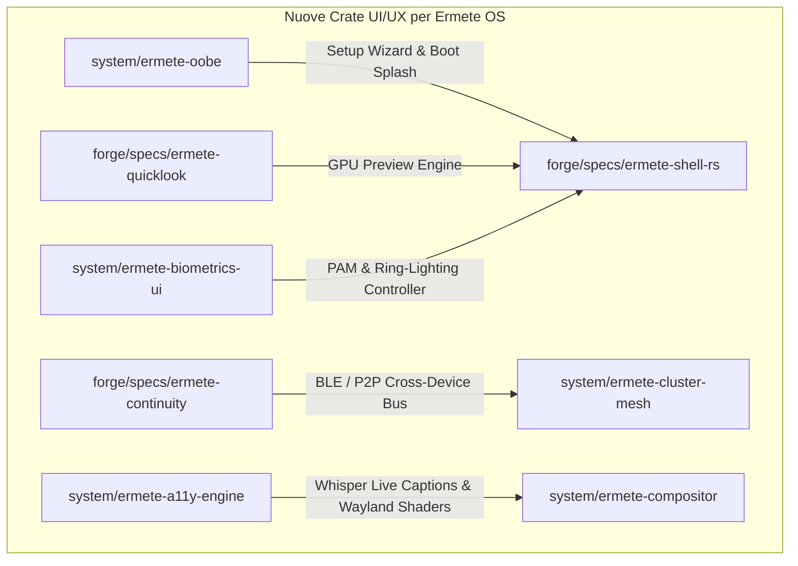

# 🔬 ERMETE OS: GAP ANALYSIS UI/UX DEFINITIVA & DEEP-AUDIT ESTREMO
> **Analista UI/UX di Deep-Audit Estremo**  
> *Confronto Sistematico con macOS Sequoia, Windows 11 (24H2), ChromeOS, Zorin OS 17 e Deepin V23*

---

## 📋 1. INTRODUZIONE & METODOLOGIA DEL DEEP-AUDIT

L'architettura desktop di **Ermete OS** ha già stabilito una solida base tecnica fondata su **GTK4/Relm4**, **Niri (Scrollable Tiling Compositor)**, **Wayland Layer Shell**, **eBPF-driven telemetry**, e **Post-Quantum Cryptography Mesh**.

Tuttavia, un'analisi approfondita rispetto ai benchmark di riferimento del mercato desktop consumer ed enterprise (**macOS Sequoia**, **Windows 11 24H2**, **ChromeOS**, **Zorin OS 17**, **Deepin V23**) evidenzia che la UI/UX di Ermete OS presenta ancora dei **vuoti funzionali ed esperrenziali critici**.

I 5 pilastri fondamentali già analizzati (`ermete-shell-rs`, `ermete-settings-rs`, `ermete-store-rs`, `ermete-dock`, e `ermete-gatekeeper-rs`) lasciano scoperte intere macro-aree di interazione utente che determinano la percezione di un sistema operativo moderno e raffinato.

Il presente report costituisce l'**ELENCO COMPLETO E DEFINITIVO** di tutte le feature mancanti in Ermete OS, categorizzate in 9 Macro-Aree e mappate direttamente nell'architettura software del sistema.

---

## 🎯 2. MACRO-AREA 1: OOBE (Out-Of-Box Experience) & GREETER FRAMEWORK

Actualmente, `system/ermete-greeter` si limita ad un'interfaccia di autenticazione PAM con verifica dell'attestazione TPM 2.0. Manca completamente l'intera esperienza di prima accensione e personalizzazione guidata.

| Feature Mancante | Stato Attuale | Benchmark Riferimento | Descrizione dell'Implementazione Richiesta per Ermete OS |
| :--- | :--- | :--- | :--- |
| **First-Boot OOBE Setup Wizard** | ❌ Assente | macOS Setup Assistant / Windows 11 OOBE | Un demone wizard dedicato (`ermete-oobe`) con interfaccia GTK4 a tutto schermo. Gestisce il primo avvio: selezione lingua e locale, accoppiamento Wi-Fi, selezione layout tastiera, mappa fuso orario reattiva, creazione account primario / importazione chiavi SSH, scelta del livello di privacy/telemetria e auto-detection dello scaling del display. |
| **Animazioni di Benvenuto & Sound Branding** | ❌ Assente | macOS "Hello" Canvas / ChromeOS Boot Splash | Flusso animato vettoriale ad alta frequenza (120 FPS) con Lottie/GSK GSK render in OpenGL/Vulkan al termine dell'OOBE o al primo login, accompagnato da un landscape sonoro spaziale dedicato generato tramite PipeWire. |
| **Lockscreen Dynamic Widgets & Glanceable Info** | ❌ Assente | iOS 17 / Windows 11 Lockscreen Widgets | Integrazione nel greeter/lockscreen di una griglia di widget informativi a colpo d'occhio: previsioni meteo locali, prossimi eventi a calendario, stato della batteria dei dispositivi Bluetooth accoppiati, widget controlli media e metriche di salute del sistema. |
| **Multi-User Fast Switching & Guest Enclave** | ❌ Parziale | macOS Fast User Switching / ChromeOS Guest Mode | Pulsante visivo sul Greeter per lo switch istantaneo tra sessioni utente senza bloccare o riavviare le app attive, e pulsante "Guest Enclave" che avvia una sessione temporanea in una MicroVM sandboxata effimera con rootfs in RAM e distruzione completa all'uscita. |
| **Boot-Time Accessibility Toggle (Voice & Visual)** | ❌ Assente | macOS VoiceOver OOBE / Win11 Narrator Shortcut | Menu di accessibilità integrato nell'OOBE e nel Greeter accessibile tramite scorciatoia universale (`Super+Alt+S`) per attivare sintesi vocale guidata, modalità ad alto contrasto e ingrandimento prima dell'autenticazione. |

---

## 🔍 3. MACRO-AREA 2: GLOBAL SEARCH (SPOTLIGHT / RAYCAST / POWERTOYS RUN)

L'attuale `spotlight.rs` in `ermete-shell-rs` gestisce solo il matching di stringhe di testo semplici per le applicazioni e query testuali generiche inviate al demone AI.

| Feature Mancante | Stato Attuale | Benchmark Riferimento | Descrizione dell'Implementazione Richiesta per Ermete OS |
| :--- | :--- | :--- | :--- |
| **Inline Math Engine, Unit & Currency Converter** | ❌ Assente | Raycast / Spotlight / PowerToys Run | Valutazione istantanea in tempo reale di espressioni matematiche complesse (`evalexpr`), conversioni di unità di misura (metriche, imperiali, byte, temperature) e tassi di cambio valute live tramite integrazione D-Bus/API con rendering visuale dei risultati copiabili con 1-click. |
| **Fuzzy File Indexing & Deep Content Search** | ❌ Parziale | macOS Spotlight / Everything | Engine di ricerca fuzzy per file e cartelle basato su `fd` e indicizzazione asincrona eBPF/Tracker, con supporto per il deep search del contenuto interno di documenti PDF, Markdown, sorgenti di codice ed estratto del testo in anteprima. |
| **Dizionario, Sinonimi & Quick Lookup Cards** | ❌ Assente | macOS Dictionary / Raycast Dictionary | Card istantanee all'interno di Spotlight per la definizione grammaticale di parole, ricerca di sinonimi/contrari e traduzione multilingua rapida senza dover aprire il browser. |
| **Palette delle Azioni & Plugin Raycast-Style** | ❌ Assente | Raycast Extensions / Alfred Workflows | Sistema di comandi rapidi eseguibili direttamente dal lanciatore: es. "Kill process [PID/Nome]", "Toggle Dark Mode", "Flush DNS", "Create Quick Note", "Base64 Encode/Decode", "Format JSON" e ricerca nella cronologia degli appunti. |
| **Integrazione AI Multimodale & Contextual Drag-Drop** | ❌ Parziale | macOS Apple Intelligence / Windows Copilot | Possibilità di trascinare file multimediali o immagini direttamente nella barra di Spotlight per eseguire OCR istantaneo o analisi di visione via `ermete-ai-daemon`, oltre a pipe rapido del testo selezionato su qualsiasi finestra ("Riassumi", "Spiega codice"). |

---

## 📱 4. MACRO-AREA 3: ECOSISTEMA & SINCRONIZZAZIONE CROSS-DEVICE (CONTINUITY / PHONE LINK / KDE CONNECT)

Mentre `ermete-mesh-sync` gestisce la sincronizzazione tra nodi Ermete OS tramite crittografia post-quantistica, manca completamente il ponte di integrazione con i dispositivi mobili dell'utente (Android / iOS).

| Feature Mancante | Stato Attuale | Benchmark Riferimento | Descrizione dell'Implementazione Richiesta per Ermete OS |
| :--- | :--- | :--- | :--- |
| **Universal Clipboard Cross-Device** | ❌ Assente | Apple Universal Clipboard / KDE Connect | Appunti condivisi e bidirezionali tra PC e smartphone (Android/iOS) con crittografia end-to-end su rete locale, supporto per testo formattato, immagini ed elenchi di file trascinati. |
| **Handoff & Continuity Camera / Mic** | ❌ Assente | macOS Continuity / Samsung Multi Control | Rilevamento automatico di schede web aperte o documenti in modifica su smartphone per riprenderli sul desktop con 1-click nella Topbar; riuso della fotocamera/microfono dello smartphone come webcam e microfono Wayland ad alta definizione senza cavi. |
| **Desktop Telephony & SMS Relay** | ❌ Assente | Windows Phone Link / macOS iMessage & Calls | Interfaccia nativa nella barra delle notifiche per leggere, rispondere e inviare SMS da desktop, oltre alla ricezione di notifiche di chiamate in arrivo con possibilità di risposta/rifiuto tramite il sistema audio di PipeWire (profili Bluetooth HFP/PBAP/MAP). |
| **AirDrop / Quick Share Drop Zone Spaziale** | ❌ Assente | macOS AirDrop / Android Quick Share | Vassoio di condivisione di prossimità spaziale integrato nella shell: trascinando un file nell'area di condivisione vengono mostrati i dispositivi nelle vicinanze per il trasferimento file ad alta velocità zero-conf. |
| **Proximity Auto-Unlock via Wearables** | ❌ Assente | macOS Auto Unlock via Apple Watch | Sblocco automatico e sicuro di Ermete OS quando l'utente si avvicina al PC indossando uno smartwatch o smartphone associato, tramite misurazione RSSI Bluetooth LE e scambio di sfide crittografiche asymmetric key. |

---

## 🎨 5. MACRO-AREA 4: MICRO-INTERAZIONI, ERGONOMIA VISUALE & UTILITY

Sebbene Ermete OS utilizzi un tema CSS Glassmorphism ben strutturato in `ermete-style`, mancano fondamentali utility di produttività e micro-interazioni di sistema.

| Feature Mancante | Stato Attuale | Benchmark Riferimento | Descrizione dell'Implementazione Richiesta per Ermete OS |
| :--- | :--- | :--- | :--- |
| **Quick Look (Spacebar File Preview System)** | ❌ Assente | macOS Quick Look / PowerToys Peek | Premendo la barra spaziatrice su qualsiasi file selezionale nel file manager o nel desktop, si apre una finestra pop-up fluttuante accelerata da GPU senza avviare l'applicazione dedicata. Supporta anteprima di immagini, video, audio con forma d'onda, documenti PDF, rendering 3D, file Markdown e sintassi codice formattata. |
| **Global Menu Bar (macOS App Menu Bar)** | ❌ Assente | macOS Global Menu / Unity | Integrazione dei menu delle applicazioni attive (`File`, `Modifica`, `Visualizza`, `Strumenti`, `Aiuto`) direttamente all'interno della Topbar di Ermete OS tramite specifiche `dbusmenu` / XDG Global Menu, standardizzando la navigazione e risparmiando spazio verticale nelle finestre. |
| **Dynamic Time-of-Day Wallpapers (Solar Engine)** | ❌ Assente | macOS Dynamic Wallpapers / Zorin Dynamic Themes | Modulo di gestione sfondi dinamici basato sulla posizione solare effettiva (o fuso orario): le immagini di sfondo (formati HEIC/AVIF multi-layer) e il tema visivo (Light/Dark mode) sfumano in modo continuo dall'alba al tramonto fino alla notte. |
| **Snap Layouts & Grid Drag Hints** | ❌ Parziale | Windows 11 Snap Layouts / PowerToys FancyZones | Passando il mouse sopra il pulsante di ingrandimento di una finestra o trascinando la barra del titolo verso la parte superiore dello schermo, appare una griglia grafica con preset di posizionamento (2x2, 1/3-2/3, 3 colonne) per organizzare istantaneamente il layout delle finestre sul compositor Niri. |
| **Utility Visuali Integrate (ColorPicker, Ruler, Pin)** | ❌ Assente | PowerToys ColorPicker / macOS Digital Color Meter | Strumenti visivi ad accesso rapido dalla Topbar: Eyedropper globale per prelevare codici colore su schermo (HEX, RGB, HSL), righello virtuale per misurare le dimensioni in pixel degli elementi UI e toggle per fissare qualsiasi finestra in modalità "Always on Top". |

---

## 🔐 6. MACRO-AREA 5: BIOMETRIA E SICUREZZA VISIVA (WINDOWS HELLO / TOUCH ID / PAM)

Il demone `ermete-gatekeeper-rs` ed i prompt di autenticazione utilizzano moduli standard che richiedono l'inserimento manuale della password, penalizzando la fluidità visiva.

| Feature Mancante | Stato Attuale | Benchmark Riferimento | Descrizione dell'Implementazione Richiesta per Ermete OS |
| :--- | :--- | :--- | :--- |
| **Unified Biometric PAM UI Enclave** | ❌ Assente | Windows Hello / macOS Touch ID UI | Integrazione visiva fluida e nativa in GTK4 per la scansione delle impronte digitali (`fprintd`) e il riconoscimento facciale tramite telecamere IR (`Howdy` / PAM-WebAuthn), affiancata da animazioni tattili sullo schermo durante la fase di scansione. |
| **Visual Ring-Lighting & Feedback Tattile** | ❌ Assente | macOS Touch ID Topbar Glow | Quando viene richiesta un'autenticazione biometrica, i bordi della Topbar o il contorno del prompt modale emettono un'aura luminosa dinamica (glow verde per sblocco riuscito, pulsazione rossa per mancato riconoscimento) con transizione immediata e senza blocco UI verso l'inserimento di PIN/Password. |
| **Hardware Passkey / FIDO2 / WebAuthn Dialog** | ❌ Assente | Windows Hello FIDO2 / macOS Security Key UI | Interfaccia grafica nativa per la gestione delle richieste di inserimento o tocco di chiavi fisiche di sicurezza (es. YubiKey NFC/USB) e conferma biometrica delle Passkey WebAuthn. |
| **In-Line Gatekeeper Elevation Biometrics** | ❌ Assente | macOS Polkit Touch ID Prompt | Nei dialoghi di autorizzazione di `ermete-gatekeeper-rs` (elevazione privilegi sudo / installazione pacchetti), la richiesta biometrica viene eseguita direttamente all'interno della modale con un solo tocco dell'impronta o uno sguardo alla fotocamera IR, senza dover selezionare campi di testo. |

---

## ♿ 7. MACRO-AREA 6: ACCESSIBILITÀ DI SISTEMA (A11Y)

Attualmente Ermete OS eredita esclusivamente l'infrastruttura accessibilità di base di GTK4 senza estenderla con servizi nativi avanzati a livello di sistema operativo.

| Feature Mancante | Stato Attuale | Benchmark Riferimento | Descrizione dell'Implementazione Richiesta per Ermete OS |
| :--- | :--- | :--- | :--- |
| **Native Real-Time Live Captions** | ❌ Assente | Windows 11 Live Captions / macOS Live Captions | Generatore nativo di sottotitoli in tempo reale a livello di sistema operativo: intercetta qualsiasi flusso audio in uscita tramite PipeWire (video web, chiamate, player multimediali) e renderizza sottotitoli fluttuanti e personalizzabili elaborati localmente su GPU/NPU via Whisper/Vosk. |
| **Screen Reader Integrato per Tiling Compositor** | ❌ Parziale | macOS VoiceOver / Windows Narrator | Lettore di schermo integrato scritto nativamente in Rust e ottimizzato per la navigazione da tastiera all'interno del layout a scorrimento di Niri, annunciando workspace focalizzati, posizioni di finestre, elementi della Topbar ed alberi di superfici Wayland. |
| **Shader Wayland per Ingrandimento & Filtri Cromatici** | ❌ Assente | macOS Accessibility Zoom & Color Filters | Modulo shader integrato direttamente nel compositor Niri per l'ingrandimento della schermata a seguire il cursore (Zoom ad alta definizione), filtri di correzione del daltonismo (Protanopia, Deuteranopia, Tritanopia), inversione cromatica ad alto contrasto e sovrascrittura globale dei font con varianti ad alta leggibilità (OpenDyslexic). |
| **Voice Control & Dictation Engine** | ❌ Assente | macOS Voice Control / Windows Voice Access | Engine per il controllo completo del desktop tramite comandi vocali ("Apri Browser", "Focalizza Workspace 2", "Clicca Salva") e sistema di dettatura testo hands-free integrato nativamente in tutti i campi di testo del sistema. |

---

## 📻 8. MACRO-AREA 7 (ESPANSIONE): CONTROL CENTER AUDIO AVANZATO & SPATIAL SOUND

Attualmente il controllo audio nel Control Center si limita alla regolazione del volume master.

| Feature Mancante | Benchmark Riferimento | Descrizione dell'Implementazione Richiesta |
| :--- | :--- | :--- |
| **Per-App Volume Mixer & Device Routing** | macOS SoundSource / Windows Volume Mixer | Menu popup rapido nella Topbar per regolare separatamente il volume di ciascuna applicazione attiva e reindirizzare l'output audio di app specifiche verso dispositivi differenti (es. Spotify su speaker Bluetooth, Discord su cuffie). |
| **Spatial Audio & HRTF Virtualization** | macOS Spatial Audio / Windows Sonic | Modulo PipeWire per la virtualizzazione dell'audio spaziale multicanale (Dolby Atmos / 7.1 HRTF) per qualsiasi paio di cuffie stereo. |
| **AI Noise Suppression Visualizer** | NVIDIA Broadcast / macOS Mic Modes | Soppressione del rumore di fondo sul microfono basata su IA (RNNoise) con indicatore visivo del livello di cancellazione del rumore e selettore dei profili ("Voce nitida", "Isolamento ambiente", "Musica"). |

---

## ⏳ 9. MACRO-AREA 8 (ESPANSIONE): FOCUS ENGINE, TEMPO DI UTILIZZO & DIGITAL WELLBEING

| Feature Mancante | Benchmark Riferimento | Descrizione dell'Implementazione Richiesta |
| :--- | :--- | :--- |
| **Advanced Focus Profiles & Workspace Association** | macOS Focus Modes / Windows Focus Sessions | Possibilità di attivare profili di concentrazione ("Lavoro", "Studio", "Relax", "Gaming") associati automaticamente a specifici Workspace di Niri. Ogni profilo silenzia notifiche non urgenti, nasconde applicazioni distraenti e attiva timer Pomodoro integrati nella Topbar. |
| **Screen Time & App Usage Analytics Dashboard** | macOS Screen Time / Android Digital Wellbeing | Pannello visivo nelle Impostazioni che traccia il tempo trascorso su ciascuna applicazione e categoria, fornendo report grafici settimanali, avvisi di utilizzo prolungato e blocchi programmabili delle app. |

---

## 🖼️ 10. MACRO-AREA 9 (ESPANSIONE): WORKSPACE ERGONOMICS & DESKTOP CANVAS

| Feature Mancante | Benchmark Riferimento | Descrizione dell'Implementazione Richiesta |
| :--- | :--- | :--- |
| **Interactive Hot Corners (Angoli Attivi)** | macOS Hot Corners / Deepin Hot Corners | Configurazione degli angoli dello schermo che scatenano azioni immediate al passaggio del mouse: es. Angolo in alto a sinistra -> Panoramica finestre (Exposé), In alto a destra -> Centro di controllo, In basso a sinistra -> Mostra Desktop, In basso a destra -> Blocco Schermo. |
| **Desktop Widget Canvas Interattivo** | macOS Sonoma Desktop Widgets / Windows 11 Widgets | Griglia libera sul desktop per il posizionamento di widget interattivi e ridimensionabili (Note adesive, Monitoraggio risorse CPU/RAM/GPU, Scorciatoie rapide, Widget meteo e orologio). |
| **Workspace-Bound Accent Themes & Wallpapers** | macOS Spaces / KDE Plasma Activities | Possibilità di assegnare uno sfondo e un accent color differente a ciascun workspace di Niri, migliorando l'orientamento visivo spaziale dell'utente durante la navigazione tra gli spazi di lavoro. |

---

## 📊 11. MATRICE COMPARATIVA DEFINITIVA DI PARITÀ UI/UX

| Macro-Area / Feature | macOS Sequoia | Windows 11 (24H2) | ChromeOS | Zorin OS 17 | Deepin V23 | **Ermete OS (Stato Attuale)** | **Ermete OS (Target Post-Audit)** |
| :--- | :---: | :---: | :---: | :---: | :---: | :---: | :---: |
| **OOBE Setup Wizard** | 🟢 Eccellente | 🟢 Completo | 🟢 Ottimo | 🟡 Base | 🟢 Completo | 🔴 **Assente** | 🟢 **Piena Parità** |
| **Lockscreen Dynamic Widgets** | 🟢 Presente | 🟢 Presente | 🔴 Assente | 🔴 Assente | 🟡 Parziale | 🔴 **Assente** | 🟢 **Piena Parità** |
| **Global Search Math/Converter** | 🟢 Spotlight | 🟢 PowerToys | 🟡 Base | 🔴 Assente | 🟡 Base | 🔴 **Assente** | 🟢 **Piena Parità** |
| **Global Search Raycast Actions** | 🟢 Spotlight | 🟢 PowerToys | 🔴 Assente | 🔴 Assente | 🔴 Assente | 🔴 **Assente** | 🟢 **Superiorità AI** |
| **Universal Clipboard** | 🟢 Continuity | 🟢 Phone Link | 🟡 Phone Hub | 🟢 GSConnect | 🔴 Assente | 🔴 **Assente** | 🟢 **Post-Quantum Encrypted** |
| **Handoff & Continuity Cam** | 🟢 Continuity | 🟢 Phone Link | 🔴 Assente | 🔴 Assente | 🔴 Assente | 🔴 **Assente** | 🟢 **Wayland Native** |
| **Quick Look (Spacebar)** | 🟢 Native | 🟢 PowerToys | 🔴 Assente | 🟡 Extension | 🟢 Native | 🔴 **Assente** | 🟢 **GPU Accelerated** |
| **Global Menu Bar** | 🟢 Native | 🔴 Assente | 🔴 Assente | 🔴 Assente | 🔴 Assente | 🔴 **Assente** | 🟢 **XDG / DBus Menu** |
| **Biometric PAM Glow & UI** | 🟢 TouchID Glow | 🟢 Win Hello | 🟢 Lock UI | 🟡 PAM Base | 🟢 DDE Auth | 🔴 **Assente** | 🟢 **Ermete Ring-Glow** |
| **Native Real-Time Live Captions**| 🟢 Native | 🟢 Native | 🟢 Native | 🔴 Assente | 🔴 Assente | 🔴 **Assente** | 🟢 **Local Whisper/NPU** |
| **Wayland Shader A11y Filters** | 🟢 Superior | 🟡 Win Zoom | 🟡 Base | 🔴 Assente | 🔴 Assente | 🔴 **Assente** | 🟢 **Compositor Shaders** |
| **Per-App Volume Control** | 🟢 SoundSource | 🟢 Volume Mixer | 🔴 Assente | 🟡 GNOME Sound | 🟢 DDE Sound | 🔴 **Assente** | 🟢 **PipeWire Topbar** |

---

## 🛠️ 12. PIANO ARCHITETTURALE RACCOMANDATO PER ERMETE OS

Per colmare in modo sistematico i vuoti evidenziati dal Deep-Audit, si raccomanda l'introduzione dei seguenti **5 nuovi moduli crate Rust** all'interno del workspace di Ermete OS:

1. **`system/ermete-oobe`**: Gestore del wizard di primo avvio GTK4, benvenuto sonoro/visivo e configurazione iniziale del sistema.
2. **`forge/specs/ermete-quicklook`**: Motore GPU-accelerato per l'anteprima istantanea dei file via pressione della barra spaziatrice.
3. **`forge/specs/ermete-continuity`**: Demone cross-device per Universal Clipboard, Handoff, SMS/Chiamate relay e fotocamera remota.
4. **`system/ermete-biometrics-ui`**: Controller grafico per impronte digitali, riconoscimento facciale IR, Passkey e feedback visivo ad anello.
5. **`system/ermete-a11y-engine`**: Engine per sottotitoli in tempo reale (Live Captions su GPU/NPU), screen reader nativo e shader di accessibilità per Niri.

---
*Report compilato dall'Analista UI/UX di Deep-Audit Estremo per l'Ecosistema Ermete OS.*
