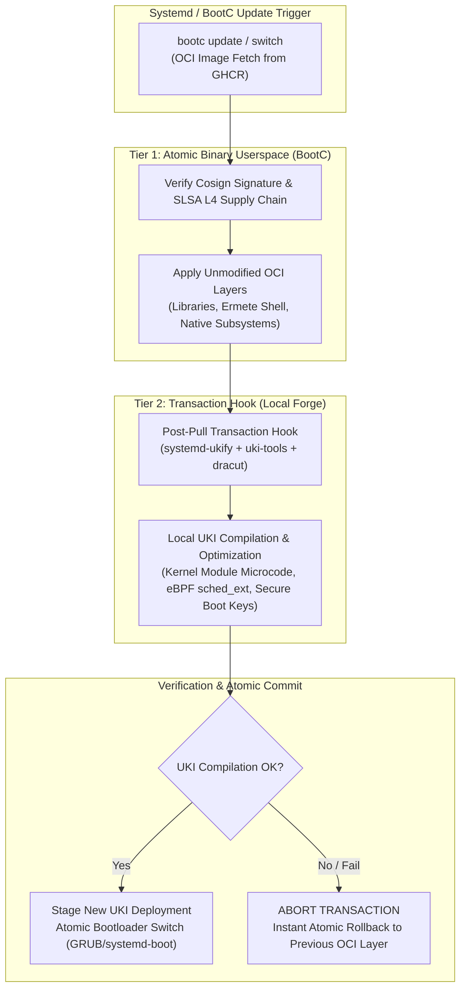

# Ermete OS — System Architecture & Component Specification

> **Component:** `system/` Core Subsystem  
> **Status:** Production / Formal Verified (Kani + Clippy Strict)  
> **Updated:** August 2026  

---

## Executive Architecture Overview

The `system` directory represents the runtime bedrock and OCI image build pipeline for **Ermete OS**. It unifies hardware security, post-quantum P2P networking, eBPF AI-driven kernel scheduling, declarative application orchestration, and **5 Native Rust Subsystems** written in Pure Rust.

The system architecture is anchored around **4 Core System Services** and **5 Native Rust Subsystems**:

```mermaid
graph TD
    subgraph Core_Services ["THE 4 CORE SYSTEM SERVICES"]
        GN1["Kernel AI Scheduler\n(system/ermete-ebpf-sched)"]
        GN2["Micro-Hypervisor Enclave\n(system/ermete-hypervisor-daemon)"]
        GN3["Mesh PQC\n(system/ermete-mesh-bus)"]
        GN4["Flatpak Declarative Orchestrator\n(system/ermete-store)"]
    end

    subgraph Native_Subsystems ["THE 5 NATIVE RUST SUBSYSTEMS"]
        P1["ermete-compositor\n(Wayland Native - Smithay DRM/KMS)"]
        P2["ermete-init-oracle\n(Systemd Native - Tokio AI Supervisor)"]
        P3["ermete-audio-bus\n(Pipewire Native - Zero-Copy Swarm Router)"]
        P4["ermete-greeter\n(Greetd Native - TPM 2.0 Key Unsealer)"]
        P5["xdg-desktop-portal-ermete\n(XDG Portal Native - Zbus Sandbox)"]
    end

    subgraph Hardware_Kernel ["Ring-0 & Hardware Bedrock"]
        K=["Ermete Chimera Kernel + sched_ext"]
        ENCLAVE["AMD SEV-SNP / Intel TDX Memory"]
    end

    subgraph Networking_Security ["Wire-Speed PQC & Bus"]
        WG["WireGuard P2P Mesh"]
        ZBUS["ZBus Pure Rust IPC"]
    end

    GN1 -->|eBPF sys_execve & cgroup v2| K
    GN2 -->|KVM / vmm-sys-util| ENCLAVE
    GN3 -->|Dilithium5 + ML-KEM-1024| WG
    GN3 -->|Post-Quantum Bus| ZBUS
    GN4 -->|SLSA L4 + Cosign OCI| ZBUS

    P1 -->|144Hz DRM/KMS Wayland| ZBUS
    P2 -->|Async Service Supervisor| ZBUS
    P3 -->|Real-Time Audio Router| ZBUS
    P4 -->|TPM 2.0 Hardware Release| ENCLAVE
    P5 -->|Zbus 4.4 Desktop Sandboxing| ZBUS
```

---

## Detailed System Service Specifications

### 1. Kernel AI Scheduler (`ermete-ebpf-sched`)
*Source Location:* [`system/ermete-ebpf-sched`](file:///var/home/ermete/GEMINI/ermete-os/system/ermete-ebpf-sched)

- **Purpose:** Low-latency kernel process prioritization bridging AI inference with Ring-0 scheduling.
- **Mechanism:**
  1. Intercepts process execution events (`sys_execve` tracepoints) via `aya` eBPF.
  2. Queries `AiDaemonBridge` on the local NPU for task classification and priority weight scoring.
  3. Dispatches task policies to `sched_ext` (Extensible Scheduler Class) with microsecond slice targets:
     - `RealtimeNpu`: **100 μs** target slice
     - `InteractiveUi`: **500 μs** target slice
     - `BatchCompute`: **5 ms** target slice
     - `IdleBackground`: **20 ms** target slice
  4. Dynamically adjusts Linux cgroup v2 `cpu.weight` parameters.

---

### 2. Micro-Hypervisor Enclave (`ermete-hypervisor-daemon`)
*Source Location:* [`system/ermete-hypervisor-daemon`](file:///var/home/ermete/GEMINI/ermete-os/system/ermete-hypervisor-daemon)

- **Purpose:** Zero-Trust Hardware Confidential Enclave Orchestration.
- **Mechanism:**
  1. Manages hardware-encrypted memory domains via AMD SEV-SNP and Intel TDX extensions.
  2. Leverages `vmm-sys-util`, KVM `ioctl` calls, and `ring` cryptographic hashes to instantiate isolated micro-enclaves.
  3. Verifies remote attestation and seals Ring-0 secrets against unauthorized host introspection.

---

### 3. Mesh PQC (`ermete-mesh-bus`)
*Source Location:* [`system/ermete-mesh-bus`](file:///var/home/ermete/GEMINI/ermete-os/system/ermete-mesh-bus)

- **Purpose:** Post-Quantum Cryptography Mesh Bus.
- **Mechanism:**
  1. Secures inter-device and daemon communication over WireGuard P2P tunnels using post-quantum primitives.
  2. **Key Encapsulation:** Employs **ML-KEM-1024 (Kyber1024)** for quantum-resistant session key negotiation.
  3. **Digital Signatures:** Uses **Dilithium5 (ML-DSA-87)** for payload authentication and identity verification.

---

### 4. Flatpak Declarative Orchestrator (`ermete-store`)
*Source Location:* [`system/ermete-store`](file:///var/home/ermete/GEMINI/ermete-os/system/ermete-store)

- **Purpose:** Declarative App Container Engine.
- **Mechanism:**
  1. Pulls immutable OCI application bundles strictly from GHCR SLSA Level 4 supply-chain registries (`ghcr.io/hr-mes/ermete-store`).
  2. Enforces Sigstore **Cosign** signature verification against public keys in `/etc/ermete/keys/cosign.pub` before granting execution or installation access.

---

## 5 Native Rust Subsystems Specification

Ermete OS replaces legacy C/C++ Linux subsystems with 5 native Pure Rust implementations:

### 1. Wayland Compositor — `ermete-compositor`
*Source Location:* [`system/ermete-compositor`](file:///var/home/ermete/GEMINI/ermete-os/system/ermete-compositor)
- **Replaced Component:** Wayland Compositor (Mutter / Weston / KWin).
- **Rust Architecture:** Built on **Smithay** (`backend_drm`, `backend_udev`, `backend_egl`, `wayland_frontend`).
- **Technical Capabilities:** Eliminates memory vulnerabilities of legacy C code, providing a tiling engine with `MasterStack`, `Grid`, `Spiral`, and automated layout modes at 144Hz.

### 2. Service Init & Supervisor Daemon — `ermete-init-oracle`
*Source Location:* [`system/ermete-init-oracle`](file:///var/home/ermete/GEMINI/ermete-os/system/ermete-init-oracle)
- **Replaced Component:** Systemd Init & Service Supervisor.
- **Rust Architecture:** Asynchronous on **Tokio** and **Zbus 4.1**.
- **Technical Capabilities:** Monitors service states in real-time, analyzes log exceptions via regex and eBPF tracepoints, and applies automated self-healing recovery routines.

### 3. Native Audio Router — `ermete-audio-bus`
*Source Location:* [`system/ermete-audio-bus`](file:///var/home/ermete/GEMINI/ermete-os/system/ermete-audio-bus)
- **Replaced Component:** PipeWire / PulseAudio session manager & routing daemons.
- **Rust Architecture:** Pure Rust router based on `tokio::sync` and zero-copy buffers.
- **Technical Capabilities:** Prevents audio stream desynchronization, enabling dynamic routing of audio channels between isolated microservices without memory copies.

### 4. Key Unsealing Display Manager — `ermete-greeter`
*Source Location:* [`system/ermete-greeter`](file:///var/home/ermete/GEMINI/ermete-os/system/ermete-greeter)
- **Replaced Component:** Greetd / LightDM display managers.
- **Rust Architecture:** Zero-Trust Key Release Daemon (`zeroize`, `sha2`, `zbus`, TPM 2.0).
- **Technical Capabilities:** Verifies TPM 2.0 PCR registers and hardware attestation prior to login. Decryption keys reside in structures wrapped by `ZeroizeOnDrop`, purged upon scope exit.

### 5. Desktop Portal Implementation — `xdg-desktop-portal-ermete`
*Source Location:* [`forge/specs/ermete-xdg-desktop-portal-ermete/xdg-desktop-portal-ermete-1.0.0`](file:///var/home/ermete/GEMINI/ermete-os/forge/specs/ermete-xdg-desktop-portal-ermete/xdg-desktop-portal-ermete-1.0.0)
- **Replaced Component:** xdg-desktop-portal (GNOME/KDE C implementations).
- **Rust Architecture:** Zbus 4.4 Async IPC + GTK4 Layer Shell backend.
- **Technical Capabilities:** Guarantees sandboxed privacy interfaces (ScreenShare, FilePicker, AppChooser, Privacy) for OCI Flatpak applications under SLSA Level 4 compliance.

---

## System Build & OCI Deployment Pipeline

1. **Layering Strategy:** 4-Tier Pyramid Caching inside `Containerfile` (`Tier 0` Bedrock hardware to `Tier 3` User Shell).
2. **Footprint Optimization:** Strips -1.1 GB of non-consumer firmware, build tools, and cache files.
3. **Immutability:** Bootable OCI container deployed and updated atomically via `bootc switch`.

### Hybrid Update Model (Rolling-Forge)

Ermete OS employs a hybrid update model combining pre-compiled immutable OCI container deployment with host-level local kernel compilation:



- **Speed & Predictability (Binary Userspace OCI):** Userspace components (Ermete Shell, Native Rust subsystems, system libraries, GTK4/Vulkan runtime) are distributed as pre-compiled immutable OCI container images. Updates via `bootc` occur within seconds through delta layering and Cosign signature verification (SLSA Level 4).
- **Local Kernel UKI Assembly:** During post-pull transaction hooks in `bootc`, the system executes automated local assembly of the Unified Kernel Image (UKI) via `uki-tools` (`ukify` + `sbsigntools`). This step integrates:
  - Host-specific CPU microcode and hardware parameters (`march=native`).
  - Custom kernel modules and **eBPF** probes for `ermete-ebpf-sched`.
  - EFI Secure Boot cryptographic signing using local host keys generated via TPM 2.0 (`ermete-greeter`).
- **Atomic Rollback Safety:** If local UKI compilation or EFI checksum verification fails during the transaction hook, the transaction aborts immediately (`ABORT TRANSACTION`). The bootloader configuration remains untouched, and the OS atomically restores the previous OCI image and UKI.

---

## Self-Contained CI/CD Infrastructure & Multi-Stage Build Pipeline

Ermete OS maintains a self-contained build toolchain independent of external binary distributions.

```mermaid
flowchart TD
    subgraph Tier0_Autarchic ["Tier 0: Self-Hosted CI Toolchain"]
        T0_Kani["kani-verifier\n(Bit-Precise Model Checker: kani-driver, cargo-kani)"]
        T0_Just["just\n(Native Rust Command Runner -O3 march=x86-64-v3)"]
        T0_Uki["uki-tools\n(Self-Contained Secure Boot: sbsigntools + systemd-ukify)"]
    end

    subgraph Heavy_Builder ["Stage 1: Heavy Builder Container (ermete-os-builder)"]
        Toolchain["Compilers GCC / Clang LLVM + Rustc"]
        Linker["Mold Linker + sccache + bwrap Sandbox"]
        Specs["Scratch RPM Micro-Containers (specs/*)"]
        Tier0_Autarchic --> Heavy_Builder
        Toolchain --> Specs
        Linker --> Specs
    end

    subgraph Lightweight_OS ["Stage 2: Minimal Bootable OS (ermete-os-system)"]
        OCI["BootC Immutable OCI Layering"]
        Install["DNF Local Bind-Mount Install (Tier 0 -> Tier 3)"]
        Purge["Post-Build Tooling Purge (-1.1 GB)"]
        Specs -->|RUN --mount=type=bind| Install
        Install --> OCI
        OCI --> Purge
    end
```

### 1. Tier 0 Self-Contained Toolchain
Build and verification tools are compiled directly from source:
- **`kani-verifier`** ([`forge/specs/kani-verifier`](file:///var/home/ermete/GEMINI/ermete-os/forge/specs/kani-verifier/kani-verifier.spec)): Compiled from official Rust source in Tier 0. Provides `kani-driver` and `cargo-kani` binaries for bit-precise formal verification of security invariants in Rust modules and eBPF drivers.
- **`just`** ([`forge/specs/just`](file:///var/home/ermete/GEMINI/ermete-os/forge/specs/just/just.spec)): Native Rust task runner compiled with optimizations (`-O3`, `-march=x86-64-v3`, `mold`). Manages build recipes across the operating system.
- **`uki-tools`** ([`forge/specs/uki-tools`](file:///var/home/ermete/GEMINI/ermete-os/forge/specs/uki-tools/uki-tools.spec)): Native package combining `sbsigntools` (`sbsign`, `sbverify`, `sbattach`, `sbkeysync`, `sbvarsign`) and `systemd-ukify` (`ukify`). Eliminates external dependencies for Unified Kernel Image (UKI) generation and EFI binary signing.

### 2. Multi-Stage Build Structure (Heavy Builder -> Minimal OS)
System image creation is divided into two stages:
1. **Stage 1 — Heavy Builder (`ermete-os-builder`)**:
   - Container image containing build toolchains, SDKs, development headers, linters, and formal verification engines (`kani-verifier`, `just`, `uki-tools`, `gcc`, `clang`, `rustc`, `mold`).
   - Generates single **OCI micro-containers** for each RPM package inside Bubblewrap (`bwrap`) sandboxes.
2. **Stage 2 — Minimal Bootable OS (`ermete-os-system`)**:
   - Built on top of minimal Fedora BootC (`system/Containerfile`).
   - RPMs produced in Stage 1 are mounted via `RUN --mount=type=bind` and installed locally without network fetching.
   - **Post-Build Purge**: Following initramfs generation via Dracut, residual build tools (`gcc`, `make`, `llvm-static`), C/Rust headers, and build caches are purged, reducing disk footprint by **-1.1 GB**.
